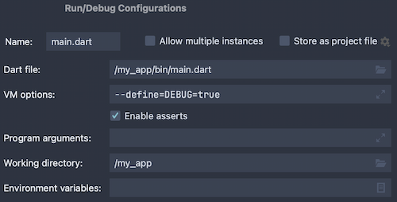

+++
title = "使用编译环境声明配置应用"
date = 2024-01-05T20:29:36+08:00
weight = 70
type = "docs"
description = ""
isCJKLanguage = true
draft = false

+++

> 原文: [https://dart.dev/guides/environment-declarations](https://dart.dev/guides/environment-declarations)

## Configuring apps with compilation environment declarations 使用编译环境声明配置应用

You can specify compilation environment declarations when building or running a Dart application. Compilation environment declarations specify configuration options as key-value pairs that are accessed and evaluated at compile time.

​	在构建或运行 Dart 应用时，您可以指定编译环境声明。编译环境声明指定配置选项，这些选项以键值对的形式出现，并在编译时进行访问和评估。

*info* **Note:** This page uses “environment” to refer to the Dart compilation environment. The common use of the term instead refers to the operating system environment.

​	注意：此页面使用“环境”来指代 Dart 编译环境。该术语的常用用法是指操作系统环境。

Your app can use the values of environment declarations to change its functionality or behavior. Dart compilers can eliminate the code made unreachable due to control flow using the environment declaration values.

​	您的应用可以使用环境声明的值来更改其功能或行为。Dart 编译器可以使用环境声明值来消除因控制流而无法访问的代码。

You might define and use environment declarations to:

​	您可以定义和使用环境声明来：

- Add functionality during debugging, such as enabling logging.
- 在调试期间添加功能，例如启用日志记录。
- Create separate flavors of your application.
- 创建应用程序的不同版本。
- Configure application behavior, such as the port of an HTTP server.
- 配置应用程序行为，例如 HTTP 服务器的端口。
- Enable an experimental mode of your application for testing.
- 为测试启用应用程序的实验模式。
- Switch between testing and production backends.
- 在测试和生产后端之间切换。

To specify an environment declaration when running or compiling a Dart application, use the `--define` option or its abbreviation, `-D`. Specify the declaration key-value pair using a `<NAME>=<VALUE>` format:

​	要在运行或编译 Dart 应用程序时指定环境声明，请使用 `--define` 选项或其缩写 `-D` 。使用 `<NAME>=<VALUE>` 格式指定声明键值对：

```
$ dart run --define=DEBUG=true -DFLAVOR=free
```

To learn how to set these declarations with other tools, check out the [specifying environment declarations](https://dart.dev/guides/environment-declarations#specifying-environment-declarations) section in this guide. That section explains the declaration syntax and how to specify them on the command line and in IDEs and editors.

​	要了解如何使用其他工具设置这些声明，请查看本指南中的指定环境声明部分。该部分解释了声明语法以及如何在命令行和 IDE 及编辑器中指定它们。

## 访问环境声明 Accessing environment declarations 

To access specified environment declaration values, use one of the `fromEnvironment` constructors with `const` or within a constant context. Use [`bool.fromEnvironment`](https://api.dart.dev/stable/dart-core/bool/bool.fromEnvironment.html) for `true` or `false` values, [`int.fromEnvironment`](https://api.dart.dev/stable/dart-core/int/int.fromEnvironment.html) for integer values, and [`String.fromEnvironment`](https://api.dart.dev/stable/dart-core/String/String.fromEnvironment.html) for anything else.

​	要访问指定的环境声明值，请使用带有 `const` 的 `fromEnvironment` 构造函数之一，或在常量上下文中使用。对 `true` 或 `false` 值使用 `bool.fromEnvironment` ，对整数值使用 `int.fromEnvironment` ，对其他任何值使用 `String.fromEnvironment` 。

*info* **Note:** The environment declaration constructors are only guaranteed to work when invoked as `const`. Most compilers must be able to evaluate their value at compile time.

​	注意：环境声明构造函数仅在作为 `const` 调用时才保证有效。大多数编译器必须能够在编译时评估其值。

Each of the `fromEnvironment` constructors require the name or key of the environment declaration. They also accept an optional `defaultValue` named argument to override the default fallback value. The default fallback value is used when a declaration isn’t defined or the specified value cannot be parsed as the expected type.

​	每个 `fromEnvironment` 构造函数都需要环境声明的名称或键。它们还接受一个可选的 `defaultValue` 命名参数来覆盖默认回退值。当声明未定义或无法将指定值解析为预期类型时，将使用默认回退值。

For example, if you want to print log messages only when the environment declaration `DEBUG` is set to `true`:

​	例如，如果您仅在环境声明 `DEBUG` 设置为 `true` 时才想打印日志消息：

```dart
void log(String message) {
  // Log the debug message if the environment declaration 'DEBUG' is `true`.
  // If there was no value specified, do not log.
  if (const bool.fromEnvironment('DEBUG', defaultValue: false)) {
    print('Debug: $message');
  }
}
```

In this snippet, if `DEBUG` is set to `false` during compilation, or not specified at all, production compilers can completely remove the condition and its body.

​	在此代码段中，如果在编译期间将 `DEBUG` 设置为 `false` ，或者根本未指定，生产编译器可以完全删除条件及其主体。

The `fromEnvironment` constructors fallback to a default value when the declaration isn’t specified or the specified value cannot be parsed. Therefore, to specifically check whether an environment declaration has been specified, use the [`bool.hasEnvironment`](https://api.dart.dev/stable/dart-core/bool/bool.hasEnvironment.html) constructor:

​	当未指定声明或无法解析指定值时， `fromEnvironment` 构造函数会回退到默认值。因此，要专门检查是否已指定环境声明，请使用 `bool.hasEnvironment` 构造函数：

```dart
if (const bool.hasEnvironment('DEBUG')) {
  print('Debug behavior was configured!');
}
```

## 指定环境声明 Specifying environment declarations 

*report_problem* **Warning:** Dart tools and compilers currently do not consistently handle environment declarations with comma-separated values. To track standardization of this handling, reference [SDK issue 44995](https://github.com/dart-lang/sdk/issues/44995).

​	警告：Dart 工具和编译器目前无法一致地处理带有逗号分隔值的环境声明。要跟踪此处理的标准化，请参考 SDK 问题 44995。

### Dart CLI

Both `dart run` and the `dart compile` subcommands accept any number of the `-D` or `--define` options to specify environment declaration values.

​	子命令 `dart run` 和 `dart compile` 都接受任意数量的 `-D` 或 `--define` 选项来指定环境声明值。

```sh
$ dart run --define=DEBUG=true -DFLAVOR=free main.dart
$ dart compile exe --define=DEBUG=true -DFLAVOR=free main.dart
$ dart compile js --define=DEBUG=true -DFLAVOR=free main.dart
$ dart compile aot-snapshot --define=DEBUG=true -DFLAVOR=free main.dart
$ dart compile jit-snapshot --define=DEBUG=true -DFLAVOR=free main.dart
$ dart compile kernel --define=DEBUG=true -DFLAVOR=free main.dart
```

#### `webdev`

To learn about configuring `webdev` to pass environment declarations to both the development and production web compilers, check out [the `webdev` configuration documentation](https://pub.dev/packages/build_web_compilers#configuring--d-environment-variables).

​	要了解如何配置 `webdev` 以将环境声明同时传递给开发和生产 Web 编译器，请查看 `webdev` 配置文档。

### Visual Studio Code

In your launch configuration (`launch.json`) under `configurations`, add a new `toolArgs` key containing the your desired environment declarations:

​	在 `configurations` 下的启动配置 ( `launch.json` ) 中，添加一个包含所需环境声明的新 `toolArgs` 键：

```json
"configurations": [
    {
        "name": "Dart",
        "request": "launch",
        "type": "dart",
        "toolArgs": [
          "--define=DEBUG=true"
        ]
    }
]
```

To learn more, check out the documentation for [VS Code launch configurations.](https://code.visualstudio.com/docs/editor/debugging#_launch-configurations)

​	要了解更多信息，请查看 VS Code 启动配置的文档。

### JetBrains IDEs 

In the **Run/Debug Configurations** for your project, add your desired environment declarations to **VM options**:

​	在项目的运行/调试配置中，将所需的环境声明添加到 VM 选项：



To learn more, check out JetBrains’ documentation for [Dart Run/Debug Configurations](https://www.jetbrains.com/help/webstorm/run-debug-configuration-dart-command-line-application.html).

​	要了解更多信息，请查看 JetBrains 的 Dart 运行/调试配置文档。

### Flutter

To specify environment declarations to the Flutter tool, use the `--dart-define` option instead:

​	要向 Flutter 工具指定环境声明，请改用 `--dart-define` 选项：

```sh
$ flutter run --dart-define=DEBUG=true
```
