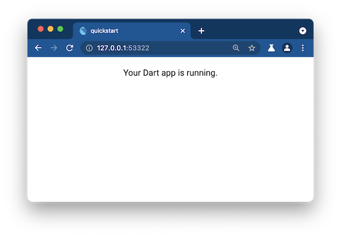
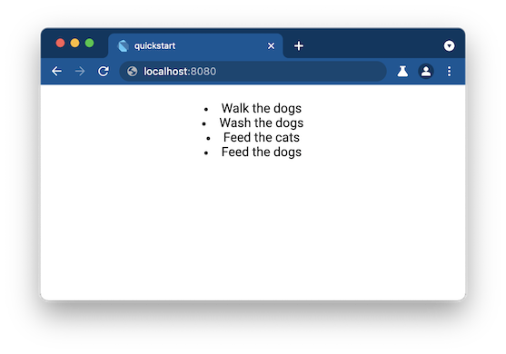

+++
title = "使用 Dart 构建 Web 应用：开始入门"
date = 2024-01-05T20:29:36+08:00
weight = 10
type = "docs"
description = ""
isCJKLanguage = true
draft = false

+++

> 原文: [https://dart.dev/web/get-started](https://dart.dev/web/get-started)

## Build a web app with Dart 使用 Dart 构建 Web 应用

This page describes the steps to start developing **web-only** apps with Dart. If you want to write a **multi-platform** app, then [try Flutter.](https://flutter.dev/web)

​	此页面介绍使用 Dart 开始开发仅限网络的应用的步骤。如果您想编写一个多平台应用，那么请尝试 Flutter。

Before you begin, ensure you’re comfortable with Dart basics by reading the [Introduction to Dart](https://dart.dev/language). Then follow the steps below to create a small web app with Dart.

​	在开始之前，请确保您通过阅读 Dart 简介来熟悉 Dart 基础知识。然后按照以下步骤使用 Dart 创建一个小网络应用。

## 1. 安装 Dart Install Dart 

To develop real apps, you need an SDK. You can either download the Dart SDK directly (as described below) or [download the Flutter SDK,](https://docs.flutter.dev/get-started/install) which includes the full Dart SDK.

​	要开发真正的应用，您需要一个 SDK。您可以直接下载 Dart SDK（如下所述），或下载包含完整 Dart SDK 的 Flutter SDK。

- Windows

  > Use [Chocolatey](https://chocolatey.org/) to install a stable release of the Dart SDK.
  > 使用 Chocolatey 安装 Dart SDK 的稳定版本。
  >
  > *error* **Important:** These commands require administrator privileges. If you need help on starting an administrator-level command prompt, try a search like *[cmd admin](https://www.google.com/search?q=cmd+admin).*
  >
  > ​	重要提示：这些命令需要管理员权限。如果您需要有关启动管理员级别命令提示符的帮助，请尝试搜索类似 cmd admin 的内容。
  >
  > To install the Dart SDK:
  >
  > ​	要安装 Dart SDK：
  >
  > ```sh
  > C:\> choco install dart-sdk
  > ```

- Linux

  > You can use APT to install the Dart SDK on Linux.
  >
  > ​	您可以在 Linux 上使用 APT 安装 Dart SDK。
  >
  > 1. Perform the following one-time setup:   执行以下一次性设置：
  >
  >    ```sh
  >    $ sudo apt-get update
  >    $ sudo apt-get install apt-transport-https
  >    $ wget -qO- https://dl-ssl.google.com/linux/linux_signing_key.pub | sudo gpg --dearmor -o /usr/share/keyrings/dart.gpg
  >    $ echo 'deb [signed-by=/usr/share/keyrings/dart.gpg arch=amd64] https://storage.googleapis.com/download.dartlang.org/linux/debian stable main' | sudo tee /etc/apt/sources.list.d/dart_stable.list
  >    ```
  >
  > 2. Install the Dart SDK:   安装 Dart SDK：
  >
  >    ```sh
  >    $ sudo apt-get update
  >    $ sudo apt-get install dart
  >    ```

- Mac

  > With [Homebrew,](https://brew.sh/) installing Dart is easy.
  >
  > ​	使用 Homebrew，安装 Dart 非常简单。
  >
  > ```sh
  > $ brew tap dart-lang/dart
  > $ brew install dart
  > ```
  
  

*error* **Important:** For more information, including how to **adjust your `PATH`**, see [Get the Dart SDK](https://dart.dev/get-dart).

​	重要提示：有关更多信息，包括如何调整您的 `PATH` ，请参阅获取 Dart SDK。

## 2. 获取 CLI 工具或 IDE（或两者）Get CLI tools or an IDE (or both) 

*terminal* If you like to use the command line, install the [`webdev`](https://dart.dev/tools/webdev) package:

​	如果您喜欢使用命令行，请安装 `webdev` 包：

```
$ dart pub global activate webdev
```

*web* Although using an IDE is optional, we highly recommend using one. For a list of available IDEs, see the [overview of editors & debuggers](https://dart.dev/tools#ides-and-editors).

​	虽然使用 IDE 是可选的，但我们强烈建议使用一个。有关可用 IDE 的列表，请参阅编辑器和调试器的概述。

## 3. 创建一个网络应用 Create a web app 

*terminal* To create a web app from the command line, use the [`dart create`](https://dart.dev/tools/dart-create) command with the `web` template:

​	要从命令行创建网络应用，请使用带有 `dart create` 模板的 `web` 命令：

```
$ dart create -t web quickstart
```

*web* To create the same web app from an IDE that has Dart integration, create a project using the template named **Bare-bones Web App**.

​	要从具有 Dart 集成的 IDE 创建相同的网络应用，请使用名为“精简网络应用”的模板创建一个项目。

## 4. 运行应用 Run the app 

*terminal* To run the app from the command line, use [`webdev`](https://dart.dev/tools/webdev) to build and serve the app:

​	要从命令行运行应用，请使用 `webdev` 来构建并提供应用：

```
$ cd quickstart
$ webdev serve
```

*web* Or run the app from your IDE.

​	或者从您的 IDE 运行应用。

To view your app, use the Chrome browser to visit the app’s URL—for example, [`localhost:8080`](http://localhost:8080/).

​	要查看您的应用，请使用 Chrome 浏览器访问应用的 URL，例如 `localhost:8080` 。

Whether you use an IDE or the command line, [`webdev serve`](https://dart.dev/tools/webdev#serve) builds and serves your app using the development JavaScript compiler. Startup is slowest the first time the development compiler builds and serves your app. After that, assets are cached on disk and incremental builds are much faster.

​	无论您使用 IDE 还是命令行， `webdev serve` 都会使用开发 JavaScript 编译器构建并提供您的应用。在开发编译器首次构建并提供您的应用时，启动速度最慢。之后，资产会缓存在磁盘上，增量构建的速度会快得多。

Once your app has compiled, the browser should display “Your Dart app is running.”

​	应用编译完成后，浏览器应显示“您的 Dart 应用正在运行”。



## 5. 向应用添加自定义代码 Add custom code to the app 

Let’s customize the app you just created.

​	让我们自定义您刚刚创建的应用。

1. Copy the `thingsTodo()` function from the following snippet to the `web/main.dart` file:

2. 将 `thingsTodo()` 函数从以下代码段复制到 `web/main.dart` 文件：

   ```
   Iterable<String> thingsTodo() sync* {
     const actions = ['Walk', 'Wash', 'Feed'];
     const pets = ['cats', 'dogs'];
      
     for (final action in actions) {
       for (final pet in pets) {
         if (pet != 'cats' || action == 'Feed') {
           yield '$action the $pet';
         }
       }
     }
   }
   ```

3. Add the `newLI()` function (as shown below). It creates a new `LIElement` containing the specified `String`.

4. 添加 `newLI()` 函数（如下所示）。它会创建一个包含指定 `String` 的新 `LIElement` 。

   ```dart
   Iterable<String> thingsTodo() sync* { ... }
   
   LIElement newLI(String itemText) => LIElement()..text = itemText;
   
   void main() { ... }
   ```

5. In the `main()` function, initialize the `output` element using `thingsTodo()`:

6. 在 `main()` 函数中，使用 `thingsTodo()` 初始化 `output` 元素：

   ```dart
   Iterable<String> thingsTodo() sync* { ... }
   
   LIElement newLI(String itemText) => LIElement()..text = itemText;
   
   void main() {
     querySelector('#output')?.children.addAll(thingsTodo().map(newLI));
   }
   ```

7. Save your changes.

8. 保存您的更改。

9. The `webdev` tool automatically rebuilds your app. Refresh the app’s browser window. Now your simple Dart app has a todo list! It should look something like this:

10. `webdev` 工具会自动重新构建您的应用。刷新应用的浏览器窗口。现在，您的简单 Dart 应用拥有了一个待办事项列表！它应该看起来像这样：
   

11. Optionally, improve the formatting by editing `web/styles.css`, then reload the app to check your changes.

12. 还可以通过编辑 `web/styles.css` 来改善格式，然后重新加载应用以检查您的更改。

    ```css
    #output {
      padding: 20px;
      text-align: left;
    }
    ```

## 6. 使用 Dart DevTools 检查应用 Use Dart DevTools to inspect the app 

Use Dart DevTools to set breakpoints, view values and types, and step through your app’s Dart code. For setup details and a walkthrough, see [Debugging Dart Web Apps](https://dart.dev/web/debugging).

​	使用 Dart DevTools 设置断点、查看值和类型，并逐步执行应用的 Dart 代码。有关设置详细信息和演练，请参阅调试 Dart Web 应用。

## 7. 构建并部署您的 Web 应用 Build and deploy your web app 

To run your web app outside your development environment, you’ll need to build and deploy it. To learn more about deploying Dart web apps, check out [Web deployment](https://dart.dev/web/deployment).

​	要在开发环境外运行您的 Web 应用，您需要构建并部署它。要详细了解如何部署 Dart Web 应用，请查看 Web 部署。

## What next?

Check out these resources:

​	查看以下资源：

- Dart language, libraries, and conventions

- 
  Dart 语言、库和约定
  
  - [Language tour
    语言之旅](https://dart.dev/language)
  - [Core library walkthrough
    核心库演练](https://dart.dev/libraries)
  - [Effective Dart
    高效的 Dart](https://dart.dev/effective-dart)
  
- Web development

- 
  Web 开发
  
  - [JavaScript interoperability
    JavaScript 互操作性](https://dart.dev/interop/js-interop)
  - [Web libraries and packages
    Web 库和软件包](https://dart.dev/web/libraries)
  - [`dart:html` overview
    `dart:html` 概述](https://dart.dev/libraries/dart-html)
  - [Introduction to the DOM
    DOM 简介](https://developer.mozilla.org/docs/Web/API/Document_Object_Model/Introduction)
  
- Tutorials and codelabs for Dart

- 
  Dart 教程和代码实验室
  
  - [Tutorials
    教程](https://dart.dev/tutorials)
  - [Codelabs
    代码实验室](https://dart.dev/codelabs)

If you get stuck, find help at [Community and support.](https://dart.dev/community)

​	如果您遇到困难，请在社区和支持中查找帮助。
