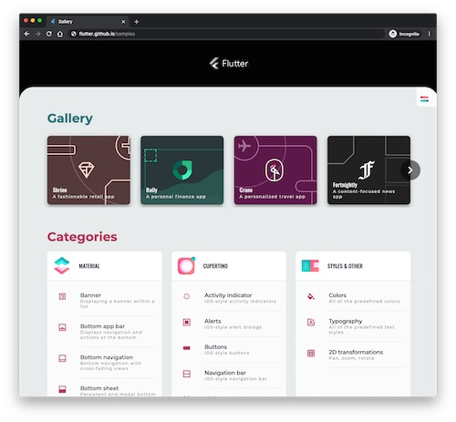

+++
title = "Web 平台：概览"
date = 2024-01-05T20:29:36+08:00
weight = 1
type = "docs"
description = ""
isCJKLanguage = true
draft = false
+++

> 原文: [https://dart.dev/web](https://dart.dev/web)

## Web platform - Web 平台

Dart supports the web as one of its core [platforms](https://dart.dev/overview#platform). Dart-to-JavaScript compilers are available both for development (with a quick edit-refresh cycle) and for production (with a focus on code size and speed).

​	Dart 将 Web 作为其核心平台之一。Dart 到 JavaScript 编译器可用于开发（具有快速编辑刷新周期）和生产（重点关注代码大小和速度）。

In addition to compilers, the Dart web platform provides [core libraries](https://dart.dev/libraries#web-platform-libraries), access to the [DOM (Document Object Model)](https://dart.dev/web/get-started), and [interoperability for calling JavaScript](https://dart.dev/interop/js-interop) from Dart.

​	除了编译器之外，Dart Web 平台还提供核心库、对 DOM（文档对象模型）的访问以及从 Dart 调用 JavaScript 的互操作性。

You have the option of using Dart web with a higher-level web app framework. Many apps that support web plus mobile or desktop are built using [Flutter](https://flutter.dev/) and [Flutter web](https://flutter.dev/web) support. Flutter web support and other web app frameworks for Dart are powered by the Dart web platform.

​	您可以选择将 Dart Web 与更高级的 Web 应用框架配合使用。许多支持 Web 加移动或桌面的应用都是使用 Flutter 和 Flutter Web 支持构建的。Flutter Web 支持和 Dart 的其他 Web 应用框架由 Dart Web 平台提供支持。

[Build a web app with Dart](https://dart.dev/web/get-started)

*Flutter Gallery, running in a web browser
Flutter Gallery，在 Web 浏览器中运行*
