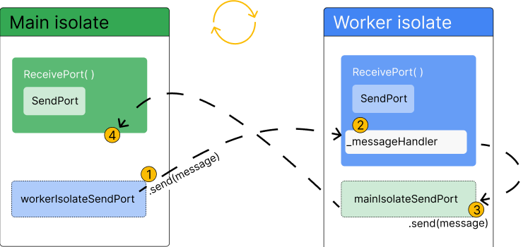

+++
title = "隔离"
date = 2024-01-05T20:29:36+08:00
weight = 20
type = "docs"
description = ""
isCJKLanguage = true
draft = false
+++

> 原文: [https://dart.dev/language/isolates](https://dart.dev/language/isolates)

## Isolates 隔离

This page discusses some examples that use the `Isolate` API to implement isolates.

​	此页面讨论了一些使用 `Isolate` API 实现隔离的示例。

You should use isolates whenever your application is handling computations that are large enough to temporarily block other computations. The most common example is in [Flutter](https://flutter.dev/perf/isolates) applications, when you need to perform large computations that might otherwise cause the UI to become unresponsive.

​	只要您的应用程序处理的计算量大到足以暂时阻塞其他计算时，您都应该使用隔离。最常见的示例是在 Flutter 应用程序中，当您需要执行可能导致 UI 无响应的大量计算时。

There aren’t any rules about when you *must* use isolates, but here are some more situations where they can be useful:

​	没有任何规则规定您必须何时使用隔离，但以下是一些它们可能派上用场的其他情况：

- Parsing and decoding exceptionally large JSON blobs.
- 解析和解码特别大的 JSON 数据块。
- Processing and compressing photos, audio and video.
- 处理和压缩照片、音频和视频。
- Converting audio and video files.
- 转换音频和视频文件。
- Performing complex searching and filtering on large lists or within file systems.
- 对大型列表或文件系统中的文件执行复杂的搜索和筛选。
- Performing I/O, such as communicating with a database.
- 执行 I/O，例如与数据库通信。
- Handling a large volume of network requests.
- 处理大量网络请求。

## 实现简单的辅助进程隔离 Implementing a simple worker isolate 

These examples implement a main isolate that spawns a simple worker isolate. [`Isolate.run()`](https://api.dart.dev/dev/dart-isolate/Isolate/run.html) simplifies the steps behind setting up and managing worker isolates:

​	这些示例实现了一个主隔离，该隔离会生成一个简单的辅助进程隔离。 `Isolate.run()` 简化了设置和管理辅助进程隔离的步骤：

1. Spawns (starts and creates) an isolate.
2. 生成（启动并创建）一个隔离。
3. Runs a function on the spawned isolate.
4. 在生成的隔离上运行一个函数。
5. Captures the result.
6. 捕获结果。
7. Returns the result to the main isolate.
8. 将结果返回给主隔离区。
9. Terminates the isolate once work is complete.
10. 工作完成后终止隔离区。
11. Checks, captures, and throws exceptions and errors back to the main isolate.
12. 检查、捕获并向主隔离区抛出异常和错误。

 **Flutter note:** If you’re using Flutter, you can use [Flutter’s `compute` function](https://api.flutter.dev/flutter/foundation/compute.html) instead of `Isolate.run()`.
 Flutter 注释：如果您使用的是 Flutter，则可以使用 Flutter 的 `compute` 函数代替 `Isolate.run()` 。

### 在新隔离区中运行现有方法 Running an existing method in a new isolate 

1. Call `run()` to spawn a new isolate (a [background worker](https://dart.dev/language/concurrency#background-workers)), directly in the [main isolate](https://dart.dev/language/concurrency#isolates) while `main()` waits for the result:
2. 调用 `run()` 以生成新的隔离区（后台工作进程），直接在主隔离区中，同时 `main()` 等待结果：

```dart
const String filename = 'with_keys.json';

void main() async {
  // Read some data.
  final jsonData = await Isolate.run(_readAndParseJson);

  // Use that data.
  print('Number of JSON keys: ${jsonData.length}');
}
```

1. Pass the worker isolate the function you want it to execute as its first argument. In this example, it’s the existing function `_readAndParseJson()`:
2. 将工作隔离区传递给您希望其作为其第一个参数执行的函数。在此示例中，它是现有函数 `_readAndParseJson()` ：

```dart
Future<Map<String, dynamic>> _readAndParseJson() async {
  final fileData = await File(filename).readAsString();
  final jsonData = jsonDecode(fileData) as Map<String, dynamic>;
  return jsonData;
}
```

1. `Isolate.run()` takes the result `_readAndParseJson()` returns and sends the value back to the main isolate, shutting down the worker isolate.
2. `Isolate.run()` 获取结果 `_readAndParseJson()` 返回并向主隔离区发送值，从而关闭工作隔离区。
3. The worker isolate *transfers* the memory holding the result to the main isolate. It *does not copy* the data. The worker isolate performs a verification pass to ensure the objects are allowed to be transferred.
4. 工作隔离区将保存结果的内存传输到主隔离区。它不会复制数据。工作隔离区执行验证过程以确保允许传输对象。

`_readAndParseJson()` is an existing, asynchronous function that could just as easily run directly in the main isolate. Using `Isolate.run()` to run it instead enables concurrency. The worker isolate completely abstracts the computations of `_readAndParseJson()`. It can complete without blocking the main isolate.

​	`_readAndParseJson()` 是一个现有的异步函数，它可以轻松地在主隔离区中直接运行。使用 `Isolate.run()` 来运行它可以实现并发。工作程序隔离区完全抽象了 `_readAndParseJson()` 的计算。它可以在不阻塞主隔离区的情况下完成。

The result of `Isolate.run()` is always a Future, because code in the main isolate continues to run. Whether the computation the worker isolate executes is synchronous or asynchronous doesn’t impact the main isolate, because it’s running concurrently either way.

​	由于主隔离区中的代码继续运行，因此 `Isolate.run()` 的结果始终是 Future。工作程序隔离区执行的计算是同步还是异步不会影响主隔离区，因为无论哪种方式，它都会并发运行。

For the complete program, check out the [send_and_receive.dart](https://github.com/dart-lang/samples/blob/main/isolates/bin/send_and_receive.dart) sample.

​	有关完整程序，请查看 send_and_receive.dart 示例。

### 使用隔离区发送闭包 Sending closures with isolates 

You can also create a simple worker isolate with `run()` using a function literal, or closure, directly in the main isolate.

​	您还可以使用 `run()` 在主隔离区中直接使用函数字面量或闭包来创建简单的工作程序隔离区。

```dart
const String filename = 'with_keys.json';

void main() async {
  // Read some data.
  final jsonData = await Isolate.run(() async {
    final fileData = await File(filename).readAsString();
    final jsonData = jsonDecode(fileData) as Map<String, dynamic>;
    return jsonData;
  });

  // Use that data.
  print('Number of JSON keys: ${jsonData.length}');
}
```

This example accomplishes the same as the previous. A new isolate spawns, computes something, and sends back the result.

​	此示例与上一个示例实现相同的功能。一个新的隔离区会生成、计算某些内容，然后发回结果。

However, now the isolate sends a [closure](https://dart.dev/language/functions#anonymous-functions). Closures are less limited than typical named functions, both in how they function and how they’re written into the code. In this example, `Isolate.run()` executes what looks like local code, concurrently. In that sense, you can imagine `run()` to work like a control flow operator for “run in parallel”.

​	然而，现在隔离发送一个闭包。闭包的限制比典型的命名函数要少，无论是在它们的功能上还是在它们被写入代码的方式上。在此示例中， `Isolate.run()` 执行看起来像本地代码的内容，同时执行。从这个意义上说，您可以想象 `run()` 像一个控制流运算符一样工作，用于“并行运行”。

## 使用端口在隔离之间发送多条消息 Sending multiple messages between isolates with ports 

Short-lived isolates are convenient to use, but require performance overhead to spawn new isolates and to copy objects from one isolate to another. If your code relies on repeatedly running the same computation using `Isolate.run`, you might improve performance by instead creating long-lived isolates that don’t exit immediately.

​	短生命周期隔离使用方便，但需要性能开销来生成新的隔离并从一个隔离复制对象到另一个隔离。如果您的代码依赖于使用 `Isolate.run` 重复运行相同的计算，您可以通过创建不会立即退出的长生命周期隔离来提高性能。

To do this, you can use some of the low-level isolate APIs that `Isolate.run` abstracts:
为此，您可以使用 `Isolate.run` 抽象出的一些低级别隔离 API：

- [`Isolate.spawn()`](https://api.dart.dev/stable/dart-isolate/Isolate/spawn.html) and [`Isolate.exit()`](https://api.dart.dev/stable/dart-isolate/Isolate/exit.html)
- `Isolate.spawn()` 和 `Isolate.exit()`
- [`ReceivePort`](https://api.dart.dev/stable/dart-isolate/ReceivePort-class.html) and [`SendPort`](https://api.dart.dev/stable/dart-isolate/SendPort-class.html)
- `ReceivePort` 和 `SendPort`
- [`SendPort.send()` method
  `SendPort.send()` 方法](https://api.dart.dev/stable/dart-isolate/SendPort/send.html)

This section goes over the steps required to establish 2-way communication between a newly spawned isolate and the [main isolate](https://dart.dev/language/concurrency#isolates). The first example, [Basic ports](https://dart.dev/language/isolates#basic-ports-example), introduces the process at a high-level. The second example, [Robust ports](https://dart.dev/language/isolates#robust-ports-example), gradually adds more practical, real-world functionality to the first.

​	本部分介绍在新生成的隔离和主隔离之间建立双向通信所需的步骤。第一个示例“基本端口”以高级别介绍了该过程。第二个示例“健壮端口”逐渐向第一个示例添加更多实用、真实的函数。

### `ReceivePort` 和 `SendPort`

Setting up long-lived communication between isolates requires two classes (in addition to `Isolate`): `ReceivePort` and `SendPort`. These ports are the only way isolates can communicate with each other.

​	要设置隔离区之间的长期通信，需要两个类（除了 `Isolate` ）： `ReceivePort` 和 `SendPort` 。这些端口是隔离区之间进行通信的唯一方式。

A `ReceivePort` is an object that handles messages that are sent from other isolates. Those messages are sent via a `SendPort`.

​	一个 `ReceivePort` 是一个处理从其他隔离区发送的消息的对象。这些消息通过 `SendPort` 发送。

*info* **Note:** A `SendPort` object is associated with exactly one `ReceivePort`, but a single `ReceivePort` can have many `SendPorts`. When you create a `ReceivePort`, it creates a `SendPort` for itself. You can create additional `SendPorts` that can send messages to an existing `ReceivePort`.

​	注意：一个 `SendPort` 对象与一个 `ReceivePort` 严格相关，但一个 `ReceivePort` 可以有多个 `SendPorts` 。创建 `ReceivePort` 时，它会为自己创建一个 `SendPort` 。您可以创建其他 `SendPorts` 来向现有 `ReceivePort` 发送消息。

Ports behave similarly to [`Stream`](https://api.dart.dev/stable/dart-async/Stream-class.html) objects (in fact, receive ports implement `Stream`!) You can think of a `SendPort` and `ReceivePort` like Stream’s `StreamController` and listeners, respectively. A `SendPort` is like a `StreamController` because you “add” messages to them with the [`SendPort.send()` method](https://api.dart.dev/stable/dart-isolate/SendPort/send.html), and those messages are handled by a listener, in this case the `ReceivePort`. The `RecievePort` then handles the messages it receives by passing them as arguments to a callback that you provide.

​	端口的行为类似于 `Stream` 对象（事实上，接收端口实现了 `Stream` ！）您可以将 `SendPort` 和 `ReceivePort` 分别视为 Stream 的 `StreamController` 和侦听器。一个 `SendPort` 类似于 `StreamController` ，因为您可以使用 `SendPort.send()` 方法向它们“添加”消息，并且这些消息由侦听器（在本例中为 `ReceivePort` ）处理。然后， `RecievePort` 通过将消息作为参数传递给您提供的回调来处理它收到的消息。

#### 设置端口 Setting up ports 

A newly spawned isolate only has the information it receives through the `Isolate.spawn` call. If you need the main isolate to continue to communicate with a spawned isolate past its initial creation, you must set up a communication channel where the spawned isolate can send messages to the main isolate. Isolates can only communicate via message passing. They can’t “see” inside each others’ memory, which is where the name “isolate” comes from.

​	新生成的隔离仅具有通过 `Isolate.spawn` 调用接收的信息。如果您需要主隔离在初始创建后继续与生成的隔离进行通信，则必须设置一个通信通道，以便生成的隔离可以向主隔离发送消息。隔离只能通过消息传递进行通信。它们无法“看到”彼此的内存，这就是“隔离”一词的由来。

To set up this 2-way communication, first create a [`ReceivePort`](https://api.dart.dev/stable/dart-isolate/ReceivePort-class.html) in the main isolate, then pass its [`SendPort`](https://api.dart.dev/stable/dart-isolate/SendPort-class.html) as an argument to the new isolate when spawning it with `Isolate.spawn`. The new isolate then creates its own `ReceivePort`, and sends *its* `SendPort` back on the `SendPort` it was passed by the main isolate. The main isolate receives this `SendPort`, and now both sides have an open channel to send and receive messages.

​	要设置此双向通信，首先在主隔离中创建一个 `ReceivePort` ，然后在使用 `Isolate.spawn` 生成它时将其 `SendPort` 作为参数传递给新隔离。然后，新隔离创建自己的 `ReceivePort` ，并将自己的 `SendPort` 通过主隔离传递的 `SendPort` 发送回去。主隔离接收此 `SendPort` ，现在双方都有一个开放的通道来发送和接收消息。

*info* **Note:** The diagrams in this section are high-level and intended to convey the *concept* of using ports for isolates. Actual implementation requires a bit more code, which you will find [later on this page](https://dart.dev/language/isolates#basic-ports-example).

​	注意：本节中的图表是高级的，旨在传达使用端口进行隔离的概念。实际实现需要更多代码，您将在本页后面找到这些代码。


1. Create a `ReceivePort` in the main isolate. The `SendPort` is created automatically as a property on the `ReceivePort`.
2. 在主隔离中创建一个 `ReceivePort` 。 `SendPort` 会自动创建为 `ReceivePort` 上的属性。
3. Spawn the worker isolate with `Isolate.spawn()`
4. 使用 `Isolate.spawn()` 生成工作者隔离
5. Pass a reference to `ReceivePort.sendPort` as the first message to the worker isolate.
6. 将对 `ReceivePort.sendPort` 的引用作为第一条消息传递给工作者隔离。
7. Create another new `ReceivePort` in the worker isolate.
8. 在工作者隔离中创建另一个新的 `ReceivePort` 。
9. Pass a reference to the worker isolate’s `ReceivePort.sendPort` as the first message *back* to the main isolate.
10. 将对工作者隔离的 `ReceivePort.sendPort` 的引用作为第一条消息传递回主隔离。

Along with creating the ports and setting up communication, you’ll also need to tell the ports what to do when they receive messages. This is done using the `listen` method on each respective `ReceivePort`.

​	除了创建端口和设置通信之外，您还需要告诉端口在收到消息时要做什么。这是通过在每个相应的 `ReceivePort` 上使用 `listen` 方法来完成的。



1. Send a message via the main isolate’s reference to the worker isolate’s `SendPort`.
2. 通过主隔离的引用向工作者隔离的 `SendPort` 发送消息。
3. Receive and handle the message via a listener on the worker isolate’s `ReceivePort`. This is where the computation you want to move off the main isolate is executed.
4. 通过工作者隔离的 `ReceivePort` 上的侦听器接收和处理消息。这是执行您要从主隔离中移出的计算的位置。
5. Send a return message via the worker isolate’s reference to the main isolate’s `SendPort`.
6. 通过工作者隔离的引用向主隔离的 `SendPort` 发送返回消息。
7. Receive the message via a listener on the main isolate’s `ReceivePort`.
8. 通过主隔离的 `ReceivePort` 上的侦听器接收消息。

### 基本端口示例 Basic ports example 

This example demonstrates how you can set up a long-lived worker isolate with 2-way communication between it and the main isolate. The code uses the example of sending JSON text to a new isolate, where the JSON will be parsed and decoded, before being sent back to the main isolate.

​	此示例演示如何设置一个长生命周期工作者隔离区，并在该隔离区与主隔离区之间进行双向通信。该代码使用向新隔离区发送 JSON 文本的示例，该 JSON 文本将在被解析和解码后发送回主隔离区。

*report_problem* This example is meant to teach the *bare minimum* needed to spawn a new isolate that can send and receive multiple messages over time.

​	此示例旨在教授生成新隔离区所需的最低限度知识，该隔离区可以随着时间推移发送和接收多条消息。

It does not cover important pieces of functionality that are expected in production software, like error handling, shutting down ports, and message sequencing.

​	它不涵盖生产软件中预期的重要功能部分，例如错误处理、关闭端口和消息排序。

The [Robust ports example](https://dart.dev/language/isolates#robust-ports-example) in the next section covers this functionality and discusses some of the issues that can arise without it.

​	下一部分中的“可靠端口”示例涵盖了此功能，并讨论了没有此功能可能出现的一些问题。

#### 步骤 1：定义工作者类 Step 1: Define the worker class 

First, create a class for your background worker isolate. This class contains all the functionality you need to:

​	首先，为您的后台工作者隔离区创建一个类。此类包含执行以下所有操作所需的所有功能：

- Spawn an isolate.
- 生成隔离区。
- Send messages to that isolate.
- 向该隔离区发送消息。
- Have the isolate decode some JSON.
- 让隔离区解码一些 JSON。
- Send the decoded JSON back to the main isolate.
- 将解码后的 JSON 发送回主隔离区。

The class exposes two public methods: one that spawns the worker isolate, and one that handles sending messages to that worker isolate.

​	该类公开了两个公共方法：一个用于生成工作者隔离区，另一个用于处理向该工作者隔离区发送消息。

The remaining sections in this example will show you how to fill in the class methods, one-by-one.

​	本示例中的其余部分将向您展示如何逐个填写类方法。

```dart
class Worker {
  Future<void> spawn() async {
    // TODO: Add functionality to spawn a worker isolate.
  }

  void _handleResponsesFromIsolate(dynamic message) {
    // TODO: Define code that should be executed on the worker isolate.
  }

  static void _startRemoteIsolate(SendPort port) {
    // TODO: Handle messages sent back from the worker isolate.
  }

  Future<void> parseJson(String message) async {
    // TODO: Define a public method that can
    // be used to send messages to the worker isolate.
  }
}
```

#### 步骤 2：生成工作者隔离区 Step 2: Spawn a worker isolate 

The `Worker.spawn` method is where you will group the code for creating the worker isolate and ensuring it can receive and send messages.

​	`Worker.spawn` 方法是您将用于对创建工作者隔离区并确保它可以接收和发送消息的代码进行分组的位置。

- First, create a `ReceivePort`. This allows the main isolate to receive messages sent from the newly spawned worker isolate.
- 首先，创建一个 `ReceivePort` 。这允许主隔离区接收从新生成的 worker 隔离区发送的消息。
- Next, add a listener to the receive port to handle messages the worker isolate will send back. The callback passed to the listener, `_handleMessagesFromIsolate`, will be covered in [step 4](https://dart.dev/language/isolates#step-4-handle-messages-on-the-main-isolate).
- 接下来，向接收端口添加一个侦听器来处理工作者隔离区将发送回来的消息。传递给侦听器的回调 `_handleMessagesFromIsolate` 将在步骤 4 中介绍。
- Finally, spawn the worker isolate with `Isolate.spawn`. It expects two arguments: a function to be executed on the worker isolate (covered in [step 3](https://dart.dev/language/isolates#step-3-execute-code-on-the-worker-isolate)), and the `sendPort` property of the receive port.
- 最后，使用 `Isolate.spawn` 生成工作者隔离区。它需要两个参数：一个将在工作者隔离区执行的函数（在步骤 3 中介绍）和接收端口的 `sendPort` 属性。

```dart
Future<void> spawn() async {
  final receivePort = ReceivePort();
  receivePort.listen(_handleResponsesFromIsolate);
  await Isolate.spawn(_startRemoteIsolate, receivePort.sendPort);
}
```

The `receivePort.sendPort` argument will be passed to the callback (`_handleMessagesFromIsolate`) as an argument when it’s called on the worker isolate. This is the first step in ensuring that the worker isolate has a way to send messages back to the main isolate.

​	当在工作者隔离区调用 `receivePort.sendPort` 参数时，它将作为参数传递给回调（ `_handleMessagesFromIsolate` ）。这是确保工作者隔离区能够向主隔离区发送消息的第一步。

#### 步骤 3：在工作者隔离区执行代码 Step 3: Execute code on the worker isolate 

In this step, you define the method `_isolateEntryPoint` that is sent to the worker isolate to be executed when it spawns. This method is like the “main” method for the worker isolate.

​	在此步骤中，您定义了在 worker isolate 生成时发送到该 isolate 以执行的方法 `_isolateEntryPoint` 。此方法类似于 worker isolate 的“main”方法。

- First, create another new `ReceivePort`. This port receives future messages from the main isolate.
- 首先，创建另一个新的 `ReceivePort` 。此端口接收来自主 isolate 的未来消息。
- Next, send that port’s `SendPort` back to the main isolate.
- 接下来，将该端口的 `SendPort` 发送回主 isolate。
- Finally, add a listener to the new `ReceivePort`. This listener handles messages the main isolate sends to the worker isolate.
- 最后，向新的 `ReceivePort` 添加一个侦听器。此侦听器处理主 isolate 发送到 worker isolate 的消息。

```dart
static void _startRemoteIsolate(SendPort port) {
  final receivePort = ReceivePort();
  port.send(receivePort.sendPort);

  receivePort.listen((dynamic message) async {
    if (message is String) {
      final transformed = jsonDecode(message);
      port.send(transformed);
    }
  });
}
```

The listener on the worker’s `ReceivePort` decodes the JSON passed from the main isolate, and then sends the decoded JSON back to the main isolate.

​	worker 的 `ReceivePort` 上的侦听器解码从主 isolate 传递的 JSON，然后将解码后的 JSON 发送回主 isolate。

This listener is the entry point for messages sent from the main isolate to the worker isolate. **This is the only chance you have to tell the worker isolate what code to execute in the future.**

​	此侦听器是主 isolate 发送到 worker isolate 的消息的入口点。这是您唯一一次机会告诉 worker isolate 将来要执行什么代码。

#### 步骤 4：在主 isolate 上处理消息 Step 4: Handle messages on the main isolate 

Finally, you need to tell the main isolate how to handle messages sent from the worker isolate back to the main isolate. To do so, you need to fill in the `_handleResponsesFromIsolate` method. Recall that this method is passed to the `Worker.spawn` method, as described in [step 2](https://dart.dev/language/isolates#step-2-spawn-a-worker-isolate):

​	最后，您需要告诉主 isolate 如何处理从 worker isolate 发送回主 isolate 的消息。为此，您需要填写 `_handleResponsesFromIsolate` 方法。回想一下，此方法会传递给 `Worker.spawn` 方法，如步骤 2 中所述：

```dart
Future<void> spawn() async {
  final receivePort = ReceivePort();
  receivePort.listen(_handleResponsesFromIsolate);
  await Isolate.spawn(_startRemoteIsolate, receivePort.sendPort);
}
```

Also recall that you sent a `SendPort` back to the main isolate in [step 3](https://dart.dev/language/isolates#step-3-execute-code-on-the-worker-isolate). This method handles the receipt of that `SendPort`, as well as handling future messages (which will be decoded JSON).

​	另外，请回想一下，您在步骤 3 中已将 `SendPort` 发送回主隔离区。此方法处理该 `SendPort` 的接收，以及处理未来消息（将解码为 JSON）。

- First, check if the message is a `SendPort`. If so, assign that port to the class’s `_sendPort` property so it can be used to send messages later.
- 首先，检查消息是否为 `SendPort` 。如果是，将该端口分配给类的 `_sendPort` 属性，以便以后可用于发送消息。
- Next, check if the message is of type `Map<String, dynamic>`, the expected type of decoded JSON. If so, handle that message with your application-specific logic. In this example, the message is printed.
- 接下来，检查消息是否为类型 `Map<String, dynamic>` ，即解码 JSON 的预期类型。如果是，请使用您的应用程序特定逻辑处理该消息。在此示例中，将打印该消息。

```dart
void _handleResponsesFromIsolate(dynamic message) {
  if (message is SendPort) {
    _sendPort = message;
    _isolateReady.complete();
  } else if (message is Map<String, dynamic>) {
    print(message);
  }
}
```

#### 步骤 5：添加一个完成器以确保您的隔离区已设置 Step 5: Add a completer to ensure your isolate is set-up 

To complete the class, define a public method called `parseJson`, which is responsible for sending messages to the worker isolate. It also needs to ensure that messages can be sent before the isolate is fully set up. To handle this, use a [`Completer`](https://api.dart.dev/stable/dart-async/Completer-class.html).

​	要完成该类，请定义一个名为 `parseJson` 的公共方法，该方法负责向工作程序隔离区发送消息。它还需要确保在隔离区完全设置之前可以发送消息。要处理此问题，请使用 `Completer` 。

- First, add a class-level property called a `Completer` and name it `_isolateReady`.
- 首先，添加一个名为 `Completer` 的类级属性，并将其命名为 `_isolateReady` 。
- Next, add a call to `complete()` on the completer in the `_handleResponsesFromIsolate` method (created in [step 4](https://dart.dev/language/isolates#step-4-handle-messages-on-the-main-isolate)) if the message is a `SendPort`.
- 接下来，如果消息为 `SendPort` ，请在 `_handleResponsesFromIsolate` 方法（在步骤 4 中创建）中对完成器调用 `complete()` 。
- Finally, in the `parseJson` method, add `await _isolateReady.future` before adding `_sendPort.send`. This ensures that no message can be sent to the worker isolate until it is spawned *and* has sent its `SendPort` back to the main isolate.
- 最后，在 `parseJson` 方法中，在添加 `_sendPort.send` 之前添加 `await _isolateReady.future` 。这可确保在生成工作者隔离并将其 `SendPort` 发送回主隔离之前，不会向工作者隔离发送任何消息。

```dart
Future<void> parseJson(String message) async {
  await _isolateReady.future;
  _sendPort.send(message);
}
```

#### 完整示例 Complete example 

<details data-immersive-translate-walked="185bd1ee-33d8-482e-abb4-74cf29b51d89" style="box-sizing: border-box;"><summary data-immersive-translate-walked="185bd1ee-33d8-482e-abb4-74cf29b51d89" data-immersive-translate-paragraph="1" style="box-sizing: border-box; display: list-item; cursor: pointer;">Expand to see the complete example<font class="notranslate immersive-translate-target-wrapper" lang="zh-CN" data-immersive-translate-translation-element-mark="1" style="box-sizing: border-box;"><br style="box-sizing: border-box;"><font class="notranslate immersive-translate-target-translation-theme-none immersive-translate-target-translation-block-wrapper-theme-none immersive-translate-target-translation-block-wrapper" data-immersive-translate-translation-element-mark="1" style="box-sizing: border-box; display: inline-block; margin: 8px 0px !important;"><font class="notranslate immersive-translate-target-inner immersive-translate-target-translation-theme-none-inner" data-immersive-translate-translation-element-mark="1" style="box-sizing: border-box;">展开以查看完整示例</font></font></font></summary><div class="code-excerpt" data-immersive-translate-walked="185bd1ee-33d8-482e-abb4-74cf29b51d89" style="box-sizing: border-box;"><div class="code-excerpt__code" data-immersive-translate-walked="185bd1ee-33d8-482e-abb4-74cf29b51d89" style="box-sizing: border-box;"><pre style="box-sizing: border-box; font-family: &quot;Google Sans Mono&quot;, &quot;Roboto Mono&quot;, Menlo, &quot;Bitstream Vera Sans Mono&quot;, &quot;DejaVu Sans Mono&quot;, Monaco, Consolas, monospace; font-size: 0.875rem; margin-top: 0px; margin-bottom: 1rem; overflow: auto; display: block; color: rgb(33, 37, 41); background-color: rgb(248, 249, 250); font-weight: 400; padding: 1.875rem;"><code class="dart prettyprint lang-dart prettyprinted" style="box-sizing: border-box; font-family: &quot;Google Sans Mono&quot;, &quot;Roboto Mono&quot;, Menlo, &quot;Bitstream Vera Sans Mono&quot;, &quot;DejaVu Sans Mono&quot;, Monaco, Consolas, monospace; font-size: inherit; color: inherit; overflow-wrap: break-word; word-break: normal; white-space: pre;"><span class="kwd" style="box-sizing: border-box; color: rgb(188, 0, 86);"></span><span class="pln" style="box-sizing: border-box; color: rgb(117, 0, 160);"></span><span class="str" style="box-sizing: border-box; color: rgb(0, 103, 122);"></span><span class="pun" style="box-sizing: border-box; color: rgb(34, 34, 34);"></span><span class="pln" style="box-sizing: border-box; color: rgb(117, 0, 160);"></span><span class="kwd" style="box-sizing: border-box; color: rgb(188, 0, 86);"></span><span class="pln" style="box-sizing: border-box; color: rgb(117, 0, 160);"></span><span class="str" style="box-sizing: border-box; color: rgb(0, 103, 122);"></span><span class="pun" style="box-sizing: border-box; color: rgb(34, 34, 34);"></span><span class="pln" style="box-sizing: border-box; color: rgb(117, 0, 160);"></span><span class="kwd" style="box-sizing: border-box; color: rgb(188, 0, 86);"></span><span class="pln" style="box-sizing: border-box; color: rgb(117, 0, 160);"></span><span class="str" style="box-sizing: border-box; color: rgb(0, 103, 122);"></span><span class="pun" style="box-sizing: border-box; color: rgb(34, 34, 34);"></span><span class="pln" style="box-sizing: border-box; color: rgb(117, 0, 160);"></span><span class="typ" style="box-sizing: border-box; color: rgb(102, 0, 102);"></span><span class="pln" style="box-sizing: border-box; color: rgb(117, 0, 160);"></span><span class="pun" style="box-sizing: border-box; color: rgb(34, 34, 34);"></span><span class="pln" style="box-sizing: border-box; color: rgb(117, 0, 160);"></span><span class="kwd" style="box-sizing: border-box; color: rgb(188, 0, 86);"></span><span class="pln" style="box-sizing: border-box; color: rgb(117, 0, 160);"></span><span class="pun" style="box-sizing: border-box; color: rgb(34, 34, 34);"></span><span class="pln" style="box-sizing: border-box; color: rgb(117, 0, 160);"></span><span class="kwd" style="box-sizing: border-box; color: rgb(188, 0, 86);"></span><span class="pln" style="box-sizing: border-box; color: rgb(117, 0, 160);"></span><span class="pun" style="box-sizing: border-box; color: rgb(34, 34, 34);"></span><span class="pln" style="box-sizing: border-box; color: rgb(117, 0, 160);"></span><span class="typ" style="box-sizing: border-box; color: rgb(102, 0, 102);"></span><span class="pun" style="box-sizing: border-box; color: rgb(34, 34, 34);"></span><span class="pln" style="box-sizing: border-box; color: rgb(117, 0, 160);"></span><span class="kwd" style="box-sizing: border-box; color: rgb(188, 0, 86);"></span><span class="pln" style="box-sizing: border-box; color: rgb(117, 0, 160);"></span><span class="pun" style="box-sizing: border-box; color: rgb(34, 34, 34);"></span><span class="pln" style="box-sizing: border-box; color: rgb(117, 0, 160);"></span><span class="pun" style="box-sizing: border-box; color: rgb(34, 34, 34);"></span><span class="pln" style="box-sizing: border-box; color: rgb(117, 0, 160);"></span><span class="kwd" style="box-sizing: border-box; color: rgb(188, 0, 86);"></span><span class="pln" style="box-sizing: border-box; color: rgb(117, 0, 160);"></span><span class="pun" style="box-sizing: border-box; color: rgb(34, 34, 34);"></span><span class="pln" style="box-sizing: border-box; color: rgb(117, 0, 160);"></span><span class="pun" style="box-sizing: border-box; color: rgb(34, 34, 34);"></span><span class="str" style="box-sizing: border-box; color: rgb(0, 103, 122);"></span><span class="pun" style="box-sizing: border-box; color: rgb(34, 34, 34);"></span><span class="pln" style="box-sizing: border-box; color: rgb(117, 0, 160);"></span><span class="pun" style="box-sizing: border-box; color: rgb(34, 34, 34);"></span><span class="pln" style="box-sizing: border-box; color: rgb(117, 0, 160);"></span><span class="kwd" style="box-sizing: border-box; color: rgb(188, 0, 86);"></span><span class="pln" style="box-sizing: border-box; color: rgb(117, 0, 160);"></span><span class="typ" style="box-sizing: border-box; color: rgb(102, 0, 102);"></span><span class="pln" style="box-sizing: border-box; color: rgb(117, 0, 160);"></span><span class="pun" style="box-sizing: border-box; color: rgb(34, 34, 34);"></span><span class="pln" style="box-sizing: border-box; color: rgb(117, 0, 160);"></span><span class="kwd" style="box-sizing: border-box; color: rgb(188, 0, 86);"></span><span class="pln" style="box-sizing: border-box; color: rgb(117, 0, 160);"></span><span class="typ" style="box-sizing: border-box; color: rgb(102, 0, 102);"></span><span class="pln" style="box-sizing: border-box; color: rgb(117, 0, 160);"></span><span class="pun" style="box-sizing: border-box; color: rgb(34, 34, 34);"></span><span class="pln" style="box-sizing: border-box; color: rgb(117, 0, 160);"></span><span class="kwd" style="box-sizing: border-box; color: rgb(188, 0, 86);"></span><span class="pln" style="box-sizing: border-box; color: rgb(117, 0, 160);"></span><span class="typ" style="box-sizing: border-box; color: rgb(102, 0, 102);"></span><span class="pun" style="box-sizing: border-box; color: rgb(34, 34, 34);"></span><span class="typ" style="box-sizing: border-box; color: rgb(102, 0, 102);"></span><span class="pun" style="box-sizing: border-box; color: rgb(34, 34, 34);"></span><span class="pln" style="box-sizing: border-box; color: rgb(117, 0, 160);"></span><span class="pun" style="box-sizing: border-box; color: rgb(34, 34, 34);"></span><span class="pln" style="box-sizing: border-box; color: rgb(117, 0, 160);"></span><span class="typ" style="box-sizing: border-box; color: rgb(102, 0, 102);"></span><span class="pun" style="box-sizing: border-box; color: rgb(34, 34, 34);"></span><span class="kwd" style="box-sizing: border-box; color: rgb(188, 0, 86);"></span><span class="pun" style="box-sizing: border-box; color: rgb(34, 34, 34);"></span><span class="pln" style="box-sizing: border-box; color: rgb(117, 0, 160);"></span><span class="typ" style="box-sizing: border-box; color: rgb(102, 0, 102);"></span><span class="pun" style="box-sizing: border-box; color: rgb(34, 34, 34);"></span><span class="typ" style="box-sizing: border-box; color: rgb(102, 0, 102);"></span><span class="pun" style="box-sizing: border-box; color: rgb(34, 34, 34);"></span><span class="pln" style="box-sizing: border-box; color: rgb(117, 0, 160);"></span><span class="pun" style="box-sizing: border-box; color: rgb(34, 34, 34);"></span><span class="pln" style="box-sizing: border-box; color: rgb(117, 0, 160);"></span><span class="kwd" style="box-sizing: border-box; color: rgb(188, 0, 86);"></span><span class="pln" style="box-sizing: border-box; color: rgb(117, 0, 160);"></span><span class="pun" style="box-sizing: border-box; color: rgb(34, 34, 34);"></span><span class="pln" style="box-sizing: border-box; color: rgb(117, 0, 160);"></span><span class="kwd" style="box-sizing: border-box; color: rgb(188, 0, 86);"></span><span class="pln" style="box-sizing: border-box; color: rgb(117, 0, 160);"></span><span class="pun" style="box-sizing: border-box; color: rgb(34, 34, 34);"></span><span class="pln" style="box-sizing: border-box; color: rgb(117, 0, 160);"></span><span class="typ" style="box-sizing: border-box; color: rgb(102, 0, 102);"></span><span class="pun" style="box-sizing: border-box; color: rgb(34, 34, 34);"></span><span class="pln" style="box-sizing: border-box; color: rgb(117, 0, 160);"></span><span class="pun" style="box-sizing: border-box; color: rgb(34, 34, 34);"></span><span class="pln" style="box-sizing: border-box; color: rgb(117, 0, 160);"></span><span class="pun" style="box-sizing: border-box; color: rgb(34, 34, 34);"></span><span class="pln" style="box-sizing: border-box; color: rgb(117, 0, 160);"></span><span class="pun" style="box-sizing: border-box; color: rgb(34, 34, 34);"></span><span class="pln" style="box-sizing: border-box; color: rgb(117, 0, 160);"></span><span class="kwd" style="box-sizing: border-box; color: rgb(188, 0, 86);"></span><span class="pln" style="box-sizing: border-box; color: rgb(117, 0, 160);"></span><span class="typ" style="box-sizing: border-box; color: rgb(102, 0, 102);"></span><span class="pun" style="box-sizing: border-box; color: rgb(34, 34, 34);"></span><span class="pln" style="box-sizing: border-box; color: rgb(117, 0, 160);"></span><span class="pun" style="box-sizing: border-box; color: rgb(34, 34, 34);"></span><span class="pln" style="box-sizing: border-box; color: rgb(117, 0, 160);"></span><span class="pun" style="box-sizing: border-box; color: rgb(34, 34, 34);"></span><span class="pln" style="box-sizing: border-box; color: rgb(117, 0, 160);"></span><span class="pun" style="box-sizing: border-box; color: rgb(34, 34, 34);"></span><span class="pln" style="box-sizing: border-box; color: rgb(117, 0, 160);"></span><span class="pun" style="box-sizing: border-box; color: rgb(34, 34, 34);"></span><span class="pln" style="box-sizing: border-box; color: rgb(117, 0, 160);"></span><span class="pun" style="box-sizing: border-box; color: rgb(34, 34, 34);"></span><span class="pln" style="box-sizing: border-box; color: rgb(117, 0, 160);"></span><span class="typ" style="box-sizing: border-box; color: rgb(102, 0, 102);"></span><span class="pln" style="box-sizing: border-box; color: rgb(117, 0, 160);"></span><span class="pun" style="box-sizing: border-box; color: rgb(34, 34, 34);"></span><span class="typ" style="box-sizing: border-box; color: rgb(102, 0, 102);"></span><span class="pln" style="box-sizing: border-box; color: rgb(117, 0, 160);"></span><span class="pun" style="box-sizing: border-box; color: rgb(34, 34, 34);"></span><span class="pln" style="box-sizing: border-box; color: rgb(117, 0, 160);"></span><span class="pun" style="box-sizing: border-box; color: rgb(34, 34, 34);"></span><span class="pln" style="box-sizing: border-box; color: rgb(117, 0, 160);"></span><span class="kwd" style="box-sizing: border-box; color: rgb(188, 0, 86);"></span><span class="pln" style="box-sizing: border-box; color: rgb(117, 0, 160);"></span><span class="pun" style="box-sizing: border-box; color: rgb(34, 34, 34);"></span><span class="pln" style="box-sizing: border-box; color: rgb(117, 0, 160);"></span><span class="kwd" style="box-sizing: border-box; color: rgb(188, 0, 86);"></span><span class="pln" style="box-sizing: border-box; color: rgb(117, 0, 160);"></span><span class="typ" style="box-sizing: border-box; color: rgb(102, 0, 102);"></span><span class="pun" style="box-sizing: border-box; color: rgb(34, 34, 34);"></span><span class="pln" style="box-sizing: border-box; color: rgb(117, 0, 160);"></span><span class="pun" style="box-sizing: border-box; color: rgb(34, 34, 34);"></span><span class="pln" style="box-sizing: border-box; color: rgb(117, 0, 160);"></span><span class="pun" style="box-sizing: border-box; color: rgb(34, 34, 34);"></span><span class="pln" style="box-sizing: border-box; color: rgb(117, 0, 160);"></span><span class="pun" style="box-sizing: border-box; color: rgb(34, 34, 34);"></span><span class="pln" style="box-sizing: border-box; color: rgb(117, 0, 160);"></span><span class="pun" style="box-sizing: border-box; color: rgb(34, 34, 34);"></span><span class="pln" style="box-sizing: border-box; color: rgb(117, 0, 160);"></span><span class="pun" style="box-sizing: border-box; color: rgb(34, 34, 34);"></span><span class="pln" style="box-sizing: border-box; color: rgb(117, 0, 160);"></span><span class="pun" style="box-sizing: border-box; color: rgb(34, 34, 34);"></span><span class="pln" style="box-sizing: border-box; color: rgb(117, 0, 160);"></span><span class="kwd" style="box-sizing: border-box; color: rgb(188, 0, 86);"></span><span class="pln" style="box-sizing: border-box; color: rgb(117, 0, 160);"></span><span class="kwd" style="box-sizing: border-box; color: rgb(188, 0, 86);"></span><span class="pln" style="box-sizing: border-box; color: rgb(117, 0, 160);"></span><span class="pun" style="box-sizing: border-box; color: rgb(34, 34, 34);"></span><span class="pln" style="box-sizing: border-box; color: rgb(117, 0, 160);"></span><span class="kwd" style="box-sizing: border-box; color: rgb(188, 0, 86);"></span><span class="pln" style="box-sizing: border-box; color: rgb(117, 0, 160);"></span><span class="typ" style="box-sizing: border-box; color: rgb(102, 0, 102);"></span><span class="pun" style="box-sizing: border-box; color: rgb(34, 34, 34);"></span><span class="typ" style="box-sizing: border-box; color: rgb(102, 0, 102);"></span><span class="pun" style="box-sizing: border-box; color: rgb(34, 34, 34);"></span><span class="pln" style="box-sizing: border-box; color: rgb(117, 0, 160);"></span><span class="typ" style="box-sizing: border-box; color: rgb(102, 0, 102);"></span><span class="pun" style="box-sizing: border-box; color: rgb(34, 34, 34);"></span><span class="pln" style="box-sizing: border-box; color: rgb(117, 0, 160);"></span><span class="pun" style="box-sizing: border-box; color: rgb(34, 34, 34);"></span><span class="pln" style="box-sizing: border-box; color: rgb(117, 0, 160);"></span><span class="pun" style="box-sizing: border-box; color: rgb(34, 34, 34);"></span><span class="pln" style="box-sizing: border-box; color: rgb(117, 0, 160);"></span><span class="pun" style="box-sizing: border-box; color: rgb(34, 34, 34);"></span><span class="pln" style="box-sizing: border-box; color: rgb(117, 0, 160);"></span><span class="pun" style="box-sizing: border-box; color: rgb(34, 34, 34);"></span><span class="pln" style="box-sizing: border-box; color: rgb(117, 0, 160);"></span><span class="pun" style="box-sizing: border-box; color: rgb(34, 34, 34);"></span><span class="pln" style="box-sizing: border-box; color: rgb(117, 0, 160);"></span><span class="kwd" style="box-sizing: border-box; color: rgb(188, 0, 86);"></span><span class="pln" style="box-sizing: border-box; color: rgb(117, 0, 160);"></span><span class="typ" style="box-sizing: border-box; color: rgb(102, 0, 102);"></span><span class="pln" style="box-sizing: border-box; color: rgb(117, 0, 160);"></span><span class="pun" style="box-sizing: border-box; color: rgb(34, 34, 34);"></span><span class="typ" style="box-sizing: border-box; color: rgb(102, 0, 102);"></span><span class="pln" style="box-sizing: border-box; color: rgb(117, 0, 160);"></span><span class="pun" style="box-sizing: border-box; color: rgb(34, 34, 34);"></span><span class="pln" style="box-sizing: border-box; color: rgb(117, 0, 160);"></span><span class="pun" style="box-sizing: border-box; color: rgb(34, 34, 34);"></span><span class="pln" style="box-sizing: border-box; color: rgb(117, 0, 160);"></span><span class="kwd" style="box-sizing: border-box; color: rgb(188, 0, 86);"></span><span class="pln" style="box-sizing: border-box; color: rgb(117, 0, 160);"></span><span class="pun" style="box-sizing: border-box; color: rgb(34, 34, 34);"></span><span class="pln" style="box-sizing: border-box; color: rgb(117, 0, 160);"></span><span class="typ" style="box-sizing: border-box; color: rgb(102, 0, 102);"></span><span class="pun" style="box-sizing: border-box; color: rgb(34, 34, 34);"></span><span class="pln" style="box-sizing: border-box; color: rgb(117, 0, 160);"></span><span class="pun" style="box-sizing: border-box; color: rgb(34, 34, 34);"></span><span class="pln" style="box-sizing: border-box; color: rgb(117, 0, 160);"></span><span class="pun" style="box-sizing: border-box; color: rgb(34, 34, 34);"></span><span class="pln" style="box-sizing: border-box; color: rgb(117, 0, 160);"></span><span class="pun" style="box-sizing: border-box; color: rgb(34, 34, 34);"></span><span class="pln" style="box-sizing: border-box; color: rgb(117, 0, 160);"></span><span class="pun" style="box-sizing: border-box; color: rgb(34, 34, 34);"></span><span class="pln" style="box-sizing: border-box; color: rgb(117, 0, 160);"></span><span class="pun" style="box-sizing: border-box; color: rgb(34, 34, 34);"></span><span class="pln" style="box-sizing: border-box; color: rgb(117, 0, 160);"></span><span class="pun" style="box-sizing: border-box; color: rgb(34, 34, 34);"></span><span class="typ" style="box-sizing: border-box; color: rgb(102, 0, 102);"></span><span class="pln" style="box-sizing: border-box; color: rgb(117, 0, 160);"></span><span class="pun" style="box-sizing: border-box; color: rgb(34, 34, 34);"></span><span class="pln" style="box-sizing: border-box; color: rgb(117, 0, 160);"></span><span class="kwd" style="box-sizing: border-box; color: rgb(188, 0, 86);"></span><span class="pln" style="box-sizing: border-box; color: rgb(117, 0, 160);"></span><span class="pun" style="box-sizing: border-box; color: rgb(34, 34, 34);"></span><span class="pln" style="box-sizing: border-box; color: rgb(117, 0, 160);"></span><span class="kwd" style="box-sizing: border-box; color: rgb(188, 0, 86);"></span><span class="pln" style="box-sizing: border-box; color: rgb(117, 0, 160);"></span><span class="pun" style="box-sizing: border-box; color: rgb(34, 34, 34);"></span><span class="pln" style="box-sizing: border-box; color: rgb(117, 0, 160);"></span><span class="kwd" style="box-sizing: border-box; color: rgb(188, 0, 86);"></span><span class="pln" style="box-sizing: border-box; color: rgb(117, 0, 160);"></span><span class="typ" style="box-sizing: border-box; color: rgb(102, 0, 102);"></span><span class="pun" style="box-sizing: border-box; color: rgb(34, 34, 34);"></span><span class="pln" style="box-sizing: border-box; color: rgb(117, 0, 160);"></span><span class="pun" style="box-sizing: border-box; color: rgb(34, 34, 34);"></span><span class="pln" style="box-sizing: border-box; color: rgb(117, 0, 160);"></span><span class="kwd" style="box-sizing: border-box; color: rgb(188, 0, 86);"></span><span class="pln" style="box-sizing: border-box; color: rgb(117, 0, 160);"></span><span class="pun" style="box-sizing: border-box; color: rgb(34, 34, 34);"></span><span class="pln" style="box-sizing: border-box; color: rgb(117, 0, 160);"></span><span class="pun" style="box-sizing: border-box; color: rgb(34, 34, 34);"></span><span class="pln" style="box-sizing: border-box; color: rgb(117, 0, 160);"></span><span class="pun" style="box-sizing: border-box; color: rgb(34, 34, 34);"></span><span class="pln" style="box-sizing: border-box; color: rgb(117, 0, 160);"></span><span class="pun" style="box-sizing: border-box; color: rgb(34, 34, 34);"></span><span class="pln" style="box-sizing: border-box; color: rgb(117, 0, 160);"></span><span class="pun" style="box-sizing: border-box; color: rgb(34, 34, 34);"></span><span class="pln" style="box-sizing: border-box; color: rgb(117, 0, 160);"></span><span class="pun" style="box-sizing: border-box; color: rgb(34, 34, 34);"></span><span class="pln" style="box-sizing: border-box; color: rgb(117, 0, 160);"></span><span class="pun" style="box-sizing: border-box; color: rgb(34, 34, 34);"></span><span class="pln" style="box-sizing: border-box; color: rgb(117, 0, 160);"></span><span class="pun" style="box-sizing: border-box; color: rgb(34, 34, 34);"></span><span class="pln" style="box-sizing: border-box; color: rgb(117, 0, 160);"></span><span class="pun" style="box-sizing: border-box; color: rgb(34, 34, 34);"></span><span class="pln" style="box-sizing: border-box; color: rgb(117, 0, 160);"></span><span class="typ" style="box-sizing: border-box; color: rgb(102, 0, 102);"></span><span class="pun" style="box-sizing: border-box; color: rgb(34, 34, 34);"></span><span class="typ" style="box-sizing: border-box; color: rgb(102, 0, 102);"></span><span class="pun" style="box-sizing: border-box; color: rgb(34, 34, 34);"></span><span class="pln" style="box-sizing: border-box; color: rgb(117, 0, 160);"></span><span class="pun" style="box-sizing: border-box; color: rgb(34, 34, 34);"></span><span class="typ" style="box-sizing: border-box; color: rgb(102, 0, 102);"></span><span class="pln" style="box-sizing: border-box; color: rgb(117, 0, 160);"></span><span class="pun" style="box-sizing: border-box; color: rgb(34, 34, 34);"></span><span class="pln" style="box-sizing: border-box; color: rgb(117, 0, 160);"></span><span class="kwd" style="box-sizing: border-box; color: rgb(188, 0, 86);"></span><span class="pln" style="box-sizing: border-box; color: rgb(117, 0, 160);"></span><span class="pun" style="box-sizing: border-box; color: rgb(34, 34, 34);"></span><span class="pln" style="box-sizing: border-box; color: rgb(117, 0, 160);"></span><span class="kwd" style="box-sizing: border-box; color: rgb(188, 0, 86);"></span><span class="pln" style="box-sizing: border-box; color: rgb(117, 0, 160);"></span><span class="pun" style="box-sizing: border-box; color: rgb(34, 34, 34);"></span><span class="pln" style="box-sizing: border-box; color: rgb(117, 0, 160);"></span><span class="pun" style="box-sizing: border-box; color: rgb(34, 34, 34);"></span><span class="pln" style="box-sizing: border-box; color: rgb(117, 0, 160);"></span><span class="pun" style="box-sizing: border-box; color: rgb(34, 34, 34);"></span><span class="pln" style="box-sizing: border-box; color: rgb(117, 0, 160);"></span><span class="pun" style="box-sizing: border-box; color: rgb(34, 34, 34);"></span><span class="pln" style="box-sizing: border-box; color: rgb(117, 0, 160);"></span><span class="pun" style="box-sizing: border-box; color: rgb(34, 34, 34);"></span><span class="pln" style="box-sizing: border-box; color: rgb(117, 0, 160);"></span><span class="pun" style="box-sizing: border-box; color: rgb(34, 34, 34);"></span><span class="pln" style="box-sizing: border-box; color: rgb(117, 0, 160);"></span><span class="pun" style="box-sizing: border-box; color: rgb(34, 34, 34);"></span></code></pre></div></div></details>

### 可靠端口示例 Robust ports example 

The [previous example](https://dart.dev/language/isolates#basic-ports-example) explained the basic building blocks needed to set up a long-lived isolate with two-way communication. As mentioned, that example lacks some important features, such as error handling, the ability to close the ports when they’re no longer in use, and inconsistencies around message ordering in some situations.

​	前面的示例说明了设置具有双向通信的长寿命隔离所需的基本构建块。如前所述，该示例缺少一些重要功能，例如错误处理、在不再使用时关闭端口的能力以及在某些情况下围绕消息排序的不一致性。

This example expands on the information in the first example by creating a long-lived worker isolate that has these additional features and more, and follows better design patterns. Although this code has similarities to the first example, it is not an extension of that example.

​	此示例通过创建具有这些附加功能等的长寿命工作者隔离来扩展第一个示例中的信息，并遵循更好的设计模式。虽然此代码与第一个示例相似，但它不是该示例的扩展。

*info* **Note:** This example assumes that you are already familiar with establishing communication between isolates with `Isolate.spawn` and ports, which was covered in the [previous example](https://dart.dev/language/isolates#basic-ports-example).

​	注意：此示例假定您已经熟悉在隔离与 `Isolate.spawn` 和端口之间建立通信，这在前面的示例中有所介绍。

#### 步骤 1：定义工作者类 Step 1: Define the worker class 

First, create a class for your background worker isolate. This class contains all the functionality you need to:

​	首先，为您的后台工作者隔离创建一个类。此类包含您需要的所有功能：

- Spawn an isolate.
- 生成隔离。
- Send messages to that isolate.
- 向该隔离发送消息。
- Have the isolate decode some JSON.
- 让隔离解码一些 JSON。
- Send the decoded JSON back to the main isolate.
- 将解码后的 JSON 发送回主隔离。

The class exposes three public methods: one that creates the worker isolate, one that handles sending messages to that worker isolate, and one that can shut down the ports when they’re no longer in use.

​	该类公开三个公共方法：一个用于创建工作者隔离，一个用于处理向该工作者隔离发送消息，一个用于在不再使用时关闭端口。

```dart
class Worker {
  final SendPort _commands;
  final ReceivePort _responses;

  Future<Object?> parseJson(String message) async {
    // TODO: Ensure the port is still open.
    _commands.send(message);
  }

  static Future<Worker> spawn() async {
    // TODO: Add functionality to create a new Worker object with a
    //  connection to a spawned isolate.
    throw UnimplementedError();
  }

  Worker._(this._commands, this._responses) {
    // TODO: Initialize main isolate receive port listener.
  }

  void _handleResponsesFromIsolate(dynamic message) {
    // TODO: Handle messages sent back from the worker isolate.
  }

  static void _handleCommandsToIsolate(ReceivePort rp, SendPort sp) async {
    // TODO: Handle messages sent back from the worker isolate.
  }

  static void _startRemoteIsolate(SendPort sp) {
    // TODO: Initialize worker isolate's ports.
  }
}
```

*info* **Note:** In this example, `SendPort` and `ReceivePort` instances follow a best practice naming convention, in which they are named in relation to the main isolate. The messages sent through the `SendPort` from the main isolate to the worker isolate are called *commands*, and the messages sent back to the main isolate are called *responses*.

​	注意：在此示例中， `SendPort` 和 `ReceivePort` 实例遵循最佳实践命名约定，其中它们是根据主隔离进行命名的。通过 `SendPort` 从主隔离发送到工作者隔离的消息称为命令，而发送回主隔离的消息称为响应。

#### 步骤 2：在 `Worker.spawn` 方法中创建一个 `RawReceivePort` Step 2: Create a `RawReceivePort` in the `Worker.spawn` method 

Before spawning an isolate, you need to create a [`RawReceivePort`](https://api.dart.dev/stable/dart-isolate/RawReceivePort-class.html), which is a lower-level `ReceivePort`. Using `RawReceivePort` is a preferred pattern because it allows you to separate your isolate startup logic from logic that handles message passing on the isolate.

​	在生成隔离区之前，您需要创建一个 `RawReceivePort` ，它是一个较低级别的 `ReceivePort` 。使用 `RawReceivePort` 是一种首选模式，因为它允许您将隔离区启动逻辑与处理隔离区上消息传递的逻辑分开。

In the `Worker.spawn` method:

在 `Worker.spawn` 方法中：

- First, create the `RawReceivePort`. This `ReceivePort` is only responsible for receiving the initial message from the worker isolate, which will be a `SendPort`.
- 首先，创建 `RawReceivePort` 。此 `ReceivePort` 仅负责接收来自工作程序隔离区的初始消息，该消息将是 `SendPort` 。
- Next, create a `Completer` that will indicate when the isolate is ready to receive messages. When this completes, it will return a record with a `ReceivePort` and a `SendPort`.
- 接下来，创建一个 `Completer` ，它将指示隔离区何时准备好接收消息。完成后，它将返回一个包含 `ReceivePort` 和 `SendPort` 的记录。
- Next, define the `RawReceivePort.handler` property. This property is a `Function?` that behaves like `ReceivePort.listener`. The function is called when a message is received by this port.
- 接下来，定义 `RawReceivePort.handler` 属性。此属性是一个 `Function?` ，其行为类似于 `ReceivePort.listener` 。当此端口收到消息时，将调用该函数。
- Within the handler function, call `isolateReady.complete()`. This expects a [record](https://dart.dev/language/records) with a `ReceivePort` and a `SendPort` as an argument. The `SendPort` is the initial message sent from the worker isolate, which will be assigned in the next step to the class level `SendPort` named `_commands`.
- 在处理程序函数中，调用 `isolateReady.complete()` 。这需要一个包含 `ReceivePort` 和 `SendPort` 的记录作为参数。 `SendPort` 是从工作程序隔离区发送的初始消息，将在下一步中分配给名为 `_commands` 的类级别 `SendPort` 。
- Then, create a new `ReceivePort` with the `ReceivePort.fromRawReceivePort` constructor, and pass in the `startupPort`.
- 然后，使用 `ReceivePort.fromRawReceivePort` 构造函数创建一个新的 `ReceivePort` ，并传入 `startupPort` 。

```dart
class Worker {
  final SendPort _commands;
  final ReceivePort _responses;

  static Future<Worker> spawn() async {
    // Create a receive port and add its initial message handler.
    final initPort = RawReceivePort();
    final connection = Completer<(ReceivePort, SendPort)>.sync();
    initPort.handler = (initialMessage) {
      final commandPort = initialMessage as SendPort;
      connection.complete((
        ReceivePort.fromRawReceivePort(initPort),
        commandPort,
      ));
    };
// ···
  }
```

By creating a `RawReceivePort` first, and then a `ReceivePort`, you’ll be able to add a new callback to `ReceivePort.listen` later on. Conversely, if you were to create a `ReceivePort` straight away, you’d only be able to add one `listener`, because `ReceivePort` implements [`Stream`](https://api.dart.dev/stable/dart-async/Stream-class.html), rather than [`BroadcastStream`](https://api.dart.dev/stable/dart-async/BroadcastStream-class.html).

​	首先创建一个 `RawReceivePort` ，然后创建一个 `ReceivePort` ，稍后您就可以向 `ReceivePort.listen` 添加一个新的回调。相反，如果您直接创建一个 `ReceivePort` ，您只能添加一个 `listener` ，因为 `ReceivePort` 实现 `Stream` ，而不是 `BroadcastStream` 。

Effectively, this allows you to separate your isolate start-up logic from the logic that handles receiving messages after setting up communication is complete. This benefit will become more obvious as the logic in the other methods grows.

​	实际上，这允许您将隔离启动逻辑与在完成通信设置后处理接收消息的逻辑分开。随着其他方法中的逻辑增长，这种好处将变得更加明显。

#### 步骤 3：使用 `Isolate.spawn` 生成一个工作者隔离 Step 3: Spawn a worker isolate with `Isolate.spawn` 

This step continues to fill in the `Worker.spawn` method. You’ll add the code needed to spawn an isolate, and return an instance of `Worker` from this class. In this example, the call to `Isolate.spawn` is wrapped in a [`try`/`catch` block](https://dart.dev/language/error-handling#catch), which ensures that, if the isolate fails to start up, the `startupPort` will be closed, and the `Worker` object won’t be created.

​	此步骤继续填充 `Worker.spawn` 方法。您将添加生成隔离所需的代码，并从此类返回 `Worker` 的实例。在此示例中，对 `Isolate.spawn` 的调用包装在一个 `try` / `catch` 块中，该块确保如果隔离启动失败，则 `startupPort` 将被关闭，并且不会创建 `Worker` 对象。

- First, declare a variable called `isolate`, and attempt to spawn a worker isolate in a `try`/`catch` block. If spawning a worker isolate fails, close the receive port that was created in the previous step. The method passed to `Isolate.spawn` will be covered in a later step.
- 首先，声明一个名为 `isolate` 的变量，并尝试在 `try` / `catch` 块中生成一个工作者隔离区。如果生成工作者隔离区失败，则关闭在上一步中创建的接收端口。传递给 `Isolate.spawn` 的方法将在后面的步骤中介绍。
- Next, await the `isolateReady.future`, and destructure the send port and receive port from the record it returns.
- 接下来，等待 `isolateReady.future` ，并从它返回的记录中解构发送端口和接收端口。
- Finally, return an instance of `Worker` by calling its private constructor, and passing in the ports from that completer.
- 最后，通过调用 `Worker` 的私有构造函数并传入来自该完成器的端口，返回 `Worker` 的一个实例。

```dart
class Worker {
  final SendPort _commands;
  final ReceivePort _responses;

  static Future<Worker> spawn() async {
    // Create a receive port and add its initial message handler
    final initPort = RawReceivePort();
    final connection = Completer<(ReceivePort, SendPort)>.sync();
    initPort.handler = (initialMessage) {
      final commandPort = initialMessage as SendPort;
      connection.complete((
        ReceivePort.fromRawReceivePort(initPort),
        commandPort,
      ));
    };
    // Spawn the isolate.
    try {
      await Isolate.spawn(_startRemoteIsolate, (initPort.sendPort));
    } on Object {
      initPort.close();
      rethrow;
    }

    final (ReceivePort receivePort, SendPort sendPort) =
        await connection.future;

    return Worker._(sendPort, receivePort);
  }
```

Note that in this example (compared to the [previous example](https://dart.dev/language/isolates#basic-ports-example)), `Worker.spawn` acts as an asynchronous static constructor for this class and is the only way to create an instance of `Worker`. This simplifies the API, making the code that creates an instance of `Worker` cleaner.

​	请注意，在此示例中（与上一个示例相比）， `Worker.spawn` 充当此类的异步静态构造函数，并且是创建 `Worker` 实例的唯一方法。这简化了 API，使创建 `Worker` 实例的代码更简洁。

#### 步骤 4：完成隔离设置过程 Step 4: Complete the isolate setup process 

In this step, you will complete the basic isolate setup process. This correlates almost entirely to the [previous example](https://dart.dev/language/isolates#basic-ports-example), and there are no new concepts. There is a slight change in that the code is broken into more methods, which is a design practice that sets you up for adding more functionality through the remainder of this example. For an in-depth walkthrough of the basic process of setting up an isolate, see the [basic ports example](https://dart.dev/language/isolates#basic-ports-example).

​	在此步骤中，您将完成基本隔离设置过程。这几乎完全与前面的示例相关，并且没有新概念。有一点轻微的变化，即代码被分解为更多方法，这是一种设计实践，可让您通过本示例的其余部分添加更多功能。有关设置隔离的基本过程的深入演练，请参阅基本端口示例。

First, create the private constructor that is returned from the `Worker.spawn` method. In the constructor body, add a listener to the receive port used by the main isolate, and pass an as-yet undefined method to that listener called `_handleResponsesFromIsolate`.

​	首先，创建从 `Worker.spawn` 方法返回的私有构造函数。在构造函数主体中，向主隔离使用的接收端口添加侦听器，并将一个尚未定义的方法传递给该侦听器，称为 `_handleResponsesFromIsolate` 。

```dart
class Worker {
  final SendPort _commands;
  final ReceivePort _responses;
// ···
  Worker._(this._responses, this._commands) {
    _responses.listen(_handleResponsesFromIsolate);
  }
```

Next, add the code to `_startRemoteIsolate` that is responsible for initializing the ports on the worker isolate. [Recall](https://dart.dev/language/isolates#step-3-spawn-a-worker-isolate-with-isolatespawn) that this method was passed to `Isolate.spawn` in the `Worker.spawn` method, and it will be passed the main isolate’s `SendPort` as an argument.

​	接下来，将代码添加到 `_startRemoteIsolate` ，该代码负责初始化工作者隔离上的端口。回想一下，此方法已在 `Worker.spawn` 方法中传递给 `Isolate.spawn` ，并且它将作为参数传递给主隔离的 `SendPort` 。

- Create a new `ReceivePort`.
- 创建一个新的 `ReceivePort` 。
- Send that port’s `SendPort` back to the main isolate.
- 将该端口的 `SendPort` 发送回主隔离。
- Call a new method called `_handleCommandsToIsolate`, and pass both the new `ReceivePort` and `SendPort` from the main isolate as arguments.
- 调用一个名为 `_handleCommandsToIsolate` 的新方法，并将来自主隔离的新 `ReceivePort` 和 `SendPort` 作为参数传递。

```dart
static void _startRemoteIsolate(SendPort sendPort) {
  final receivePort = ReceivePort();
  sendPort.send(receivePort.sendPort);
  _handleCommandsToIsolate(receivePort, sendPort);
}
```

Next, add the `_handleCommandsToIsolate` method, which is responsible for receiving messages from the main isolate, decoding json on the worker isolate, and sending the decoded json back as a response.

​	接下来，添加 `_handleCommandsToIsolate` 方法，该方法负责接收来自主隔离区的消息，在工作者隔离区解码 json，并将解码后的 json 作为响应发送回去。

- First, declare a listener on the worker isolate’s `ReceivePort`.
- 首先，在工作者隔离区的 `ReceivePort` 上声明一个侦听器。
- Within the callback added to the listener, attempt to decode the JSON passed from the main isolate within a [`try`/`catch` block](https://dart.dev/language/error-handling#catch). If decoding is successful, send the decoded JSON back to the main isolate.
- 在添加到侦听器的回调中，尝试在 `try` / `catch` 块中解码从主隔离区传递的 JSON。如果解码成功，将解码后的 JSON 发送回主隔离区。
- If there is an error, send back a [`RemoteError`](https://api.dart.dev/stable/dart-isolate/RemoteError-class.html).
- 如果出现错误，则发送回 `RemoteError` 。

```dart
static void _handleCommandsToIsolate(
    ReceivePort receivePort, SendPort sendPort) {
  receivePort.listen((message) {
    try {
      final jsonData = jsonDecode(message as String);
      sendPort.send(jsonData);
    } catch (e) {
      sendPort.send(RemoteError(e.toString(), ''));
    }
  });
}
```

Next, add the code for the `_handleResponsesFromIsolate` method.

​	接下来，添加 `_handleResponsesFromIsolate` 方法的代码。

- First, check if the message is a `RemoteError`, in which case you should `throw` that error.
- 首先，检查消息是否为 `RemoteError` ，如果是，则应 `throw` 该错误。
- Otherwise, print the message. In future steps, you will update this code to return messages rather than print them.
- 否则，打印消息。在后续步骤中，您将更新此代码以返回消息，而不是打印消息。

```dart
void _handleResponsesFromIsolate(dynamic message) {
  if (message is RemoteError) {
    throw message;
  } else {
    print(message);
  }
}
```

Finally, add the `parseJson` method, which is a public method that allows outside code to send JSON to the worker isolate to be decoded.

​	最后，添加 `parseJson` 方法，这是一个公共方法，允许外部代码将 JSON 发送到工作者隔离区进行解码。

```dart
Future<Object?> parseJson(String message) async {
  _commands.send(message);
}
```

You will update this method in the next step.

​	您将在下一步中更新此方法。

#### 步骤 5：同时处理多条消息 Step 5: Handle multiple messages at the same time 

Currently, if you rapidly send messages to the worker isolate, the isolate will send the decoded json response in *the order that they complete*, rather than the order that they’re sent. You have no way to determine which response corresponds to which message.

​	目前，如果您快速向工作进程隔离发送消息，则隔离会按照完成的顺序而不是发送的顺序发送解码的 json 响应。您无法确定哪个响应对应哪个消息。

In this step, you’ll fix this problem by giving each message an id, and using `Completer` objects to ensure that when outside code calls `parseJson` the response that is returned to that caller is the correct response.

​	在此步骤中，您将通过为每条消息分配一个 ID，并使用 `Completer` 对象来确保当外部代码调用 `parseJson` 时，返回给该调用者的响应是正确的响应来解决此问题。

First, add two class-level properties to `Worker`:

​	首先，向 `Worker` 添加两个类级属性：

- `Map<int, Completer<Object?>> _activeRequests`
- `int _idCounter`

```dart
class Worker {
  final SendPort _commands;
  final ReceivePort _responses;
  final Map<int, Completer<Object?>> _activeRequests = {};
  int _idCounter = 0;
```

The `_activeRequests` map associates a message sent to the worker isolate with a `Completer`. The keys used in `_activeRequests` are taken from `_idCounter`, which will be increased as more messages are sent.

​	`_activeRequests` 映射将发送到工作进程隔离的消息与 `Completer` 相关联。在 `_activeRequests` 中使用的键取自 `_idCounter` ，随着发送更多消息，该键会增加。

Next, update the `parseJson` method to create completers before it sends messages to the worker isolate.

​	接下来，更新 `parseJson` 方法，以便在向工作进程隔离发送消息之前创建完成程序。

- First create a `Completer`.
- 首先创建一个 `Completer` 。
- Next, increment `_idCounter`, so that each `Completer` is associated with a unique number.
- 接下来，递增 `_idCounter` ，以便每个 `Completer` 都与一个唯一编号相关联。
- Add an entry to the `_activeRequests` map in which the key is the current number of `_idCounter`, and the completer is the value.
- 向 `_activeRequests` 映射中添加一个条目，其中键是 `_idCounter` 的当前编号，而完成程序是值。
- Send the message to the worker isolate, along with the id. Because you can only send one value through the `SendPort`, wrap the id and message in a [record](https://dart.dev/language/records).
- 将消息发送到工作者隔离区，以及 ID。因为您只能通过 `SendPort` 发送一个值，所以将 ID 和消息包装在一个记录中。
- Finally, return the completer’s future, which will eventually contain the response from the worker isolate.
- 最后，返回完成程序的 future，它最终将包含来自工作者隔离区的响应。

```dart
Future<Object?> parseJson(String message) async {
  final completer = Completer<Object?>.sync();
  final id = _idCounter++;
  _activeRequests[id] = completer;
  _commands.send((id, message));
  return await completer.future;
}
```

You also need to update `_handleResponsesFromIsolate` and `_handleCommandsToIsolate` to handle this system.

​	您还需要更新 `_handleResponsesFromIsolate` 和 `_handleCommandsToIsolate` 来处理此系统。

In `_handleCommandsToIsolate`, you need to account for the `message` being a record with two values, rather than just the json text. Do so by destructuring the values from `message`.

​	在 `_handleCommandsToIsolate` 中，您需要考虑 `message` 是一个包含两个值的记录，而不仅仅是 json 文本。通过从 `message` 解构值来实现。

Then, after decoding the json, update the call to `sendPort.send` to pass both the id and the decoded json back to the main isolate, again using a record.

​	然后，在对 json 进行解码后，更新对 `sendPort.send` 的调用，以使用记录将 ID 和解码后的 json 传递回主隔离区。

```dart
static void _handleCommandsToIsolate(
    ReceivePort receivePort, SendPort sendPort) {
  receivePort.listen((message) {
    final (int id, String jsonText) = message as (int, String); // New
    try {
      final jsonData = jsonDecode(jsonText);
      sendPort.send((id, jsonData)); // Updated
    } catch (e) {
      sendPort.send((id, RemoteError(e.toString(), '')));
    }
  });
}
```

Finally, update the `_handleResponsesFromIsolate`.

​	最后，更新 `_handleResponsesFromIsolate` 。

- First, destructure the id and the response from the message argument again.
- 首先，再次从消息参数中解构 ID 和响应。
- Then, remove the completer that corresponds to this request from the `_activeRequests` map.
- 然后，从 `_activeRequests` 映射中删除与此请求对应的完成程序。
- Lastly, rather than throwing an error or printing the decoded json, complete the completer, passing in the response. When this completes, the response will be returned to the code that called `parseJson` on the main isolate.
- 最后，完成完成程序，传入响应，而不是抛出错误或打印解码后的 json。完成此操作后，将把响应返回给在主隔离区调用 `parseJson` 的代码。

```dart
void _handleResponsesFromIsolate(dynamic message) {
  final (int id, Object? response) = message as (int, Object?); // New
  final completer = _activeRequests.remove(id)!; // New

  if (response is RemoteError) {
    completer.completeError(response); // Updated
  } else {
    completer.complete(response); // Updated
  }
}
```

#### 步骤 6：添加关闭端口的功能 Step 6: Add functionality to close the ports 

When the isolate is no longer being used by your code, you should close the ports on the main isolate and the worker isolate.

​	当您的代码不再使用隔离区时，您应该关闭主隔离区和工作隔离区上的端口。

- First, add a class-level boolean that tracks if the ports are closed.
- 首先，添加一个类级别的布尔值来跟踪端口是否已关闭。
- Then, add the `Worker.close` method. Within this method:
- 然后，添加 `Worker.close` 方法。在此方法中：
  - Update `_closed` to be true.
  - 将 `_closed` 更新为 true。
  - Send a final message to the worker isolate. This message is a `String` that reads “shutdown”, but it could be any object you’d like. You will use it in the next code snippet.
  - 向工作隔离区发送最终消息。此消息是一个 `String` ，内容为“shutdown”，但它可以是您想要的任何对象。您将在下一个代码段中使用它。
- Finally, check if `_activeRequests` is empty. If it is, close down the main isolate’s `ReceivePort` named `_responses`.
- 最后，检查 `_activeRequests` 是否为空。如果是，则关闭主隔离区的 `ReceivePort` 名为 `_responses` 。

```dart
class Worker {
  bool _closed = false;
// ···
  void close() {
    if (!_closed) {
      _closed = true;
      _commands.send('shutdown');
      if (_activeRequests.isEmpty) _responses.close();
      print('--- port closed --- ');
    }
  }
```

- Next, you need to handle the “shutdown” message in the worker isolate. Add the following code to the `_handleCommandsToIsolate` method. This code will check if the message is a `String` that reads “shutdown”. If it is, it will close the worker isolate’s `ReceivePort`, and return.
- 接下来，您需要在工作隔离区中处理“shutdown”消息。将以下代码添加到 `_handleCommandsToIsolate` 方法中。此代码将检查消息是否为 `String` ，内容为“shutdown”。如果是，它将关闭工作隔离区的 `ReceivePort` ，并返回。

```dart
static void _handleCommandsToIsolate(
  ReceivePort receivePort,
  SendPort sendPort,
) {
  receivePort.listen((message) {
    // New if-block.
    if (message == 'shutdown') {
      receivePort.close();
      return;
    }
    final (int id, String jsonText) = message as (int, String);
    try {
      final jsonData = jsonDecode(jsonText);
      sendPort.send((id, jsonData));
    } catch (e) {
      sendPort.send((id, RemoteError(e.toString(), '')));
    }
  });
}
```

- Finally, you should add code to check if the ports are closed before trying to send messages. Add one line in the `Worker.parseJson` method.
- 最后，您应该添加代码来检查端口是否已关闭，然后再尝试发送消息。在 `Worker.parseJson` 方法中添加一行。

```dart
Future<Object?> parseJson(String message) async {
  if (_closed) throw StateError('Closed'); // New
  final completer = Completer<Object?>.sync();
  final id = _idCounter++;
  _activeRequests[id] = completer;
  _commands.send((id, message));
  return await completer.future;
}
```

#### 完整示例 Complete example 

```dart
import 'dart:async';
import 'dart:convert';
import 'dart:isolate';

void main() async {
  final worker = await Worker.spawn();
  print(await worker.parseJson('{"key":"value"}'));
  print(await worker.parseJson('"banana"'));
  print(await worker.parseJson('[true, false, null, 1, "string"]'));
  print(
      await Future.wait([worker.parseJson('"yes"'), worker.parseJson('"no"')]));
  worker.close();
}

class Worker {
  final SendPort _commands;
  final ReceivePort _responses;
  final Map<int, Completer<Object?>> _activeRequests = {};
  int _idCounter = 0;
  bool _closed = false;

  Future<Object?> parseJson(String message) async {
    if (_closed) throw StateError('Closed');
    final completer = Completer<Object?>.sync();
    final id = _idCounter++;
    _activeRequests[id] = completer;
    _commands.send((id, message));
    return await completer.future;
  }

  static Future<Worker> spawn() async {
    // Create a receive port and add its initial message handler
    final initPort = RawReceivePort();
    final connection = Completer<(ReceivePort, SendPort)>.sync();
    initPort.handler = (initialMessage) {
      final commandPort = initialMessage as SendPort;
      connection.complete((
        ReceivePort.fromRawReceivePort(initPort),
        commandPort,
      ));
    };

    // Spawn the isolate.
    try {
      await Isolate.spawn(_startRemoteIsolate, (initPort.sendPort));
    } on Object {
      initPort.close();
      rethrow;
    }

    final (ReceivePort receivePort, SendPort sendPort) =
        await connection.future;

    return Worker._(receivePort, sendPort);
  }

  Worker._(this._responses, this._commands) {
    _responses.listen(_handleResponsesFromIsolate);
  }

  void _handleResponsesFromIsolate(dynamic message) {
    final (int id, Object? response) = message as (int, Object?);
    final completer = _activeRequests.remove(id)!;

    if (response is RemoteError) {
      completer.completeError(response);
    } else {
      completer.complete(response);
    }

    if (_closed && _activeRequests.isEmpty) _responses.close();
  }

  static void _handleCommandsToIsolate(
    ReceivePort receivePort,
    SendPort sendPort,
  ) {
    receivePort.listen((message) {
      if (message == 'shutdown') {
        receivePort.close();
        return;
      }
      final (int id, String jsonText) = message as (int, String);
      try {
        final jsonData = jsonDecode(jsonText);
        sendPort.send((id, jsonData));
      } catch (e) {
        sendPort.send((id, RemoteError(e.toString(), '')));
      }
    });
  }

  static void _startRemoteIsolate(SendPort sendPort) {
    final receivePort = ReceivePort();
    sendPort.send(receivePort.sendPort);
    _handleCommandsToIsolate(receivePort, sendPort);
  }

  void close() {
    if (!_closed) {
      _closed = true;
      _commands.send('shutdown');
      if (_activeRequests.isEmpty) _responses.close();
      print('--- port closed --- ');
    }
  }
}
```
