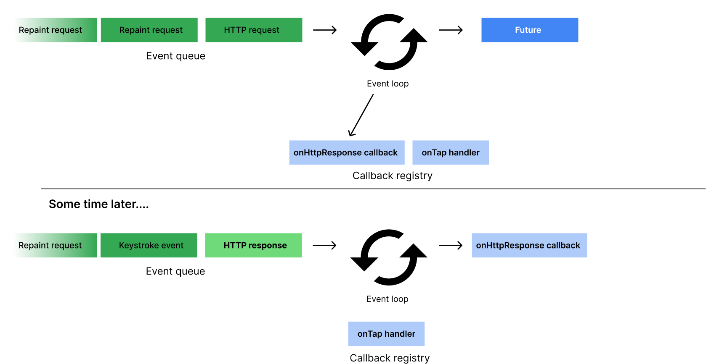
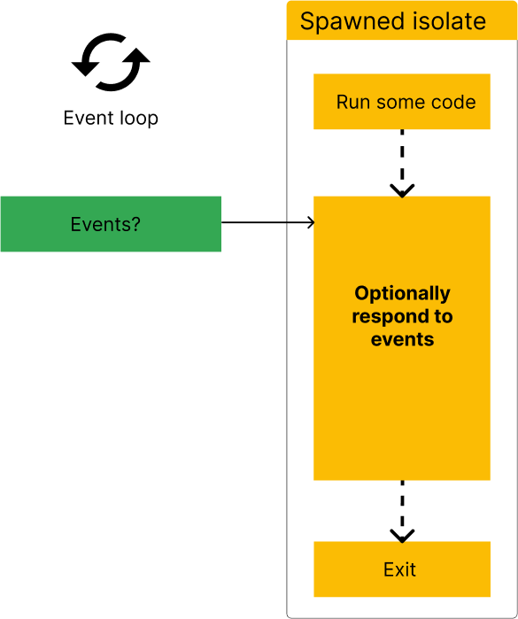

+++
title = "Dart 中的并发：概览"
date = 2024-01-05T20:29:36+08:00
weight = 1
type = "docs"
description = ""
isCJKLanguage = true
draft = false
+++

> 原文: [https://dart.dev/language/concurrency](https://dart.dev/language/concurrency)

## Concurrency in Dart  - Dart 中的并发

This page contains a conceptual overview of how concurrent programming works in Dart. It explains the event-loop, async language features, and isolates from a high-level. For more practical code examples of using concurrency in Dart, read the [Asynchrony support](https://dart.dev/language/async) page and [Isolates](https://dart.dev/language/isolates) page.

​	此页面包含有关 Dart 中并发编程工作原理的概念性概述。它从高层次解释了事件循环、异步语言特性和隔离。有关在 Dart 中使用并发性的更实用代码示例，请阅读异步支持页面和隔离页面。

Concurrent programming in Dart refers to both asynchronous APIs, like `Future` and `Stream`, and *isolates*, which allow you to move processes to separate cores.

​	Dart 中的并发编程是指异步 API，例如 `Future` 和 `Stream` ，以及允许您将进程移动到单独内核的隔离。

All Dart code runs in isolates, starting in the default main isolate, and optionally expanding to whatever subsequent isolates you explicitly create. When you spawn a new isolate, it has its own isolated memory, and its own event loop. The event loop is what makes asynchronous and concurrent programming possible in Dart.

​	所有 Dart 代码都在隔离中运行，从默认主隔离开始，并根据需要扩展到您显式创建的任何后续隔离。当您生成新的隔离时，它有自己的隔离内存和自己的事件循环。事件循环是使 Dart 中的异步和并发编程成为可能的原因。

## 事件循环 Event Loop 

Dart’s runtime model is based on an event loop. The event loop is responsible for executing your program’s code, collecting and processing events, and more.

​	Dart 的运行时模型基于事件循环。事件循环负责执行程序的代码、收集和处理事件等。

As your application runs, all events are added to a queue, called the *event queue*. Events can be anything from requests to repaint the UI, to user taps and keystrokes, to I/O from the disk. Because your app can’t predict what order events will happen, the event loop processes events in the order they’re queued, one at a time.

​	随着应用程序的运行，所有事件都会被添加到一个队列中，称为事件队列。事件可以是任何内容，从重新绘制 UI 的请求到用户点击和按键，再到磁盘的 I/O。由于应用程序无法预测事件发生的顺序，因此事件循环会按事件入队的顺序逐个处理事件。


The way the event loop functions resembles this code:

​	事件循环的工作方式类似于以下代码：

```
while (eventQueue.waitForEvent()) {
  eventQueue.processNextEvent();
}
```

This example event loop is synchronous and runs on a single thread. However, most Dart applications need to do more than one thing at a time. For example, a client application might need to execute an HTTP request, while also listening for a user to tap a button. To handle this, Dart offers many async APIs, like [Futures, Streams, and async-await](https://dart.dev/language/async). These APIs are built around this event loop.

​	此示例事件循环是同步的，并且在单个线程上运行。但是，大多数 Dart 应用程序需要一次执行多项任务。例如，客户端应用程序可能需要执行 HTTP 请求，同时还要监听用户点击按钮。为了处理这种情况，Dart 提供了许多异步 API，例如 Futures、Streams 和 async-await。这些 API 都是围绕此事件循环构建的。

For example, consider making a network request:

​	例如，考虑发出网络请求：

```
http.get('https://example.com').then((response) {
  if (response.statusCode == 200) {
    print('Success!')'
  }  
}
```

When this code reaches the event loop, it immediately calls the first clause, `http.get`, and returns a `Future`. It also tells the event loop to hold onto the callback in the `then()` clause until the HTTP request resolves. When that happens, it should execute that callback, passing the result of the request as an argument.

​	当此代码到达事件循环时，它会立即调用第一个子句 `http.get` ，并返回一个 `Future` 。它还告诉事件循环在 HTTP 请求解析之前，将回调保留在 `then()` 子句中。发生这种情况时，它应执行该回调，并将请求的结果作为参数传递。



This same model is generally how the event loop handles all other asynchronous events in Dart, such as [`Stream`](https://api.dart.dev/stable/dart-async/Stream-class.html) objects.

​	这种相同的模型通常是事件循环处理 Dart 中所有其他异步事件的方式，例如 `Stream` 对象。

## 异步编程 Asynchronous programming 

This section summarizes the different types and syntaxes of asynchronous programming in Dart. If you’re already familiar with `Future`, `Stream`, and async-await, then you can skip ahead to the [isolates section](https://dart.dev/language/concurrency#isolates).

​	本部分总结了 Dart 中异步编程的不同类型和语法。如果您已经熟悉 `Future` 、 `Stream` 和 async-await，则可以跳至隔离部分。

### Futures Future

A `Future` represents the result of an asynchronous operation that will eventually complete with a value or an error.

​	`Future` 表示最终将完成并带有值或错误的异步操作的结果。

In this sample code, the return type of `Future<String>` represents a promise to eventually provide a `String` value (or error).

​	在此示例代码中， `Future<String>` 的返回类型表示最终提供 `String` 值（或错误）的承诺。

```dart
Future<String> _readFileAsync(String filename) {
  final file = File(filename);

  // .readAsString() returns a Future.
  // .then() registers a callback to be executed when `readAsString` resolves.
  return file.readAsString().then((contents) {
    return contents.trim();
  });
}
```

### async-await 语法 The async-await syntax 

The `async` and `await` keywords provide a declarative way to define asynchronous functions and use their results.

​	`async` 和 `await` 关键字提供了一种声明方式来定义异步函数并使用其结果。

Here’s an example of some synchronous code that blocks while waiting for file I/O:

​	下面是同步代码的一个示例，该代码在等待文件 I/O 时会阻塞：

```dart
const String filename = 'with_keys.json';

void main() {
  // Read some data.
  final fileData = _readFileSync();
  final jsonData = jsonDecode(fileData);

  // Use that data.
  print('Number of JSON keys: ${jsonData.length}');
}

String _readFileSync() {
  final file = File(filename);
  final contents = file.readAsStringSync();
  return contents.trim();
}
```

Here’s similar code, but with changes (highlighted) to make it asynchronous:

​	以下是类似的代码，但进行了更改（突出显示）以使其异步：

```dart
const String filename = 'with_keys.json';

void main() async {
  // Read some data.
  final fileData = await _readFileAsync();
  final jsonData = jsonDecode(fileData);

  // Use that data.
  print('Number of JSON keys: ${jsonData.length}');
}

Future<String> _readFileAsync() async {
  final file = File(filename);
  final contents = await file.readAsString();
  return contents.trim();
}
```

The `main()` function uses the `await` keyword in front of `_readFileAsync()` to let other Dart code (such as event handlers) use the CPU while native code (file I/O) executes. Using `await` also has the effect of converting the `Future<String>` returned by `_readFileAsync()` into a `String`. As a result, the `contents` variable has the implicit type `String`.

​	函数 `main()` 在 `_readFileAsync()` 前面使用 `await` 关键字，以便其他 Dart 代码（例如事件处理程序）在执行本机代码（文件 I/O）时使用 CPU。使用 `await` 还会将 `_readFileAsync()` 返回的 `Future<String>` 转换为 `String` 。因此， `contents` 变量具有隐式类型 `String` 。

*info* **Note:** The `await` keyword works only in functions that have `async` before the function body.

​	注意： `await` 关键字仅在函数体前带有 `async` 的函数中有效。

As the following figure shows, the Dart code pauses while `readAsString()` executes non-Dart code, in either the Dart runtime or the operating system. Once `readAsString()` returns a value, Dart code execution resumes.

​	如下图所示，Dart 代码在 `readAsString()` 在 Dart 运行时或操作系统中执行非 Dart 代码时暂停。一旦 `readAsString()` 返回一个值，Dart 代码执行就会恢复。


### 流 Streams 

Dart also supports asynchronous code in the form of streams. Streams provide values in the future and repeatedly over time. A promise to provide a series of `int` values over time has the type `Stream<int>`.

​	Dart 还以流的形式支持异步代码。流在未来和一段时间内反复提供值。随着时间的推移提供一系列 `int` 值的承诺具有类型 `Stream<int>` 。

In the following example, the stream created with `Stream.periodic` repeatedly emits a new `int` value every second.

​	在以下示例中，使用 `Stream.periodic` 创建的流每秒重复发出一个新的 `int` 值。

```dart
Stream<int> stream = Stream.periodic(const Duration(seconds: 1), (i) => i * i);
```

#### await-for 和 yield

Await-for is a type of for loop that executes each subsequent iteration of the loop as new values are provided. In other words, it’s used to “loop over” streams. In this example, a new value will be emitted from the function `sumStream` as new values are emitted from the stream that’s provided as an argument. The `yield` keyword is used rather than `return` in functions that return streams of values.

​	await-for 是一种 for 循环，它在提供新值时执行循环的每次后续迭代。换句话说，它用于“循环处理”流。在此示例中，当作为参数提供的流发出新值时，函数 `sumStream` 将发出新值。在返回值流的函数中使用 `yield` 关键字，而不是 `return` 。

```dart
Stream<int> sumStream(Stream<int> stream) async* {
  var sum = 0;
  await for (final value in stream) {
    yield sum += value;
  }
}
```

If you’d like to learn more about using `async`, `await`, `Stream`s and `Future`s, visit the [asynchronous programming codelab](https://dart.dev/codelabs/async-await).

​	如果您想详细了解如何使用 `async` 、 `await` 、 `Stream` 和 `Future` ，请访问异步编程代码实验室。

## 隔离 Isolates 

Dart supports concurrency via isolates, in addition to [asynchronous APIs](https://dart.dev/language/concurrency#asynchronous-programming). Most modern devices have multi-core CPUs. To take advantage of multiple cores, developers sometimes use shared-memory threads running concurrently. However, shared-state concurrency is [error prone](https://en.wikipedia.org/wiki/Race_condition#In_software) and can lead to complicated code.

​	除了异步 API 之外，Dart 还通过隔离支持并发性。大多数现代设备都具有多核 CPU。为了利用多个内核，开发人员有时会使用同时运行的共享内存线程。但是，共享状态并发容易出错，并且可能导致代码复杂。

Instead of threads, all Dart code runs inside isolates. Using isolates, your Dart code can perform multiple independent tasks at once. Isolates are like threads or processes, but each isolate has its own memory and a single thread running an event loop.

​	所有 Dart 代码都在隔离中运行，而不是线程。使用隔离，您的 Dart 代码可以一次执行多个独立的任务。隔离类似于线程或进程，但每个隔离都有自己的内存和一个运行事件循环的单线程。

Each isolate has its own global fields, ensuring that none of the state in an isolate is accessible from any other isolate. Isolates can only communicate to each other via message passing. No shared state between isolates means concurrency complexities like [mutexes or locks](https://en.wikipedia.org/wiki/Lock_(computer_science)) and [data races](https://en.wikipedia.org/wiki/Race_condition#Data_race) won’t occur in Dart. That said, isolates don’t prevent race conditions all together. For more information on this concurrency model, read about the [Actor model](https://en.wikipedia.org/wiki/Actor_model).

​	每个隔离都有自己的全局字段，确保无法从任何其他隔离访问隔离中的任何状态。隔离只能通过消息传递相互通信。隔离之间没有共享状态意味着在 Dart 中不会出现诸如互斥锁或锁以及数据竞争之类的并发复杂性。也就是说，隔离并不能完全防止竞争条件。有关此并发模型的更多信息，请阅读 Actor 模型。

Using isolates, your Dart code can perform multiple independent tasks at once, using additional processor cores if they’re available. Isolates are like threads or processes, but each isolate has its own memory and a single thread running an event loop.

​	使用隔离，您的 Dart 代码可以同时执行多个独立的任务，如果可用，可以使用其他处理器内核。隔离就像线程或进程，但每个隔离都有自己的内存和一个运行事件循环的单线程。

*info* **Platform note:** Only the [Dart Native platform](https://dart.dev/overview#platform) implements isolates. To learn more about the Dart Web platform, see the [Concurrency on the web](https://dart.dev/language/concurrency#concurrency-on-the-web) section.

​	平台说明：只有 Dart Native 平台实现了隔离。要详细了解 Dart Web 平台，请参阅 Web 上的并发部分。

### 主隔离 The main isolate 

In most cases, you don’t need to think about isolates at all. Dart programs run in the main isolate by default. It’s the thread where a program starts to run and execute, as shown in the following figure:

​	在大多数情况下，您根本不需要考虑隔离。默认情况下，Dart 程序在主隔离中运行。它是程序开始运行和执行的线程，如下图所示：


Even single-isolate programs can execute smoothly. Before continuing to the next line of code, these apps use [async-await](https://dart.dev/codelabs/async-await) to wait for asynchronous operations to complete. A well-behaved app starts quickly, getting to the event loop as soon as possible. The app then responds to each queued event promptly, using asynchronous operations as necessary.

​	即使是单隔离程序也能顺利执行。在继续执行下一行代码之前，这些应用使用 async-await 等待异步操作完成。表现良好的应用启动迅速，尽快进入事件循环。然后，该应用使用异步操作（如有必要）及时响应每个排队的事件。

### 隔离生命周期 The isolate life cycle 

As the following figure shows, every isolate starts by running some Dart code, such as the `main()` function. This Dart code might register some event listeners—to respond to user input or file I/O, for example. When the isolate’s initial function returns, the isolate stays around if it needs to handle events. After handling the events, the isolate exits.

​	如下图所示，每个隔离通过运行一些 Dart 代码（例如 `main()` 函数）启动。此 Dart 代码可能会注册一些事件侦听器，例如响应用户输入或文件 I/O。当隔离的初始函数返回时，如果需要处理事件，则隔离会继续存在。处理完事件后，隔离退出。



### 事件处理 Event handling 

In a client app, the main isolate’s event queue might contain repaint requests and notifications of tap and other UI events. For example, the following figure shows a repaint event, followed by a tap event, followed by two repaint events. The event loop takes events from the queue in first in, first out order.

​	在客户端应用中，主隔离的事件队列可能包含重新绘制请求以及点击和其他 UI 事件的通知。例如，下图显示了一个重新绘制事件，后跟一个点击事件，再后跟两个重新绘制事件。事件循环按先进先出的顺序从队列中获取事件。


Event handling happens on the main isolate after `main()` exits. In the following figure, after `main()` exits, the main isolate handles the first repaint event. After that, the main isolate handles the tap event, followed by a repaint event.

​	事件处理在 `main()` 退出后发生在主隔离区。在下图中，在 `main()` 退出后，主隔离区处理第一个重绘事件。之后，主隔离区处理点击事件，然后是重绘事件。

If a synchronous operation takes too much processing time, the app can become unresponsive. In the following figure, the tap-handling code takes too long, so subsequent events are handled too late. The app might appear to freeze, and any animation it performs might be jerky.

​	如果同步操作占用过多的处理时间，应用可能会变得无响应。在下图中，点击处理代码占用时间过长，因此后续事件处理得太晚。应用可能看起来冻结了，并且它执行的任何动画都可能不流畅。


In client apps, the result of a too-lengthy synchronous operation is often [janky (non-smooth) UI animation](https://docs.flutter.dev/perf/rendering-performance). Worse, the UI might become completely unresponsive.

​	在客户端应用中，同步操作时间过长通常会导致不流畅的 UI 动画。更糟糕的是，UI 可能会完全无响应。

### 后台工作线程 Background workers 

If your app’s UI becomes unresponsive due to a time-consuming computation—[parsing a large JSON file](https://docs.flutter.dev/cookbook/networking/background-parsing), for example—consider offloading that computation to a worker isolate, often called a *background worker.* A common case, shown in the following figure, is spawning a simple worker isolate that performs a computation and then exits. The worker isolate returns its result in a message when it exits.

​	如果您的应用的 UI 因耗时的计算（例如解析大型 JSON 文件）而变得无响应，请考虑将该计算卸载到工作线程隔离区，通常称为后台工作线程。一个常见的情况（如下图所示）是生成一个简单的执行计算然后退出的工作线程隔离区。工作线程隔离区在退出时通过消息返回其结果。


A worker isolate can perform I/O (reading and writing files, for example), set timers, and more. It has its own memory and doesn’t share any state with the main isolate. The worker isolate can block without affecting other isolates.

​	工作者隔离可以执行 I/O（例如，读取和写入文件）、设置计时器等。它有自己的内存，并且不与主隔离共享任何状态。工作者隔离可以阻塞，而不会影响其他隔离。

### 使用隔离 Using isolates 

There are two ways to work with isolates in Dart, depending on the use-case:

​	在 Dart 中，有两种方法可以处理隔离，具体取决于用例：

- Use [`Isolate.run()`](https://api.dart.dev/stable/dart-isolate/Isolate/run.html) to perform a single computation on a separate thread.
- 使用 `Isolate.run()` 在单独的线程上执行单个计算。
- Use [`Isolate.spawn()`](https://api.dart.dev/stable/dart-isolate/Isolate/spawn.html) to create an isolate that will handle multiple messages over time, or a background worker. For more information on working with long-lived isolates, read the [Isolates](https://dart.dev/language/isolates) page.
- 使用 `Isolate.spawn()` 创建一个隔离，该隔离会随着时间的推移处理多条消息，或一个后台工作者。有关处理长期隔离的更多信息，请阅读隔离页。

In most cases, `Isolate.run` is the recommended API to run processes in the background.

​	在大多数情况下， `Isolate.run` 是在后台运行进程的推荐 API。

#### `Isolate.run()`

The static `Isolate.run()` method requires one argument: a callback that will be run on the newly spawned isolate.

​	静态 `Isolate.run()` 方法需要一个参数：将在新生成的隔离上运行的回调。

```dart
int slowFib(int n) => n <= 1 ? 1 : slowFib(n - 1) + slowFib(n - 2);

// Compute without blocking current isolate.
void fib40() async {
  var result = await Isolate.run(() => slowFib(40));
  print('Fib(40) = $result');
}
```

### 性能和隔离组 Performance and isolate groups 

When an isolate calls [`Isolate.spawn()`](https://api.dart.dev/stable/dart-isolate/Isolate/spawn.html), the two isolates have the same executable code and are in the same *isolate group*. Isolate groups enable performance optimizations such as sharing code; a new isolate immediately runs the code owned by the isolate group. Also, `Isolate.exit()` works only when the isolates are in the same isolate group.

​	当一个隔离调用 `Isolate.spawn()` 时，这两个隔离具有相同的可执行代码，并且位于同一个隔离组中。隔离组支持性能优化，例如共享代码；新的隔离会立即运行隔离组拥有的代码。此外， `Isolate.exit()` 仅在隔离位于同一个隔离组中时才起作用。

In some special cases, you might need to use [`Isolate.spawnUri()`](https://api.dart.dev/stable/dart-isolate/Isolate/spawnUri.html), which sets up the new isolate with a copy of the code that’s at the specified URI. However, `spawnUri()` is much slower than `spawn()`, and the new isolate isn’t in its spawner’s isolate group. Another performance consequence is that message passing is slower when isolates are in different groups.

​	在某些特殊情况下，您可能需要使用 `Isolate.spawnUri()` ，它会使用指定 URI 处的代码副本设置新的隔离区。但是， `spawnUri()` 比 `spawn()` 慢得多，并且新的隔离区不在其生成者的隔离区组中。另一个性能后果是，当隔离区位于不同的组中时，消息传递会更慢。

### 隔离区的局限性 Limitations of isolates 

#### 隔离区不是线程 Isolates aren’t threads 

If you’re coming to Dart from a language with multithreading, it’d be reasonable to expect isolates to behave like threads, but that isn’t the case. Each isolate has its own state, ensuring that none of the state in an isolate is accessible from any other isolate. Therefore, isolates are limited by their access to their own memory.

​	如果您从一种具有多线程的语言转到 Dart，那么您可能会合理地期望隔离区表现得像线程一样，但事实并非如此。每个隔离区都有自己的状态，确保隔离区中的任何状态都无法从任何其他隔离区访问。因此，隔离区受限于它们访问其自身内存的情况。

For example, if you have an application with a global mutable variable, that variable will be a separate variable in your spawned isolate. If you mutate that variable in the spawned isolate, it will remain untouched in the main isolate. This is how isolates are meant to function, and it’s important to keep in mind when you’re considering using isolates.

​	例如，如果您有一个具有全局可变变量的应用程序，那么该变量将成为您生成的隔离区中的一个单独变量。如果您在生成的隔离区中改变该变量，它在主隔离区中将保持不变。这就是隔离区应有的功能，在您考虑使用隔离区时务必牢记这一点。

#### 消息类型 Message types 

Messages sent via [`SendPort`](https://api.dart.dev/stable/dart-isolate/SendPort-class.html) can be almost any type of Dart object, but there are a few exceptions:

​	通过 `SendPort` 发送的消息几乎可以是任何类型的 Dart 对象，但有一些例外情况：

- Objects with native resources, such as [`Socket`](https://api.dart.dev/stable/dart-io/Socket-class.html).
- 具有本机资源的对象，例如 `Socket` 。
- [`ReceivePort`](https://api.dart.dev/stable/dart-isolate/ReceivePort-class.html)
- [`DynamicLibrary`](https://api.dart.dev/stable/dart-ffi/DynamicLibrary-class.html)
- [`Finalizable`](https://api.dart.dev/stable/dart-ffi/Finalizable-class.html)
- [`Finalizer`](https://api.dart.dev/stable/dart-core/Finalizer-class.html)
- [`NativeFinalizer`](https://api.dart.dev/stable/dart-ffi/NativeFinalizer-class.html)
- [`Pointer`](https://api.dart.dev/stable/dart-ffi/Pointer-class.html)
- [`UserTag`](https://api.dart.dev/stable/dart-developer/UserTag-class.html)
- Instances of classes that are marked with `@pragma('vm:isolate-unsendable')`
- 标记为 `@pragma('vm:isolate-unsendable')` 的类的实例

Apart from those exceptions, any object can be sent. Check out the [`SendPort.send`](https://api.dart.dev/stable/dart-isolate/SendPort/send.html) documentation for more information.

​	除了这些例外情况，任何对象都可以发送。有关更多信息，请查看 `SendPort.send` 文档。

Note that `Isolate.spawn()` and `Isolate.exit()` abstract over `SendPort` objects, so they’re subject to the same limitations.

​	请注意， `Isolate.spawn()` 和 `Isolate.exit()` 对 `SendPort` 对象进行抽象，因此它们受到相同的限制。


## Web 上的并发 Concurrency on the web 

All Dart apps can use `async-await`, `Future`, and `Stream` for non-blocking, interleaved computations. The [Dart web platform](https://dart.dev/overview#platform), however, does not support isolates. Dart web apps can use [web workers](https://developer.mozilla.org/docs/Web/API/Web_Workers_API/Using_web_workers) to run scripts in background threads similar to isolates. Web workers’ functionality and capabilities differ somewhat from isolates, though.

​	所有 Dart 应用都可以使用 `async-await` 、 `Future` 和 `Stream` 进行非阻塞、交错计算。但是，Dart Web 平台不支持隔离。Dart Web 应用可以使用 Web 工作线程在后台线程中运行脚本，类似于隔离。不过，Web 工作线程的功能和能力与隔离略有不同。

For instance, when web workers send data between threads, they copy the data back and forth. Data copying can be very slow, though, especially for large messages. Isolates do the same, but also provide APIs that can more efficiently *transfer* the memory that holds the message instead.

​	例如，当 Web 工作线程在各个线程之间发送数据时，它们会来回复制数据。但是，数据复制可能非常慢，尤其是对于较大的消息。隔离也会执行相同的操作，但还提供了可以更有效地传输保存消息的内存的 API。

Creating web workers and isolates also differs. You can only create web workers by declaring a separate program entrypoint and compiling it separately. Starting a web worker is similar to using `Isolate.spawnUri` to start an isolate. You can also start an isolate with `Isolate.spawn`, which requires fewer resources because it [reuses some of the same code and data](https://dart.dev/language/concurrency#performance-and-isolate-groups) as the spawning isolate. Web workers don’t have an equivalent API.

​	创建 Web 工作线程和隔离也存在差异。您只能通过声明单独的程序入口点并单独编译它来创建 Web 工作线程。启动 Web 工作线程类似于使用 `Isolate.spawnUri` 启动隔离。您还可以使用 `Isolate.spawn` 启动隔离，它需要的资源更少，因为它会重复使用与生成隔离相同的某些代码和数据。Web 工作线程没有等效的 API。

## 其他资源 Additional resources 

- If you’re using many isolates, consider the [`IsolateNameServer`](https://api.flutter.dev/flutter/dart-ui/IsolateNameServer-class.html) in Flutter, or [`package:isolate_name_server`](https://pub.dev/packages/isolate_name_server) that provides similar functionality for non-Flutter Dart applications.
- 如果您使用多个隔离，请考虑 Flutter 中的 `IsolateNameServer` ，或 `package:isolate_name_server` ，它为非 Flutter Dart 应用程序提供类似的功能。
- Read more about [Actor model](https://en.wikipedia.org/wiki/Actor_model), which Dart’s isolates are based on.
- 阅读有关 Actor 模型的更多信息，Dart 的隔离基于该模型。
- Additional documentation on `Isolate` APIs:
- 有关 `Isolate` API 的其他文档：
  - [`Isolate.exit()`](https://api.dart.dev/stable/dart-isolate/Isolate/exit.html)
  - [`Isolate.spawn()`](https://api.dart.dev/stable/dart-isolate/Isolate/spawn.html)
  - [`ReceivePort`](https://api.dart.dev/stable/dart-isolate/ReceivePort-class.html)
  - [`SendPort`](https://api.dart.dev/stable/dart-isolate/SendPort-class.html)
