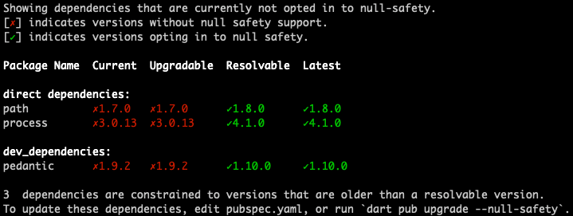

+++
title = "Migrating to null safety"
date = 2024-01-05T20:29:36+08:00
weight = 10
type = "docs"
description = ""
isCJKLanguage = true
draft = false
+++

> 原文: [https://dart.dev/null-safety/migration-guide](https://dart.dev/null-safety/migration-guide)

# Migrating to null safety 迁移到空安全

*merge_type* **Version note:** Dart 2.19 is the final release that supports null-safety migration, including the `dart migrate` tool. To migrate your package to null safety, use the Dart 2.19.6 SDK. To learn more, see [Dart 3 and null safety](https://dart.dev/null-safety#dart-3-and-null-safety).
版本说明：Dart 2.19 是支持空安全迁移的最终版本，包括 `dart migrate` 工具。要将软件包迁移到空安全，请使用 Dart 2.19.6 SDK。要了解更多信息，请参阅 Dart 3 和空安全。

This page describes how and when to migrate your code to [null safety](https://dart.dev/null-safety). Here are the basic steps for migrating each package that you own:
此页面介绍如何以及何时将代码迁移到空安全。以下是迁移您拥有的每个软件包的基本步骤：

1. [**Wait**](https://dart.dev/null-safety/migration-guide#step1-wait) for the packages that you depend on to migrate.
   等待您依赖的软件包进行迁移。
2. [**Migrate**](https://dart.dev/null-safety/migration-guide#step2-migrate) your package’s code, preferably using the interactive migration tool.
   最好使用交互式迁移工具迁移软件包的代码。
3. [**Statically analyze**](https://dart.dev/null-safety/migration-guide#step3-analyze) your package’s code.
   静态分析软件包的代码。
4. [**Test**](https://dart.dev/null-safety/migration-guide#step4-test) to make sure your changes work.
   测试以确保更改有效。
5. If the package is already on pub.dev, [**publish**](https://dart.dev/null-safety/migration-guide#step5-publish) the null-safe version as a **prerelease** version.
   如果软件包已在 pub.dev 上，请将空安全版本发布为预发布版本。

*tips_and_updates* **Tip:** If your application or library is large, check out [Gradual null safety migration for large Dart projects](https://medium.com/dartlang/gradual-null-safety-migration-for-large-dart-projects-85acb10b64a9).
提示：如果您的应用程序或库很大，请查看针对大型 Dart 项目的逐步空安全迁移。

*info* **Migrating an app is technically the same as migrating a package.** Before migrating an app, make sure that all of your dependencies are ready.
从技术上讲，迁移应用与迁移软件包相同。在迁移应用之前，请确保所有依赖项都已就绪。

To get an informal look at the experience of using the migration tool, watch this video:
要非正式地了解使用迁移工具的体验，请观看此视频：

<iframe width="560" height="315" title="Learn about the null-safety migration tool" src="https://www.youtube.com/embed/eBr5tlumwlg" frameborder="0" allow="accelerometer; autoplay; clipboard-write; encrypted-media; gyroscope; picture-in-picture; web-share" allowfullscreen="" loading="lazy" style="box-sizing: border-box; color: rgb(33, 33, 33); font-family: &quot;Google Sans Text&quot;, Roboto, sans-serif; font-size: 16px; font-style: normal; font-variant-ligatures: normal; font-variant-caps: normal; font-weight: 400; letter-spacing: normal; orphans: 2; text-align: left; text-indent: 0px; text-transform: none; widows: 2; word-spacing: 0px; -webkit-text-stroke-width: 0px; white-space: normal; background-color: rgb(255, 255, 255); text-decoration-thickness: initial; text-decoration-style: initial; text-decoration-color: initial;"></iframe>


## 1. Wait to migrate 1. 等待迁移

We strongly recommend migrating code in order, with the leaves of the dependency graph being migrated first. For example, if package C depends on package B, which depends on package A, then A should be migrated to null safety first, then B, then C.
我们强烈建议按顺序迁移代码，首先迁移依赖关系图的叶子节点。例如，如果软件包 C 依赖于软件包 B，而软件包 B 依赖于软件包 A，则应首先将 A 迁移到空安全，然后是 B，最后是 C。


Although you [*can* migrate](https://dart.dev/null-safety/unsound-null-safety) before your dependencies support null safety, you might have to change your code when your dependencies migrate. For example, if you predict that a function will take a nullable parameter but the package migrates it to be non-nullable, then passing a nullable argument becomes a compile error.
虽然您可以在依赖项支持空安全之前进行迁移，但当依赖项迁移时，您可能必须更改代码。例如，如果您预测某个函数将采用可空参数，但软件包将其迁移为不可空，那么传递可空参数将成为编译错误。

*info* **You can—and should—migrate your package before packages that depend on it are migrated.** Your null-safe package is usable by packages and apps that don’t use null safety yet, as long as they use Dart 2.12 or later. For example, the Dart and Flutter core libraries are null safe, and they’re still usable by apps that haven’t migrated to null safety.
您可以在依赖它的软件包迁移之前迁移您的软件包，而且应该这样做。只要使用 Dart 2.12 或更高版本，您的空安全软件包就可以被尚未使用空安全的软件包和应用使用。例如，Dart 和 Flutter 核心库是空安全的，并且仍然可以被尚未迁移到空安全的应用使用。

This section tells you how to check and update your package’s dependencies, with the help of the `dart pub outdated` command in null-safety mode. The instructions assume your code is under **source control**, so that you can easily undo any changes.
本部分将告诉您如何在空安全模式下借助 `dart pub outdated` 命令检查和更新软件包的依赖项。这些说明假设您的代码处于源代码控制之下，以便您可以轻松地撤消任何更改。


### Switch to the Dart 2.19.6 release 切换到 Dart 2.19.6 版本

Switch to the **2.19.6 release** of the Dart SDK. This is included in the Flutter 3.7.12 SDK.
切换到 Dart SDK 的 2.19.6 版本。这包含在 Flutter 3.7.12 SDK 中。

Check that you have Dart 2.19.6:
检查您是否具有 Dart 2.19.6：

```
$ dart --version
Dart SDK version: 2.19.6
```

### Check dependency status 检查依赖项状态

Get the migration state of your package’s dependencies, using the following command:
使用以下命令获取软件包依赖项的迁移状态：

```
$ dart pub outdated --mode=null-safety
```

If the output says that all the packages support null safety, then you can start migrating. Otherwise, use the **Resolvable** column to find null-safe releases, if they exist.
如果输出显示所有软件包都支持空安全，则可以开始迁移。否则，使用可解析列查找空安全版本（如果存在）。

*info* **Why do all dependencies need to support null safety?** When all of an app’s direct dependencies support null safety, you can *run the app* with sound null safety. When all the dev dependencies support null safety, you can *run tests* with sound null safety. You might also need null-safe dev dependencies for other reasons, such as code generation.
为什么所有依赖项都需要支持空安全？当应用程序的所有直接依赖项都支持空安全时，您可以运行具有健全空安全的应用程序。当所有开发依赖项都支持空安全时，您可以运行具有健全空安全的测试。您可能还需要空安全的开发依赖项，原因包括代码生成等。

Here’s an example of the output for a simple package. The green checkmarked version for each package supports null safety:
以下是一个简单软件包的输出示例。每个软件包的绿色复选标记版本支持空安全：



The output shows that all of the package’s dependencies have resolvable prereleases that support null safety.
输出显示软件包的所有依赖项都具有可解决的支持空安全的预发布版本。

If any of your package’s dependencies *don’t* yet support null safety, we encourage you to reach out to the package owner. You can find contact details on the package page on [pub.dev](https://pub.dev/).
如果软件包的任何依赖项尚不支持空安全，我们建议您联系软件包所有者。您可以在 pub.dev 上的软件包页面上找到联系方式。

### Update dependencies 更新依赖项

Before migrating your package’s code, update its dependencies to null-safe versions:
在迁移软件包的代码之前，请将其依赖项更新为支持空安全的版本：

1. Run `dart pub upgrade --null-safety` to upgrade to the latest versions supporting null safety. **Note:** This command changes your `pubspec.yaml` file.
   运行 `dart pub upgrade --null-safety` 以升级到支持空安全的最新版本。注意：此命令会更改您的 `pubspec.yaml` 文件。
2. Run `dart pub get`.
   运行 `dart pub get` 。

## 2. Migrate 2. 迁移

Most of the changes that your code needs to be null safe are easily predictable. For example, if a variable can be `null`, [its type needs a `?` suffix](https://dart.dev/null-safety#creating-variables). If a named parameter shouldn’t be nullable, mark it [`required`](https://dart.dev/null-safety/understanding-null-safety#required-named-parameters) or give it a [default value](https://dart.dev/language/functions#default-parameters).
大部分需要进行空安全检查的代码更改都很容易预测。例如，如果变量可以为 `null` ，则其类型需要一个 `?` 后缀。如果命名参数不应为可空，请将其标记为 `required` 或为其提供默认值。

You have two options for migrating:
您有两种迁移方式：

- [Use the migration tool](https://dart.dev/null-safety/migration-guide#migration-tool), which can make most of the easily predictable changes for you.
  使用迁移工具，它可以为您进行大部分容易预测的更改。
- [Migrate your code by hand.
  手动迁移代码。](https://dart.dev/null-safety/migration-guide#migrating-by-hand)

*tips_and_updates* **Tip:** For additional help while migrating code, check the [null safety FAQ](https://dart.dev/null-safety/faq).
提示：如需在迁移代码时获得其他帮助，请查看空安全常见问题解答。

### Using the migration tool 使用迁移工具

The migration tool takes a package of null-unsafe Dart code and converts it to null safety. You can guide the tool’s conversion by adding [hint markers](https://dart.dev/null-safety/migration-guide#hint-markers) to your Dart code.
迁移工具获取一个空不安全的 Dart 代码包并将其转换为空安全。您可以通过向 Dart 代码添加提示标记来指导工具的转换。

Before starting the tool, make sure you’re ready:
在启动工具之前，请确保您已准备好：

- Use the 2.19.6 release of the Dart SDK.
  使用 Dart SDK 的 2.19.6 版本。
- Use `dart pub outdated --mode=null-safety` to make sure that all dependencies are null safe and up-to-date.
  使用 `dart pub outdated --mode=null-safety` 确保所有依赖项都是空安全且最新的。

Start the migration tool by running the `dart migrate` command in the directory that contains the package’s `pubspec.yaml` file:
通过在包含软件包的 `pubspec.yaml` 文件的目录中运行 `dart migrate` 命令启动迁移工具：

```
$ dart migrate
```

If your package is ready to migrate, then the tool produces a line like the following:
如果您的软件包已准备好迁移，则该工具会生成类似以下内容的行：

```
View the migration suggestions by visiting:

  http://127.0.0.1:60278/Users/you/project/mypkg.console-simple?authToken=Xfz0jvpyeMI%3D
```

Visit that URL in a Chrome browser to see an interactive UI where you can guide the migration process:
在 Chrome 浏览器中访问该 URL，以查看一个交互式 UI，您可以在其中指导迁移过程：


For every variable and type annotation, you can see what nullability the tool infers. For example, in the preceding screenshot, the tool infers that the `ints` list (previously a list of `int`) in line 1 is nullable, and thus should be a list of `int?`.
对于每个变量和类型注释，您可以看到工具推断出的可空性。例如，在前面的屏幕截图中，该工具推断出第 1 行中的 `ints` 列表（以前是 `int` 列表）是可空的，因此应为 `int?` 列表。

#### Understanding migration results 了解迁移结果

To see the reasons for each change (or non-change), click its line number in the **Proposed Edits** pane. The reasons appear in the **Edit Details** pane.
要查看每个更改（或未更改）的原因，请在“建议的编辑”窗格中单击其行号。原因显示在“编辑详细信息”窗格中。

For example, consider the following code, from before null safety:
例如，考虑以下代码，来自空安全之前：

```
var ints = const <int>[0, null];
var zero = ints[0];
var one = zero + 1;
var zeroOne = <int>[zero, one];
```

The default migration when this code is outside a function (it’s different within a function) is backward compatible but not ideal:
当此代码位于函数外部时（函数内部不同），默认迁移向后兼容，但并不理想：

```
var ints = const <int?>[0, null];
var zero = ints[0];
var one = zero! + 1;
var zeroOne = <int?>[zero, one];
```

By clicking the **line 3** link, you can see the migration tool’s reasons for adding the `!`. Because you know that `zero` can’t be null, you can improve the migration result.
通过单击第 3 行链接，您可以看到迁移工具添加 `!` 的原因。因为您知道 `zero` 不能为 null，所以您可以改进迁移结果。

#### Improving migration results 改进迁移结果

When analysis infers the wrong nullability, you can override its proposed edits by inserting temporary hint markers:
当分析推断出错误的可空性时，您可以通过插入临时提示标记来覆盖其建议的编辑：

- In the **Edit Details** pane of the migration tool, you can insert hint markers using the **Add `/\*?\*/` hint** and **Add `/\*!\*/` hint** buttons.
  在迁移工具的“编辑详细信息”窗格中，您可以使用“添加 `/*?*/` 提示”和“添加 `/*!*/` 提示”按钮插入提示标记。

  These buttons add comments to your file immediately, and there’s **no Undo**. If you don’t want a hint that the tool inserted, you can use your usual code editor to remove it.
  这些按钮会立即将注释添加到您的文件中，并且没有“撤消”功能。如果您不想要工具插入的提示，可以使用常规代码编辑器将其删除。

- You can use an editor to add hint markers, even while the tool is still running. Because your code hasn’t opted into null safety yet, you can’t use new null-safety features. You can, however, make changes like refactoring that don’t depend on null-safety features.
  即使工具仍在运行，您也可以使用编辑器添加提示标记。由于您的代码尚未选择加入空安全，因此您无法使用新的空安全功能。但是，您可以进行不依赖于空安全功能的更改，例如重构。

  When you’ve finished editing your code, click **Rerun from sources** to pick up your changes.
  编辑完代码后，单击“从源重新运行”以获取您的更改。

The following table shows the hint markers that you can use to change the migration tool’s proposed edits.
下表显示了可用于更改迁移工具建议的编辑的提示标记。

| Hint marker 提示标记 | Effect on the migration tool 对迁移工具的影响                |
| -------------------- | ------------------------------------------------------------ |
| `*expression* /*!*/` | Adds a `!` to the migrated code, casting *expression* to its underlying non-nullable type. 将 `!` 添加到已迁移的代码中，将表达式强制转换为其基础的非空类型。 |
| `*type* /*!*/`       | Marks *type* as non-nullable. 将类型标记为非空。             |
| `/*?*/`              | Marks the preceding type as nullable. 将前一个类型标记为可空。 |
| `/*late*/`           | Marks the variable declaration as `late`, indicating that it has late initialization. 将变量声明标记为 `late` ，表示它具有延迟初始化。 |
| `/*late final*/`     | Marks the variable declaration as `late final`, indicating that it has late, one-time initialization. 将变量声明标记为 `late final` ，表示它具有延迟的一次性初始化。 |
| `/*required*/`       | Marks the parameter as `required`. 将参数标记为 `required` 。 |

A single hint can have ripple effects elsewhere in the code. In the example from before, manually adding a `/*!*/` marker where `zero` is assigned its value (on line 2) makes the migration tool infer the type of `zero` as `int` instead of `int?`. This type change can affect code that directly or indirectly uses `zero`.
单个提示可能会在代码的其他位置产生连锁反应。在之前的示例中，在 `zero` 分配其值（第 2 行）的位置手动添加 `/*!*/` 标记，使迁移工具将 `zero` 的类型推断为 `int` ，而不是 `int?` 。此类型更改可能会影响直接或间接使用 `zero` 的代码。

```
var zero = ints[0]/*!*/;
```

With the above hint, the migration tool changes its proposed edits, as the following code snippets show. Line 3 no longer has a `!` after `zero`, and in line 4 `zeroOne` is inferred to be a list of `int`, not `int?`.
有了上述提示，迁移工具会更改其建议的编辑，如下面的代码片段所示。第 3 行不再在 `zero` 后带有 `!` ，并且在第 4 行中，推断 `zeroOne` 是 `int` 的列表，而不是 `int?` 。

| First migration 首次迁移                                     | Migration with hint 带有提示的迁移                           |
| ------------------------------------------------------------ | ------------------------------------------------------------ |
| `var ints = const <int?>[0, null]; var zero = ints[0]; var one = zero! + 1; var zeroOne = <int?>[zero, one]; ` | `var ints = const <int?>[0, null]; var zero = ints[0]/*!*/; var one = zero + 1; var zeroOne = <int>[zero, one]; ` |

#### Opting out files 选择退出文件

Although we recommend migrating all at once, sometimes that isn’t practical, especially in a large app or package. To opt out a file or directory, click its green checkbox. Later, when you apply changes, each opted out file will be unchanged except for a 2.9 [version comment](https://dart.dev/guides/language/evolution#per-library-language-version-selection).
虽然我们建议一次性迁移所有内容，但有时这是不切实际的，尤其是在大型应用或软件包中。要选择退出某个文件或目录，请点击其绿色复选框。稍后，当您应用更改时，每个选择退出的文件都将保持不变，除了 2.9 版本注释。

For more information about incremental migration, see [Unsound null safety](https://dart.dev/null-safety/unsound-null-safety).
有关增量迁移的更多信息，请参阅不健全的空安全性。

Note that only fully migrated apps and packages are compatible with Dart 3.
请注意，只有完全迁移的应用和软件包与 Dart 3 兼容。

#### Applying changes 应用更改

When you like all of the changes that the migration tool proposes, click **Apply migration**. The migration tool deletes the hint markers and saves the migrated code. The tool also updates the minimum SDK constraint in the pubspec, which opts the package into null safety.
当您喜欢迁移工具建议的所有更改时，请点击应用迁移。迁移工具会删除提示标记并保存迁移的代码。该工具还会更新 pubspec 中的最低 SDK 约束，这会使软件包选择加入空安全性。

The next step is to [statically analyze your code](https://dart.dev/null-safety/migration-guide#step3-analyze). If it’s valid, then [test your code](https://dart.dev/null-safety/migration-guide#step4-test). Then, if you’ve published your code on pub.dev, [publish a null-safe prerelease](https://dart.dev/null-safety/migration-guide#step5-publish).
下一步是对您的代码进行静态分析。如果有效，则测试您的代码。然后，如果您已在 pub.dev 上发布了您的代码，请发布一个空安全预发布版本。

### Migrating by hand 手动迁移

If you prefer not to use the migration tool, you can migrate manually.
如果您不想使用迁移工具，则可以手动迁移。

We recommend that you **first migrate leaf libraries**—libraries that don’t import other files from the package. Then migrate libraries that directly depend on the leaf libraries. End by migrating the libraries that have the most intra-package dependencies.
我们建议您首先迁移叶库——不从软件包导入其他文件的库。然后迁移直接依赖于叶库的库。最后迁移具有最多包内依赖项的库。

For example, say you have a `lib/src/util.dart` file that imports other (null-safe) packages and core libraries, but that doesn’t have any `import '<local_path>'` directives. Consider migrating `util.dart` first, and then migrating simple files that depend only on `util.dart`. If any libraries have cyclic imports (for example, A imports B which imports C, and C imports A), consider migrating those libraries together.
例如，假设您有一个导入其他（null 安全）包和核心库的 `lib/src/util.dart` 文件，但它没有任何 `import '<local_path>'` 指令。请考虑先迁移 `util.dart` ，然后迁移仅依赖于 `util.dart` 的简单文件。如果任何库具有循环导入（例如，A 导入 B，B 导入 C，C 导入 A），请考虑一起迁移这些库。

To migrate a package by hand, follow these steps:
要手动迁移包，请按照以下步骤操作：

1. Edit the package’s `pubspec.yaml` file, setting the minimum SDK constraint to at least `2.12.0`:
   编辑包的 `pubspec.yaml` 文件，将最低 SDK 约束至少设置为 `2.12.0` ：

   ```
   environment:
     sdk: '>=2.12.0 <3.0.0'
   ```

2. Regenerate the [package configuration file](https://github.com/dart-lang/language/blob/main/accepted/2.8/language-versioning/package-config-file-v2.md):
   重新生成包配置文件：

   ```
   $ dart pub get
   ```

   Running `dart pub get` with a lower SDK constraint of at least `2.12.0` sets the default language version of every library in the package to a minimum of 2.12, opting them all in to null safety.
   使用至少为 `2.12.0` 的较低 SDK 约束运行 `dart pub get` 会将包中每个库的默认语言版本设置为至少 2.12，从而使它们全部选择加入 null 安全。

3. Open the package in your IDE.
   在 IDE 中打开包。
   You’re likely to see a lot of analysis errors. That’s OK.
   您可能会看到许多分析错误。没关系。

4. Migrate the code of each Dart file, using the analyzer to identify static errors.
   使用分析器识别静态错误，迁移每个 Dart 文件的代码。
   Eliminate static errors by adding `?`, `!`, `required`, and `late`, as needed.
   根据需要添加 `?` 、 `!` 、 `required` 和 `late` ，消除静态错误。

See [Unsound null safety](https://dart.dev/null-safety/unsound-null-safety) for more help on migrating code by hand.
有关手动迁移代码的更多帮助，请参阅不健全的空安全性。

## 3. Analyze 3. 分析

Update your packages (using `dart pub get` in your IDE or on the command line). Then use your IDE or the command line to perform [static analysis](https://dart.dev/tools/analysis) on your code:
更新您的软件包（在您的 IDE 或命令行中使用 `dart pub get` ）。然后使用您的 IDE 或命令行对您的代码执行静态分析：

```
$ dart pub get
$ dart analyze     # or `flutter analyze`
```

## 4. Test 4. 测试

If your code passes analysis, run tests:
如果您的代码通过分析，请运行测试：

```
$ dart test       # or `flutter test`
```

You might need to update tests that expect null values.
您可能需要更新期望空值测试。

If you need to make large changes to your code, then you might need to remigrate it. If so, revert your code changes before using the migration tool again.
如果您需要对代码进行重大更改，则可能需要重新迁移它。如果是这样，请在再次使用迁移工具之前还原您的代码更改。

## 5. Publish 5. 发布

We encourage you to publish packages—possibly as prereleases—as soon as you migrate:
我们鼓励您在迁移后立即发布软件包（可能作为预发布版本）：

- [Set the package version to indicate a breaking change.
  设置软件包版本以指示重大更改。](https://dart.dev/null-safety/migration-guide#package-version)
- [Update the SDK constraints and package dependencies.
  更新 SDK 约束和软件包依赖项。](https://dart.dev/null-safety/migration-guide#check-your-pubspec)
- [Publish the package](https://dart.dev/tools/pub/publishing). If you don’t consider this version to be a stable release, then [publish the package as a prerelease](https://dart.dev/tools/pub/publishing#publishing-prereleases).
  发布软件包。如果您不认为此版本是稳定版本，则将软件包发布为预发布版本。

### Update the package version 更新软件包版本

Update the version of the package to indicate a breaking change:
更新软件包版本以指示重大更改：

- If your package is already at `1.0.0` or greater, increase the major version. For example, if the previous version is `2.3.2`, the new version is `3.0.0`.
  如果您的软件包已达到 `1.0.0` 或更高版本，请增加主版本号。例如，如果之前的版本是 `2.3.2` ，则新版本是 `3.0.0` 。
- If your package hasn’t reached `1.0.0` yet, *either* increase the minor version *or* update the version to `1.0.0`. For example, if the previous version is `0.3.2`, the new version is either `0.4.0` or `1.0.0`.
  如果您的软件包尚未达到 `1.0.0` ，请增加次版本号或将版本更新为 `1.0.0` 。例如，如果之前的版本是 `0.3.2` ，则新版本是 `0.4.0` 或 `1.0.0` 。

### Check your pubspec 检查您的 pubspec

Before you publish a stable null safety version of a package, we strongly recommend following these pubspec rules:
在发布软件包的稳定空安全版本之前，我们强烈建议您遵循以下 pubspec 规则：

- Set the Dart lower SDK constraint to the lowest stable version that you’ve tested against (at least `2.12.0`).
  将 Dart 较低 SDK 约束设置为已针对其进行测试的最低稳定版本（至少 `2.12.0` ）。
- Use stable versions of all direct dependencies.
  使用所有直接依赖项的稳定版本。

## Welcome to null safety 欢迎使用 null 安全

If you made it this far, you should have a fully migrated, null-safe Dart package.
如果您已经完成了这一步，那么您应该拥有一个完全迁移的、null 安全的 Dart 包。

If all of the packages you depend on are migrated too, then your program is sound with respect to null-reference errors. You should see output like this when running or compiling your code:
如果您依赖的所有包也已迁移，那么您的程序对于 null 引用错误来说是合理的。在运行或编译代码时，您应该会看到如下输出：

```
Compiling with sound null safety
```

From all of the Dart team, *thank you* for migrating your code.
感谢 Dart 团队的所有成员迁移您的代码。
