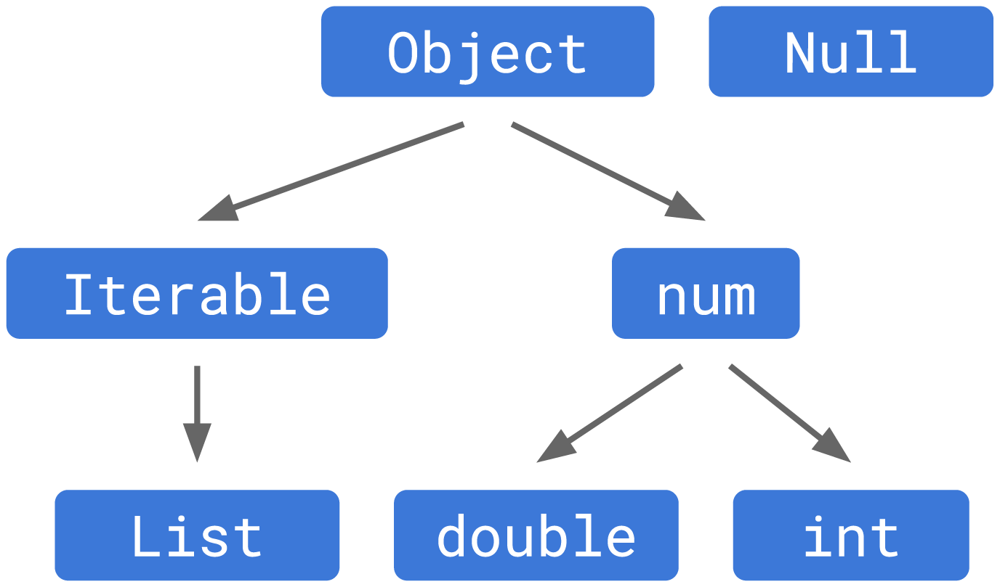

+++
title = "了解空安全性"
date = 2024-01-05T20:29:36+08:00
weight = 20
type = "docs"
description = ""
isCJKLanguage = true
draft = false
+++

> 原文: [https://dart.dev/null-safety/understanding-null-safety](https://dart.dev/null-safety/understanding-null-safety)

## Understanding null safety 了解空安全性

*Written by Bob Nystrom
作者：Bob Nystrom
July 2020
2020 年 7 月*

Null safety is the largest change we’ve made to Dart since we replaced the original unsound optional type system with [a sound static type system](https://dart.dev/language/type-system) in Dart 2.0. When Dart first launched, compile-time null safety was a rare feature needing a long introduction. Today, Kotlin, Swift, Rust, and other languages all have their own answers to what has become a very [familiar problem.](https://www.infoq.com/presentations/Null-References-The-Billion-Dollar-Mistake-Tony-Hoare/) Here is an example:
空安全是我们对 Dart 做出的最大更改，因为我们在 Dart 2.0 中用健全的静态类型系统替换了最初不健全的可选类型系统。Dart 最初发布时，编译时空安全是一个罕见的功能，需要长时间的介绍。如今，Kotlin、Swift、Rust 和其他语言都对已成为非常熟悉的问题给出了自己的答案。以下是一个示例：

```
// Without null safety:
bool isEmpty(String string) => string.length == 0;

main() {
  isEmpty(null);
}
```

If you run this Dart program without null safety, it throws a `NoSuchMethodError` exception on the call to `.length`. The `null` value is an instance of the `Null` class, and `Null` has no “length” getter. Runtime failures suck. This is especially true in a language like Dart that is designed to run on an end-user’s device. If a server application fails, you can often restart it before anyone notices. But when a Flutter app crashes on a user’s phone, they are not happy. When your users aren’t happy, you aren’t happy.
如果不使用空安全运行此 Dart 程序，它将在调用 `.length` 时抛出 `NoSuchMethodError` 异常。 `null` 值是 `Null` 类的实例，而 `Null` 没有“length”获取器。运行时故障很糟糕。在设计为在最终用户设备上运行的语言（如 Dart）中尤其如此。如果服务器应用程序发生故障，您通常可以在任何人注意到之前重新启动它。但是，当 Flutter 应用在用户的手机上崩溃时，他们会不高兴。当您的用户不高兴时，您也不会高兴。

Developers like statically-typed languages like Dart because they enable the type checker to find mistakes in code at compile time, usually right in the IDE. The sooner you find a bug, the sooner you can fix it. When language designers talk about “fixing null reference errors”, they mean enriching the static type checker so that the language can detect mistakes like the above attempt to call `.length` on a value that might be `null`.
像 Dart 这样的静态类型语言之所以受到开发人员的喜爱，是因为它们能让类型检查器在编译时发现代码中的错误，通常就在 IDE 中。发现错误越早，修复错误就越快。当语言设计者谈论“修复空引用错误”时，他们的意思是丰富静态类型检查器，以便语言能够检测到上述尝试在可能为 `null` 的值上调用 `.length` 之类的错误。

There is no one true solution to this problem. Rust and Kotlin both have their own approach that makes sense in the context of those languages. This doc walks through all the details of our answer for Dart. It includes changes to the static type system and a suite of other modifications and new language features to let you not only write null-safe code but hopefully to *enjoy* doing so.
对于此问题，没有一个真正的解决方案。Rust 和 Kotlin 都各自有自己的方法，在这些语言的上下文中很有意义。此文档详细介绍了我们针对 Dart 的答案的所有细节。它包括对静态类型系统的更改以及一系列其他修改和新语言功能，不仅让您可以编写空安全代码，而且希望您在编写时也能乐在其中。

This document is long. If you want something shorter that covers just what you need to know to get up and running, start with the [overview](https://dart.dev/null-safety). When you are ready for a deeper understanding and have the time, come back here so you can understand *how* the language handles `null`, *why* we designed it that way, and how to write idiomatic, modern, null-safe Dart. (Spoiler alert: it ends up surprisingly close to how you write Dart today.)
这份文档很长。如果您想要更简短的内容，仅涵盖您需要了解的启动和运行信息，请从概述开始。当您准备好进行更深入的了解并且有时间时，请返回此处，以便了解该语言如何处理 `null` ，我们为何采用这种设计，以及如何编写惯用、现代、null 安全的 Dart。（剧透预警：最终结果与您现在编写 Dart 的方式非常接近。）

The various ways a language can tackle null reference errors each have their pros and cons. These principles guided the choices we made:
语言处理 null 引用错误的各种方式各有优缺点。这些原则是我们做出选择时的指导原则：

- **Code should be safe by default.** If you write new Dart code and don’t use any explicitly unsafe features, it never throws a null reference error at runtime. All possible null reference errors are caught statically. If you want to defer some of that checking to runtime to get greater flexibility, you can, but you have to choose that by using some feature that is textually visible in the code.
  代码应默认安全。如果您编写新的 Dart 代码并且不使用任何明确不安全的功能，则它在运行时绝不会引发 null 引用错误。所有可能的 null 引用错误都会在静态时捕获。如果您想将其中一些检查推迟到运行时以获得更大的灵活性，您可以这样做，但您必须通过使用代码中以文本形式可见的某些功能来选择这样做。

  In other words, we aren’t giving you a life jacket and leaving it up to you to remember to put it on every time you go out on the water. Instead, we give you a boat that doesn’t sink. You stay dry unless you jump overboard.
  换句话说，我们不会给您一件救生衣，然后让您记住每次出海时都要穿上它。相反，我们给您一艘不会沉没的船。除非您跳下船，否则您会保持干燥。

- **Null safe code should be easy to write.** Most existing Dart code is dynamically correct and does not throw null reference errors. You like your Dart program the way it looks now, and we want you to be able to keep writing code that way. Safety shouldn’t require sacrificing usability, paying penance to the type checker, or having to significantly change the way you think.
  空安全代码应该易于编写。大多数现有的 Dart 代码在动态上是正确的，并且不会引发空引用错误。您喜欢 Dart 程序现在的外观，我们希望您能够继续以这种方式编写代码。安全性不应要求牺牲可用性、向类型检查器赎罪或大幅改变您的思维方式。

- **The resulting null safe code should be fully sound.** “Soundness” in the context of static checking means different things to different people. For us, in the context of null safety, that means that if an expression has a static type that does not permit `null`, then no possible execution of that expression can ever evaluate to `null`. The language provides this guarantee mostly through static checks, but there can be some runtime checks involved too. (Though, note the first principle: any place where those runtime checks happen will be your choice.)
  生成的空安全代码应该是完全健全的。在静态检查的上下文中，“健全性”对不同的人来说意味着不同的事情。对我们而言，在空安全性的上下文中，这意味着如果表达式的静态类型不允许 `null` ，那么该表达式的任何可能执行都永远无法计算为 `null` 。该语言主要通过静态检查提供此保证，但也可能涉及一些运行时检查。（不过，请注意第一条原则：发生这些运行时检查的任何地方都由您选择。）

  Soundness is important for user confidence. A boat that *mostly* stays afloat is not one you’re enthused to brave the open seas on. But it’s also important for our intrepid compiler hackers. When the language makes hard guarantees about semantic properties of a program, it means that the compiler can perform optimizations that assume those properties are true. When it comes to `null`, it means we can generate smaller code that eliminates unneeded `null` checks, and faster code that doesn’t need to verify a receiver is non-`null` before calling methods on it.
  健全性对于用户信心很重要。一艘大部分时间都漂浮在水上的船，并不是您热衷于在公海上航行的船。但对于我们勇敢的编译器黑客来说，这也是很重要的。当语言对程序的语义属性做出严格的保证时，这意味着编译器可以执行假设这些属性为真的优化。当涉及到 `null` 时，这意味着我们可以生成更小的代码，消除不必要的 `null` 检查，以及更快的代码，在调用方法之前不需要验证接收器是否非 `null` 。

  One caveat: We only guarantee soundness in Dart programs that are fully null safe. Dart supports programs that contain a mixture of newer null safe code and older legacy code. In these mixed-version programs, null reference errors may still occur. In a mixed-version program, you get all of the *static* safety benefits in the portions that are null safe, but you don’t get full runtime soundness until the entire application is null safe.
  一个警告：我们仅保证完全空安全 Dart 程序的健全性。Dart 支持包含较新的空安全代码和较旧的传统代码的混合程序。在这些混合版本程序中，仍然可能发生空引用错误。在混合版本程序中，您可以在空安全的各个部分获得所有静态安全优势，但在整个应用程序空安全之前，您无法获得完全的运行时健全性。

Note that *eliminating* `null` is not a goal. There’s nothing wrong with `null`. On the contrary, it’s really useful to be able to represent the *absence* of a value. Building support for a special “absent” value directly into the language makes working with absence flexible and usable. It underpins optional parameters, the handy `?.` null-aware operator, and default initialization. It is not `null` that is bad, it is having `null` go *where you don’t expect it* that causes problems.
请注意，消除 `null` 并非目标。 `null` 没有任何问题。相反，能够表示值不存在非常有用。将对特殊“不存在”值的直接支持构建到语言中，使处理不存在变得灵活且可用。它支持可选参数、便捷的 `?.` null 感知运算符和默认初始化。 `null` 本身并不糟糕，而是让 `null` 进入您不希望它进入的地方才会导致问题。

Thus with null safety, our goal is to give you *control* and *insight* into where `null` can flow through your program and certainty that it can’t flow somewhere that would cause a crash.
因此，通过 null 安全，我们的目标是让您能够控制和洞悉 `null` 在程序中流经何处，并确信它不会流经可能导致崩溃的地方。

## Nullability in the type system 类型系统中的可空性

Null safety begins in the static type system because everything else rests upon that. Your Dart program has a whole universe of types in it: primitive types like `int` and `String`, collection types like `List`, and all of the classes and types you and the packages you use define. Before null safety, the static type system allowed the value `null` to flow into expressions of any of those types.
Null 安全始于静态类型系统，因为其他所有内容都依赖于它。您的 Dart 程序中包含整个类型的宇宙：基本类型（如 `int` 和 `String` ）、集合类型（如 `List` ）以及您和您使用的软件包定义的所有类和类型。在 null 安全之前，静态类型系统允许值 `null` 流入任何这些类型的表达式中。

In type theory lingo, the `Null` type was treated as a subtype of all types:
在类型理论术语中， `Null` 类型被视为所有类型的子类型：


The set of operations—getters, setters, methods, and operators—allowed on some expressions are defined by its type. If the type is `List`, you can call `.add()` or `[]` on it. If it’s `int`, you can call `+`. But the `null` value doesn’t define any of those methods. Allowing `null` to flow into an expression of some other type means any of those operations can fail. This is really the crux of null reference errors—every failure comes from trying to look up a method or property on `null` that it doesn’t have.
对某些表达式允许的操作（获取器、设置器、方法和运算符）的集合由其类型定义。如果类型是 `List` ，则可以在其上调用 `.add()` 或 `[]` 。如果它是 `int` ，则可以调用 `+` 。但 `null` 值不定义任何这些方法。允许 `null` 流入其他类型的表达式意味着任何这些操作都可能失败。这实际上是空引用错误的症结所在——每次失败都是由于尝试查找 `null` 上它不具备的方法或属性引起的。

### Non-nullable and nullable types 非空类型和可空类型

Null safety eliminates that problem at the root by changing the type hierarchy. The `Null` type still exists, but it’s no longer a subtype of all types. Instead, the type hierarchy looks like this:
空安全通过更改类型层次结构从根本上消除了该问题。 `Null` 类型仍然存在，但它不再是所有类型的子类型。相反，类型层次结构如下所示：



Since `Null` is no longer a subtype, no type except the special `Null` class permits the value `null`. We’ve made all types *non-nullable by default*. If you have a variable of type `String`, it will always contain *a string*. There, we’ve fixed all null reference errors.
由于 `Null` 不再是子类型，因此除了特殊的 `Null` 类之外，没有类型允许值 `null` 。我们默认使所有类型都为非空。如果有一个类型为 `String` 的变量，它将始终包含一个字符串。这样，我们就修复了所有空引用错误。

If we didn’t think `null` was useful at all, we could stop here. But `null` is useful, so we still need a way to handle it. Optional parameters are a good illustrative case. Consider this null safe Dart code:
如果我们认为 `null` 根本没用，我们就可以就此打住。但 `null` 是有用的，所以我们仍然需要一种方法来处理它。可选参数是一个很好的说明性案例。考虑以下 null 安全的 Dart 代码：

```
// Using null safety:
makeCoffee(String coffee, [String? dairy]) {
  if (dairy != null) {
    print('$coffee with $dairy');
  } else {
    print('Black $coffee');
  }
}
```

Here, we want to allow the `dairy` parameter to accept any string, or the value `null`, but nothing else. To express that, we give `dairy` a *nullable type* by slapping `?` at the end of the underlying base type `String`. Under the hood, this is essentially defining a [union](https://en.wikipedia.org/wiki/Union_type) of the underlying type and the `Null` type. So `String?` would be a shorthand for `String|Null` if Dart had full-featured union types.
在这里，我们希望允许 `dairy` 参数接受任何字符串或值 `null` ，但不能接受其他任何内容。为了表达这一点，我们通过在基础基本类型 `String` 的末尾添加 `?` 来为 `dairy` 提供一个可空类型。从本质上讲，这定义了基础类型和 `Null` 类型的并集。因此，如果 Dart 具有功能齐全的并集类型， `String?` 将是 `String|Null` 的简写。

### Using nullable types 使用可空类型

If you have an expression with a nullable type, what can you do with the result? Since our principle is safe by default, the answer is not much. We can’t let you call methods of the underlying type on it because those might fail if the value is `null`:
如果有一个具有可空类型的表达式，你能对结果做什么？由于我们的原则是默认情况下安全，所以答案并不多。我们不能让你在它上面调用基础类型的函数，因为如果值为 `null` ，这些函数可能会失败：

```
// Hypothetical unsound null safety:
bad(String? maybeString) {
  print(maybeString.length);
}

main() {
  bad(null);
}
```

This would crash if we let you run it. The only methods and properties we can safely let you access are ones defined by both the underlying type and the `Null` class. That’s just `toString()`, `==`, and `hashCode`. So you can use nullable types as map keys, store them in sets, compare them to other values, and use them in string interpolation, but that’s about it.
如果我们让你运行它，这会崩溃。我们唯一可以安全让你访问的方法和属性是基础类型和 `Null` 类都定义的那些。那只是 `toString()` 、 `==` 和 `hashCode` 。因此，你可以将可空类型用作映射键，将它们存储在集合中，将它们与其他值进行比较，并在字符串内插中使用它们，但仅此而已。

How do they interact with non-nullable types? It’s always safe to pass a *non*-nullable type to something expecting a nullable type. If a function accepts `String?` then passing a `String` is allowed because it won’t cause any problems. We model this by making every nullable type a supertype of its underlying type. You can also safely pass `null` to something expecting a nullable type, so `Null` is also a subtype of every nullable type:
它们如何与不可空类型交互？将不可空类型传递给期望可空类型的东西总是安全的。如果函数接受 `String?` ，那么传递 `String` 是允许的，因为它不会造成任何问题。我们通过使每个可空类型成为其基础类型的超类型来建模此操作。你也可以安全地将 `null` 传递给期望可空类型的东西，因此 `Null` 也是每个可空类型的子类型：


But going the other direction and passing a nullable type to something expecting the underlying non-nullable type is unsafe. Code that expects a `String` may call `String` methods on the value. If you pass a `String?` to it, `null` could flow in and that could fail:
但反过来将可空类型传递给期望基础不可空类型的东西是不安全的。期望 `String` 的代码可能会对该值调用 `String` 方法。如果你将 `String?` 传递给它，则 `null` 可能会流入，并且可能会失败：

```
// Hypothetical unsound null safety:
requireStringNotNull(String definitelyString) {
  print(definitelyString.length);
}

main() {
  String? maybeString = null; // Or not!
  requireStringNotNull(maybeString);
}
```

This program is not safe and we shouldn’t allow it. However, Dart has always had this thing called *implicit downcasts*. If you, for example, pass a value of type `Object` to a function expecting a `String`, the type checker allows it:
此程序不安全，我们不应该允许它。但是，Dart 一直都有这种称为隐式向下转换的东西。例如，如果您将类型为 `Object` 的值传递给期望 `String` 的函数，类型检查器允许这样做：

```
// Without null safety:
requireStringNotObject(String definitelyString) {
  print(definitelyString.length);
}

main() {
  Object maybeString = 'it is';
  requireStringNotObject(maybeString);
}
```

To maintain soundness, the compiler silently inserts an `as String` cast on the argument to `requireStringNotObject()`. That cast could fail and throw an exception at runtime, but at compile time, Dart says this is OK. Since non-nullable types are modeled as subtypes of nullable types, implicit downcasts would let you pass a `String?` to something expecting a `String`. Allowing that would violate our goal of being safe by default. So with null safety we are removing implicit downcasts entirely.
为了保持健全性，编译器会默默地在 `requireStringNotObject()` 的参数上插入一个 `as String` 转换。该转换可能会失败并在运行时引发异常，但在编译时，Dart 会说这是可以的。由于非空类型被建模为可空类型的子类型，因此隐式向下转换可以让您将 `String?` 传递给期望 `String` 的内容。允许这样做会违反我们默认情况下保持安全的目标。因此，使用空安全，我们完全删除了隐式向下转换。

This makes the call to `requireStringNotNull()` produce a compile error, which is what you want. But it also means *all* implicit downcasts become compile errors, including the call to `requireStringNotObject()`. You’ll have to add the explicit downcast yourself:
这使得对 `requireStringNotNull()` 的调用会产生编译错误，而这是您想要的。但这也意味着所有隐式向下转换都会变成编译错误，包括对 `requireStringNotObject()` 的调用。您必须自己添加显式向下转换：

```
// Using null safety:
requireStringNotObject(String definitelyString) {
  print(definitelyString.length);
}

main() {
  Object maybeString = 'it is';
  requireStringNotObject(maybeString as String);
}
```

We think this is an overall good change. Our impression is that most users never liked implicit downcasts. In particular, you may have been burned by this before:
我们认为这是一个总体上的好变化。我们的印象是，大多数用户从来不喜欢隐式向下转换。特别是，您可能以前被这个坑过：

```
// Without null safety:
List<int> filterEvens(List<int> ints) {
  return ints.where((n) => n.isEven);
}
```

Spot the bug? The `.where()` method is lazy, so it returns an `Iterable`, not a `List`. This program compiles but then throws an exception at runtime when it tries to cast that `Iterable` to the `List` type that `filterEvens` declares it returns. With the removal of implicit downcasts, this becomes a compile error.
发现错误了吗？ `.where()` 方法很懒，因此它返回一个 `Iterable` ，而不是 `List` 。此程序编译，但随后在尝试将该 `Iterable` 转换为 `List` 类型时引发运行时异常，而 `filterEvens` 声明它返回该类型。通过删除隐式向下转换，这将成为编译错误。

Where were we? Right, OK, so it’s as if we’ve taken the universe of types in your program and split them into two halves:
我们刚才讲到哪里了？对，好的，所以就好像我们已经将程序中的类型宇宙分成两半：


There is a region of non-nullable types. Those types let you access all of the interesting methods, but can never ever contain `null`. And then there is a parallel family of all of the corresponding nullable types. Those permit `null`, but you can’t do much with them. We let values flow from the non-nullable side to the nullable side because doing so is safe, but not the other direction.
有一个非空类型区域。这些类型允许您访问所有有趣的方法，但绝不会包含 `null` 。然后，有一个所有相应可空类型的并行系列。这些允许 `null` ，但您无法对它们做太多操作。我们让值从非空侧流向可空侧，因为这样做是安全的，但反之则不然。

That seems like nullable types are basically useless. They have no methods and you can’t get away from them. Don’t worry, we have a whole suite of features to help you move values from the nullable half over to the other side that we will get to soon.
这似乎意味着可空类型基本上是无用的。它们没有任何方法，您也无法摆脱它们。别担心，我们有一整套功能来帮助您将值从可空的一半移到另一半，我们很快就会讲到。

### Top and bottom 顶部和底部

This section is a little esoteric. You can mostly skip it, except for two bullets at the very end, unless you’re into type system stuff. Imagine all the types in your program with edges between ones that are subtypes and supertypes of each other. If you were to draw it, like the diagrams in this doc, it would form a huge directed graph with supertypes like `Object` near the top and leaf classes like your own types near the bottom.
这一部分有点深奥。除了最后两点之外，你基本上可以跳过它，除非你对类型系统感兴趣。想象一下程序中的所有类型，它们之间有边，这些边连接着子类型和超类型。如果你把它画出来，就像本文档中的图表一样，它将形成一个巨大的有向图，其中超类型（如 `Object` ）位于顶部附近，而叶类（如你自己的类型）位于底部附近。

If that directed graph comes to a point at the top where there is a single type that is the supertype (directly or indirectly), that type is called the *top type*. Likewise, if there is a weird type at that bottom that is a subtype of every type, you have a *bottom type*. (In this case, your directed graph is a [lattice.](https://en.wikipedia.org/wiki/Lattice_(order)))
如果该有向图在顶部形成一个点，其中有一个作为超类型（直接或间接）的单一类型，则该类型称为顶级类型。同样，如果在底部有一个怪异的类型是所有类型的子类型，则你有一个底层类型。（在这种情况下，你的有向图是一个格。）

It’s convenient if your type system has a top and bottom type, because it means that type-level operations like least upper bound (which type inference uses to figure out the type of a conditional expression based on the types of its two branches) can always produce a type. Before null safety, `Object` was Dart’s top type and `Null` was its bottom type.
如果你的类型系统具有顶级和底层类型，则很方便，因为这意味着类型级操作（例如最小上界（类型推断用于根据其两个分支的类型来确定条件表达式的类型））始终可以生成类型。在空安全之前， `Object` 是 Dart 的顶级类型， `Null` 是其底层类型。

Since `Object` is non-nullable now, it is no longer a top type. `Null` is not a subtype of it. Dart has no *named* top type. If you need a top type, you want `Object?`. Likewise, `Null` is no longer the bottom type. If it was, everything would still be nullable. Instead, we’ve added a new bottom type named `Never`:
由于 `Object` 现在为非空，它不再是顶级类型。 `Null` 不是它的子类型。Dart 没有命名的顶级类型。如果您需要顶级类型，您需要 `Object?` 。同样， `Null` 不再是底层类型。如果是，所有内容仍然是可空的。相反，我们添加了一个名为 `Never` 的新底层类型：


In practice, this means:
实际上，这意味着：

- If you want to indicate that you allow a value of any type, use `Object?` instead of `Object`. In fact, it becomes pretty unusual to use `Object` since that type means “could be any possible value except this one weirdly prohibited value `null`”.
  如果您想表明允许任何类型的变量，请使用 `Object?` 而不是 `Object` 。事实上，使用 `Object` 变得非常不寻常，因为该类型意味着“可以是任何可能的值，除了这个奇怪的禁止值 `null` ”。
- On the rare occasion that you need a bottom type, use `Never` instead of `Null`. This is particularly useful to indicate a function never returns to [help reachability analysis](https://dart.dev/null-safety/understanding-null-safety#never-for-unreachable-code). If you don’t know if you need a bottom type, you probably don’t.
  在极少数情况下需要底层类型时，请使用 `Never` 而不是 `Null` 。这对于表明函数从不返回以帮助可达性分析特别有用。如果您不知道是否需要底层类型，您可能不需要。

## Ensuring correctness 确保正确性

We divided the universe of types into nullable and non-nullable halves. In order to maintain soundness and our principle that you can never get a null reference error at runtime unless you ask for it, we need to guarantee that `null` never appears in any type on the non-nullable side.
我们将类型宇宙划分为可空和不可空两半。为了保持健全性和我们的原则，即除非您要求，否则您在运行时永远不会收到空引用错误，我们需要保证 `null` 永远不会出现在不可空侧的任何类型中。

Getting rid of implicit downcasts and removing `Null` as a bottom type covers all of the main places that types flow through a program across assignments and from arguments into parameters on function calls. The main remaining places where `null` can sneak in are when a variable first comes into being and when you leave a function. So there are some additional compile errors:
消除隐式向下转型并移除 `Null` 作为底层类型涵盖了类型在程序中通过赋值以及从函数调用的参数流入参数的所有主要位置。 `null` 可能潜入的剩余主要位置是变量首次出现时以及离开函数时。因此，还有一些其他编译错误：

### Invalid returns 无效返回

If a function has a non-nullable return type, then every path through the function must reach a `return` statement that returns a value. Before null safety, Dart was pretty lax about missing returns. For example:
如果函数具有非空返回类型，则通过函数的每条路径都必须到达返回值的 `return` 语句。在空安全之前，Dart 对缺少返回非常宽松。例如：

```
// Without null safety:
String missingReturn() {
  // No return.
}
```

If you analyzed this, you got a gentle *hint* that *maybe* you forgot a return, but if not, no big deal. That’s because if execution reaches the end of a function body then Dart implicitly returns `null`. Since every type is nullable, *technically* this function is safe, even though it’s probably not what you want.
如果分析此内容，您会得到一个温和的提示，即您可能忘记了返回，但如果没有，则没什么大不了的。这是因为如果执行到达函数体的末尾，则 Dart 会隐式返回 `null` 。由于每个类型都是可空的，因此从技术上讲，此函数是安全的，即使它可能不是您想要的。

With sound non-nullable types, this program is flat out wrong and unsafe. Under null safety, you get a compile error if a function with a non-nullable return type doesn’t reliably return a value. By “reliably”, I mean that the language analyzes all of the control flow paths through the function. As long as they all return something, it is satisfied. The analysis is pretty smart, so even this function is OK:
对于具有声音非空类型的程序，该程序完全错误且不安全。在空安全下，如果具有非空返回类型的函数不可靠地返回一个值，则会产生编译错误。通过“可靠地”，我的意思是语言分析通过函数的所有控制流路径。只要它们都返回某些内容，它就会感到满意。该分析非常智能，因此即使是此函数也可以：

```
// Using null safety:
String alwaysReturns(int n) {
  if (n == 0) {
    return 'zero';
  } else if (n < 0) {
    throw ArgumentError('Negative values not allowed.');
  } else {
    if (n > 1000) {
      return 'big';
    } else {
      return n.toString();
    }
  }
}
```

We’ll dive more deeply into the new flow analysis in the next section.
我们将在下一节中更深入地研究新的流分析。

### Uninitialized variables 未初始化的变量

When you declare a variable, if you don’t give it an explicit initializer, Dart default initializes the variable with `null`. That’s convenient, but obviously totally unsafe if the variable’s type is non-nullable. So we have to tighten things up for non-nullable variables:
声明变量时，如果不为其提供显式初始化程序，Dart 会使用 `null` 默认初始化变量。这很方便，但如果变量的类型为非空，显然是完全不安全的。因此，我们必须为非空变量收紧限制：

- **Top level variable and static field declarations must have an initializer.** Since these can be accessed and assigned from anywhere in the program, it’s impossible for the compiler to guarantee that the variable has been given a value before it gets used. The only safe option is to require the declaration itself to have an initializing expression that produces a value of the right type:
  顶级变量和静态字段声明必须具有初始化程序。由于可以在程序的任何位置访问和分配这些变量，因此编译器无法保证在使用变量之前已为其赋予值。唯一安全的选择是要求声明本身具有产生正确类型值的初始化表达式：

  ```
  // Using null safety:
  int topLevel = 0;
  
  class SomeClass {
    static int staticField = 0;
  }
  ```

- **Instance fields must either have an initializer at the declaration, use an initializing formal, or be initialized in the constructor’s initialization list.** That’s a lot of jargon. Here are the examples:
  实例字段必须在声明时具有初始化程序，使用初始化形式或在构造函数的初始化列表中进行初始化。这是很多术语。以下是一些示例：

  ```
  // Using null safety:
  class SomeClass {
    int atDeclaration = 0;
    int initializingFormal;
    int initializationList;
  
    SomeClass(this.initializingFormal)
        : initializationList = 0;
  }
  ```

  In other words, as long as the field has a value before you reach the constructor body, you’re good.
  换句话说，只要在到达构造函数主体之前字段具有值，那么就可以了。

- Local variables are the most flexible case. A non-nullable local variable *doesn’t* need to have an initializer. This is perfectly fine:
  局部变量是最灵活的情况。非空局部变量不需要具有初始化程序。这是完全可以的：

  ```
  // Using null safety:
  int tracingFibonacci(int n) {
    int result;
    if (n < 2) {
      result = n;
    } else {
      result = tracingFibonacci(n - 2) + tracingFibonacci(n - 1);
    }
  
    print(result);
    return result;
  }
  ```

  The rule is only that **a local variable must be \*definitely assigned\* before it is used.** We get to rely on the new flow analysis I alluded to for this as well. As long as every path to a variable’s use initializes it first, the use is OK.
  规则只是局部变量必须在使用之前明确赋值。我们也可以依靠我提到的新的流分析来实现这一点。只要变量使用的每条路径首先对其进行初始化，那么使用就是可以的。

- **Optional parameters must have a default value.** If you don’t pass an argument for an optional positional or named parameter, then the language fills it in with the default value. If you don’t specify a default value, the *default* default value is `null`, and that doesn’t fly if the parameter’s type is non-nullable.
  可选参数必须具有默认值。如果您没有为可选位置或命名参数传递参数，那么语言会用默认值填充它。如果您未指定默认值，则默认默认值是 `null` ，如果参数的类型为非空，则该值无效。

  So, if you want a parameter to be optional, you need to either make it nullable or specify a valid non-`null` default value.
  因此，如果您希望参数是可选的，则需要使其可空或指定有效的非 `null` 默认值。

These restrictions sound onerous, but they aren’t too bad in practice. They are very similar to the existing restrictions around `final` variables and you’ve likely been working with those for years without even really noticing. Also, remember that these only apply to *non-nullable* variables. You can always make the type nullable and then get the default initialization to `null`.
这些限制听起来很繁重，但实际上并没有那么糟糕。它们与围绕 `final` 变量的现有限制非常相似，而且您可能已经使用它们很多年了，甚至都没有真正注意到。此外，请记住，这些限制仅适用于非空变量。您始终可以使类型可空，然后将默认初始化设置为 `null` 。

Even so, the rules do cause friction. Fortunately, we have a suite of new language features to lubricate the most common patterns where these new limitations slow you down. First, though, it’s time to talk about flow analysis.
即便如此，这些规则确实会造成摩擦。幸运的是，我们有一套新的语言特性来润滑这些新限制减慢您的速度的最常见模式。不过，首先，是时候讨论一下流分析了。

## Flow analysis 流分析

[Control flow analysis](https://en.wikipedia.org/wiki/Control_flow_analysis) has been around in compilers for years. It’s mostly hidden from users and used during compiler optimization, but some newer languages have started to use the same techniques for visible language features. Dart already has a dash of flow analysis in the form of *type promotion*:
控制流分析多年来一直存在于编译器中。它对用户来说大多是隐藏的，并在编译器优化期间使用，但一些较新的语言已经开始将相同的技术用于可见的语言特性。Dart 已经通过类型提升的形式进行了一些流分析：

```
// With (or without) null safety:
bool isEmptyList(Object object) {
  if (object is List) {
    return object.isEmpty; // <-- OK!
  } else {
    return false;
  }
}
```

Note how on the marked line, we can call `isEmpty` on `object`. That method is defined on `List`, not `Object`. This works because the type checker looks at all of the `is` expressions and the control flow paths in the program. If the body of some control flow construct only executes when a certain `is` expression on a variable is true, then inside that body the variable’s type is “promoted” to the tested type.
注意，在标记的行中，我们可以对 `object` 调用 `isEmpty` 。该方法在 `List` 中定义，而不是在 `Object` 中定义。之所以可行，是因为类型检查器会查看程序中的所有 `is` 表达式和控制流路径。如果某个控制流结构的主体仅在变量上的某个 `is` 表达式为真时执行，那么在该主体内部，变量的类型将“提升”为经过测试的类型。

In the example here, the then branch of the `if` statement only runs when `object` actually contains a list. Therefore, Dart promotes `object` to type `List` instead of its declared type `Object`. This is a handy feature, but it’s pretty limited. Prior to null safety, the following functionally identical program did not work:
在此示例中， `if` 语句的 then 分支仅在 `object` 实际包含列表时才运行。因此，Dart 将 `object` 提升为类型 `List` ，而不是其声明的类型 `Object` 。这是一个方便的功能，但它非常有限。在 null 安全之前，以下功能相同的程序无法运行：

```
// Without null safety:
bool isEmptyList(Object object) {
  if (object is! List) return false;
  return object.isEmpty; // <-- Error!
}
```

Again, you can only reach the `.isEmpty` call when `object` contains a list, so this program is dynamically correct. But the type promotion rules were not smart enough to see that the `return` statement means the second statement can only be reached when `object` is a list.
同样，您只能在 `object` 包含列表时才能访问 `.isEmpty` 调用，因此此程序在动态上是正确的。但类型提升规则不够智能，无法看出 `return` 语句意味着只有在 `object` 是列表时才能访问第二个语句。

For null safety, we’ve taken this limited analysis and made it [much more powerful in several ways.](https://github.com/dart-lang/language/blob/main/resources/type-system/flow-analysis.md)
对于 null 安全，我们采用了这种有限的分析，并通过多种方式使其变得更加强大。

### Reachability analysis 可达性分析

First off, we fixed the [long-standing complaint](https://github.com/dart-lang/sdk/issues/18921) that type promotion isn’t smart about early returns and other unreachable code paths. When analyzing a function, it now takes into account `return`, `break`, `throw`, and any other way execution might terminate early in a function. Under null safety, this function:
首先，我们修复了长期存在的抱怨，即类型提升对于早期返回和其他无法到达的代码路径并不明智。在分析函数时，它现在考虑了 `return` 、 `break` 、 `throw` 以及函数中执行可能提前终止的任何其他方式。在 null 安全下，此函数：

```
// Using null safety:
bool isEmptyList(Object object) {
  if (object is! List) return false;
  return object.isEmpty;
}
```

Is now perfectly valid. Since the `if` statement will exit the function when `object` is *not* a `List`, Dart promotes `object` to be `List` on the second statement. This is a really nice improvement that helps a lot of Dart code, even stuff not related to nullability.
现在完全有效。由于当 `object` 不是 `List` 时， `if` 语句将退出函数，因此 Dart 将 `object` 提升为第二个语句中的 `List` 。这是一个非常好的改进，它帮助了很多 Dart 代码，即使是与可空性无关的代码。

### Never for unreachable code 永远不会用于无法到达的代码

You can also *program* this reachability analysis. The new bottom type `Never` has no values. (What kind of value is simultaneously a `String`, `bool`, and `int`?) So what does it mean for an expression to have type `Never`? It means that expression can never successfully finish evaluating. It must throw an exception, abort, or otherwise ensure that the surrounding code expecting the result of the expression never runs.
您还可以对这种可达性分析进行编程。新的底部类型 `Never` 没有值。（什么类型的值同时是 `String` 、 `bool` 和 `int` ？）那么，对于表达式具有类型 `Never` 意味着什么？这意味着表达式永远无法成功完成求值。它必须引发异常、中止或以其他方式确保期望表达式的结果的周围代码永远不会运行。

In fact, according to the language, the static type of a `throw` expression is `Never`. The type `Never` is declared in the core libraries and you can use it as a type annotation. Maybe you have a helper function to make it easier to throw a certain kind of exception:
事实上，根据语言， `throw` 表达式的静态类型是 `Never` 。类型 `Never` 在核心库中声明，您可以将其用作类型注释。也许您有一个帮助器函数，可以更轻松地抛出某种异常：

```
// Using null safety:
Never wrongType(String type, Object value) {
  throw ArgumentError('Expected $type, but was ${value.runtimeType}.');
}
```

You might use it like so:
您可以像这样使用它：

```
// Using null safety:
class Point {
  final double x, y;

  bool operator ==(Object other) {
    if (other is! Point) wrongType('Point', other);
    return x == other.x && y == other.y;
  }

  // Constructor and hashCode...
}
```

This program analyzes without error. Notice that the last line of the `==` method accesses `.x` and `.y` on `other`. It has been promoted to `Point` even though the function doesn’t have any `return` or `throw`. The control flow analysis knows that the declared type of `wrongType()` is `Never` which means the then branch of the `if` statement *must* abort somehow. Since the second statement can only be reached when `other` is a `Point`, Dart promotes it.
此程序分析时不会出错。请注意， `==` 方法的最后一行访问了 `other` 上的 `.x` 和 `.y` 。它已被提升为 `Point` ，即使该函数没有任何 `return` 或 `throw` 。控制流分析知道 `wrongType()` 的声明类型是 `Never` ，这意味着 `if` 语句的 then 分支必须以某种方式中止。由于只有当 `other` 是 `Point` 时才能到达第二个语句，因此 Dart 会提升它。

In other words, using `Never` in your own APIs lets you extend Dart’s reachability analysis.
换句话说，在您自己的 API 中使用 `Never` 可以让您扩展 Dart 的可达性分析。

### Definite assignment analysis 明确赋值分析

I mentioned this one briefly with local variables. Dart needs to ensure a non-nullable local variable is always initialized before it is read. We use *definite assignment analysis* to be as flexible about that as possible. The language analyzes each function body and tracks the assignments to local variables and parameters through all control flow paths. As long as the variable is assigned on every path that reaches some use of a variable, the variable is considered initialized. This lets you declare a variable with no initializer and then initialize it afterwards using complex control flow, even when the variable has a non-nullable type.
我曾用局部变量简单地提过这一点。Dart 需要确保在读取非空局部变量之前始终对其进行初始化。我们使用明确赋值分析尽可能灵活地处理这个问题。该语言会分析每个函数体，并通过所有控制流路径跟踪对局部变量和参数的赋值。只要在到达变量的某个使用位置的每条路径上都对变量进行了赋值，该变量就被视为已初始化。这允许您声明一个没有初始化程序的变量，然后使用复杂的控制流对其进行初始化，即使该变量具有非空类型。

We also use definite assignment analysis to make *final* variables more flexible. Before null safety, it can be difficult to use `final` for local variables if you need to initialize them in any sort of interesting way:
我们还使用明确赋值分析使 final 变量更灵活。在空安全之前，如果您需要以任何有趣的方式初始化局部变量，则很难对局部变量使用 `final` ：

```
// Using null safety:
int tracingFibonacci(int n) {
  final int result;
  if (n < 2) {
    result = n;
  } else {
    result = tracingFibonacci(n - 2) + tracingFibonacci(n - 1);
  }

  print(result);
  return result;
}
```

This would be an error since the `result` variable is `final` but has no initializer. With the smarter flow analysis under null safety, this program is fine. The analysis can tell that `result` is definitely initialized exactly once on every control flow path, so the constraints for marking a variable `final` are satisfied.
这将是一个错误，因为 `result` 变量是 `final` ，但没有初始化程序。使用空安全下的更智能流分析，此程序没有问题。分析可以判断 `result` 在每个控制流路径上都明确初始化了一次，因此满足了将变量标记为 `final` 的约束条件。

### Type promotion on null checks 空检查中的类型提升

The smarter flow analysis helps lots of Dart code, even code not related to nullability. But it’s not a coincidence that we’re making these changes now. We have partitioned types into nullable and non-nullable sets. If you have a value of a nullable type, you can’t really *do* anything useful with it. In cases where the value *is* `null`, that restriction is good. It’s preventing you from crashing.
更智能的流分析有助于许多 Dart 代码，即使是与可空性无关的代码。但我们现在进行这些更改并非巧合。我们将类型划分为可空和不可空集。如果您具有可空类型的值，则无法对其执行任何有用的操作。在值为 `null` 的情况下，此限制很好。它可以防止您崩溃。

But if the value isn’t `null`, it would be good to be able to move it over to the non-nullable side so you can call methods on it. Flow analysis is one of the primary ways to do this for local variables and parameters (and private final fields, as of Dart 3.2). We’ve extended type promotion to also look at `== null` and `!= null` expressions.
但如果该值不是 `null` ，则最好能够将其移至不可空一侧，以便您可以对其调用方法。流分析是针对局部变量和参数（以及 Dart 3.2 中的私有 final 字段）执行此操作的主要方法之一。我们已扩展类型提升以查看 `== null` 和 `!= null` 表达式。

If you check a local variable with nullable type to see if it is not `null`, Dart then promotes the variable to the underlying non-nullable type:
如果您检查具有可空类型的局部变量以查看它是否不是 `null` ，则 Dart 会将该变量提升为基础不可空类型：

```
// Using null safety:
String makeCommand(String executable, [List<String>? arguments]) {
  var result = executable;
  if (arguments != null) {
    result += ' ' + arguments.join(' ');
  }
  return result;
}
```

Here, `arguments` has a nullable type. Normally, that prohibits you from calling `.join()` on it. But because we have guarded that call in an `if` statement that checks to ensure the value is not `null`, Dart promotes it from `List<String>?` to `List<String>` and lets you call methods on it or pass it to functions that expect non-nullable lists.
在此， `arguments` 具有可空类型。通常，这会禁止您调用 `.join()` 。但由于我们已在 `if` 语句中保护了该调用，该语句检查以确保该值不是 `null` ，因此 Dart 会将其从 `List<String>?` 提升到 `List<String>` ，并允许您调用其上的方法或将其传递给期望不可空列表的函数。

This sounds like a fairly minor thing, but this flow-based promotion on null checks is what makes most existing Dart code work under null safety. Most Dart code *is* dynamically correct and does avoid throwing null reference errors by checking for `null` before calling methods. The new flow analysis on null checks turns that *dynamic* correctness into provable *static* correctness.
这听起来像是一件相当小的事情，但这种基于流的空检查提升正是使大多数现有 Dart 代码在空安全下工作的原因。大多数 Dart 代码在动态上是正确的，并且确实通过在调用方法之前检查 `null` 来避免抛出空引用错误。空检查的新流分析将这种动态正确性转变为可证明的静态正确性。

It also, of course, works with the smarter analysis we do for reachability. The above function can be written just as well as:
当然，它也适用于我们为可达性所做的更智能的分析。上述函数可以写得和以下一样好：

```
// Using null safety:
String makeCommand(String executable, [List<String>? arguments]) {
  var result = executable;
  if (arguments == null) return result;
  return result + ' ' + arguments.join(' ');
}
```

The language is also smarter about what kinds of expressions cause promotion. An explicit `== null` or `!= null` of course works. But explicit casts using `as`, or assignments, or the postfix `!` operator (which we’ll cover [later on](https://dart.dev/null-safety/understanding-null-safety#non-null-assertion-operator)) also cause promotion. The general goal is that if the code is dynamically correct and it’s reasonable to figure that out statically, the analysis should be clever enough to do so.
语言还更智能地了解哪些类型的表达式会导致提升。当然，显式的 `== null` 或 `!= null` 有效。但使用 `as` 、赋值或后缀 `!` 运算符（我们稍后会介绍）进行显式转换也会导致提升。总体目标是，如果代码在动态上是正确的，并且可以合理地静态地弄清楚，那么分析应该足够聪明地做到这一点。

Note that type promotion originally only worked on local variables, and now also works on private final fields as of Dart 3.2. For more information about working with non-local variables, see [Working with nullable fields](https://dart.dev/null-safety/understanding-null-safety#working-with-nullable-fields).
请注意，类型提升最初仅适用于局部变量，现在也适用于 Dart 3.2 中的私有 final 字段。有关使用非局部变量的更多信息，请参阅使用可空字段。

### Unnecessary code warnings 不必要的代码警告

Having smarter reachability analysis and knowing where `null` can flow through your program helps ensure that you *add* code to handle `null`. But we can also use that same analysis to detect code that you *don’t* need. Before null safety, if you wrote something like:
拥有更智能的可达性分析并知道 `null` 可以流经程序的哪些位置有助于确保您添加代码来处理 `null` 。但我们还可以使用相同的分析来检测您不需要的代码。在空安全之前，如果您编写类似以下内容：

```
// Using null safety:
String checkList(List<Object> list) {
  if (list?.isEmpty ?? false) {
    return 'Got nothing';
  }
  return 'Got something';
}
```

Dart had no way of knowing if that null-aware `?.` operator is useful or not. For all it knows, you could pass `null` to the function. But in null safe Dart, if you have annotated that function with the now non-nullable `List` type, then it knows `list` will never be `null`. That implies the `?.` will never do anything useful and you can and should just use `.`.
Dart 无法知道该 null 感知 `?.` 运算符是否有用。就它所知，您可以将 `null` 传递给该函数。但在 null 安全的 Dart 中，如果您已使用现在不可为 null 的 `List` 类型注释该函数，那么它知道 `list` 绝不会是 `null` 。这意味着 `?.` 绝不会执行任何有用的操作，您只能且应该使用 `.` 。

To help you simplify your code, we’ve added warnings for unnecessary code like this now that the static analysis is precise enough to detect it. Using a null-aware operator or even a check like `== null` or `!= null` on a non-nullable type gets reported as a warning.
为了帮助您简化代码，我们已为这种不必要的代码添加了警告，因为现在静态分析足够精确，可以检测到它。对不可为 null 的类型使用 null 感知运算符或类似 `== null` 或 `!= null` 的检查会被报告为警告。

And, of course, this plays with non-nullable type promotion too. Once a variable has been promoted to a non-nullable type, you get a warning if you redundantly check it again for `null`:
当然，这也适用于不可为 null 的类型提升。一旦某个变量提升为不可为 null 的类型，如果您冗余地再次检查它是否为 `null` ，您会收到警告：

```
// Using null safety:
String checkList(List<Object>? list) {
  if (list == null) return 'No list';
  if (list?.isEmpty ?? false) {
    return 'Empty list';
  }
  return 'Got something';
}
```

You get a warning on the `?.` here because at the point that it executes, we already know `list` cannot be `null`. The goal with these warnings is not just to clean up pointless code. By removing *unneeded* checks for `null`, we ensure that the remaining meaningful checks stand out. We want you to be able to look at your code and *see* where `null` can flow.
您在此处收到有关 `?.` 的警告，因为在它执行时，我们已经知道 `list` 不能为 `null` 。发出这些警告的目的不仅仅是为了清理无意义的代码。通过删除对 `null` 的不必要检查，我们确保剩余的有意义的检查脱颖而出。我们希望您能够查看您的代码并了解 `null` 可以流向何处。

## Working with nullable types 使用可空类型

We’ve now corralled `null` into the set of nullable types. With flow analysis, we can safely let some non-`null` values hop over the fence to the non-nullable side where we can use them. That’s a big step, but if we stop here, the resulting system is still painfully restrictive. Flow analysis only helps with locals, parameters, and private final fields.
我们现在已将 `null` 归入可空类型集合。通过流分析，我们可以安全地让一些非 `null` 值跳过围栏到非空一侧，以便我们使用它们。这是一个很大的进步，但如果我们止步于此，那么由此产生的系统仍然非常具有限制性。流分析仅对局部变量、参数和私有 final 字段提供帮助。

To try to regain as much of the flexibility that Dart had before null safety—and to go beyond it in some places—we have a handful of other new features.
为了尝试重新获得 Dart 在空安全之前所具有的灵活性，并在某些地方超越它，我们有一些其他新功能。

### Smarter null-aware methods 更智能的 null 感知方法

Dart’s null aware operator `?.` is much older than null safety. The runtime semantics state that if the receiver is `null` then the property access on the right-hand side is skipped and the expression evaluates to `null`:
Dart 的 null 感知运算符 `?.` 比空安全要早得多。运行时语义指出，如果接收器为 `null` ，则跳过右侧的属性访问，表达式求值为 `null` ：

```
// Without null safety:
String notAString = null;
print(notAString?.length);
```

Instead of throwing an exception, this prints “null”. The null-aware operator is a nice tool for making nullable types usable in Dart. While we can’t let you call methods on nullable types, we can and do let you use null-aware operators on them. The post-null safety version of the program is:
这种方法不会抛出异常，而是打印“null”。空感知运算符是一个不错的工具，可用于在 Dart 中使用可空类型。虽然我们不允许您在可空类型上调用方法，但我们可以且确实允许您对它们使用空感知运算符。该程序的空安全版本如下：

```
// Using null safety:
String? notAString = null;
print(notAString?.length);
```

It works just like the previous one.
它的工作方式与前一个版本完全相同。

However, if you’ve ever used null-aware operators in Dart, you’ve probably encountered an annoyance when using them in method chains. Let’s say you want to see if the length of a potentially absent string is an even number (not a particularly realistic problem, I know, but work with me here):
但是，如果您曾经在 Dart 中使用过空感知运算符，那么您可能在方法链中使用它们时遇到过一个烦恼。假设您想查看一个可能不存在的字符串的长度是否为偶数（我知道这不是一个特别现实的问题，但请配合我）：

```
// Using null safety:
String? notAString = null;
print(notAString?.length.isEven);
```

Even though this program uses `?.`, it still throws an exception at runtime. The problem is that the receiver of the `.isEven` expression is the result of the entire `notAString?.length` expression to its left. That expression evaluates to `null`, so we get a null reference error trying to call `.isEven`. If you’ve ever used `?.` in Dart, you probably learned the hard way that you have to apply the null-aware operator to *every* property or method in a chain after you use it once:
即使此程序使用了 `?.` ，它在运行时仍然会抛出异常。问题在于 `.isEven` 表达式的接收者是其左侧整个 `notAString?.length` 表达式的结果。该表达式求值为 `null` ，因此我们在尝试调用 `.isEven` 时会得到一个空引用错误。如果您曾经在 Dart 中使用过 `?.` ，您可能已经深刻地了解到，在您使用它一次后，您必须将空感知运算符应用于链中的每个属性或方法：

```
String? notAString = null;
print(notAString?.length?.isEven);
```

This is annoying, but, worse, it obscures important information. Consider:
这很烦人，但更糟糕的是，它会掩盖重要信息。请考虑：

```
// Using null safety:
showGizmo(Thing? thing) {
  print(thing?.doohickey?.gizmo);
}
```

Here’s a question for you: Can the `doohickey` getter on `Thing` return `null`? It looks like it *could* because you’re using `?.` on the result. But it may just be that the second `?.` is only there to handle cases where `thing` is `null`, not the result of `doohickey`. You can’t tell.
这里有一个问题： `doohickey` 上的 `Thing` 获取器可以返回 `null` 吗？看起来可以，因为您在结果中使用了 `?.` 。但可能只是第二个 `?.` 仅用于处理 `thing` 为 `null` 的情况，而不是 `doohickey` 的结果。您无法判断。

To address this, we borrowed a smart idea from C#’s design of the same feature. When you use a null-aware operator in a method chain, if the receiver evaluates to `null`, then *the entire rest of the method chain is short-circuited and skipped*. This means if `doohickey` has a non-nullable return type, then you can and should write:
为了解决这个问题，我们借鉴了 C# 设计相同功能的一个巧妙想法。当您在方法链中使用 null 感知运算符时，如果接收器评估为 `null` ，则方法链的其余部分将短路并跳过。这意味着如果 `doohickey` 具有非空返回值类型，那么您可以且应该编写：

```
// Using null safety:
showGizmo(Thing? thing) {
  print(thing?.doohickey.gizmo);
}
```

In fact, you’ll get an unnecessary code warning on the second `?.` if you don’t. If you see code like:
事实上，如果您不这样做，您将在第二个 `?.` 上收到不必要的代码警告。如果您看到如下代码：

```
// Using null safety:
showGizmo(Thing? thing) {
  print(thing?.doohickey?.gizmo);
}
```

Then you know for certain it means that `doohickey` itself has a nullable return type. Each `?.` corresponds to a *unique* path that can cause `null` to flow into the method chain. This makes null-aware operators in method chains both more terse and more precise.
那么您肯定知道 `doohickey` 本身具有可空返回值类型。每个 `?.` 对应一个唯一路径，该路径可能导致 `null` 流入方法链。这使得方法链中的 null 感知运算符既更简洁又更精确。

While we were at it, we added a couple of other null-aware operators:
当我们这样做时，我们添加了另外两个 null 感知运算符：

```
// Using null safety:

// Null-aware cascade:
receiver?..method();

// Null-aware index operator:
receiver?[index];
```

There isn’t a null-aware function call operator, but you can write:
没有 null 感知函数调用运算符，但您可以编写：

```
// Allowed with or without null safety:
function?.call(arg1, arg2);
```


### Non-null assertion operator 非空断言运算符

The great thing about using flow analysis to move a nullable variable to the non-nullable side of the world is that doing so is provably safe. You get to call methods on the previously-nullable variable without giving up any of the safety or performance of non-nullable types.
使用流分析将可空变量移至非空侧的好处在于，这样做是可证明安全的。您可以在以前可为空的变量上调用方法，而不会放弃任何非空类型的安全性或性能。

But many valid uses of nullable types can’t be *proven* to be safe in a way that pleases static analysis. For example:
但许多可空类型的有效用法无法以静态分析满意的方式证明是安全的。例如：

```
// Using null safety, incorrectly:
class HttpResponse {
  final int code;
  final String? error;

  HttpResponse.ok()
      : code = 200,
        error = null;
  HttpResponse.notFound()
      : code = 404,
        error = 'Not found';

  @override
  String toString() {
    if (code == 200) return 'OK';
    return 'ERROR $code ${error.toUpperCase()}';
  }
}
```

If you try to run this, you get a compile error on the call to `toUpperCase()`. The `error` field is nullable because it won’t have a value in a successful response. We can see by inspecting the class that we never access the `error` message when it is `null`. But that requires understanding the relationship between the value of `code` and the nullability of `error`. The type checker can’t see that connection.
如果您尝试运行此代码，您将在调用 `toUpperCase()` 时收到编译错误。 `error` 字段可为空，因为它在成功的响应中不会具有值。我们可以通过检查类来看到，当 `error` 消息为 `null` 时，我们从不访问它。但这需要理解 `code` 的值与 `error` 的可空性之间的关系。类型检查器无法看到该连接。

In other words, we human maintainers of the code *know* that error won’t be `null` at the point that we use it and we need a way to assert that. Normally, you assert types using an `as` cast, and you can do the same thing here:
换句话说，我们人类代码维护者知道错误不会在使用它的时刻为 `null` ，我们需要一种方法来断言这一点。通常，您使用 `as` 强制转换来断言类型，您也可以在此处执行相同操作：

```
// Using null safety:
String toString() {
  if (code == 200) return 'OK';
  return 'ERROR $code ${(error as String).toUpperCase()}';
}
```

Casting `error` to the non-nullable `String` type will throw a runtime exception if the cast fails. Otherwise, it gives us a non-nullable string that we can then call methods on.
将 `error` 转换为非空 `String` 类型会在转换失败时引发运行时异常。否则，它会提供一个非空字符串，然后我们可以在其上调用方法。

“Casting away nullability” comes up often enough that we have a new shorthand syntax. A postfix exclamation mark (`!`) takes the expression on the left and casts it to its underlying non-nullable type. So the above function is equivalent to:
“消除空值”出现得足够频繁，以至于我们有了新的简写语法。后缀感叹号 ( `!` ) 取左侧表达式并将其转换为其基础非空类型。因此，上述函数等效于：

```
// Using null safety:
String toString() {
  if (code == 200) return 'OK';
  return 'ERROR $code ${error!.toUpperCase()}';
}
```

This one-character “bang operator” is particularly handy when the underlying type is verbose. It would be really annoying to have to write `as Map<TransactionProviderFactory, List<Set<ResponseFilter>>>` just to cast away a single `?` from some type.
这个一个字符的“感叹号运算符”在基础类型冗长时特别方便。仅仅为了从某个类型中消除单个 `?` 而必须编写 `as Map<TransactionProviderFactory, List<Set<ResponseFilter>>>` 会非常烦人。

Of course, like any cast, using `!` comes with a loss of static safety. The cast must be checked at runtime to preserve soundness and it may fail and throw an exception. But you have control over where these casts are inserted, and you can always see them by looking through your code.
当然，与任何转换一样，使用 `!` 会导致静态安全性降低。必须在运行时检查转换以保持健全性，并且它可能会失败并引发异常。但您可以控制在何处插入这些转换，并且您始终可以通过查看代码来看到它们。

### Late variables 延迟变量

The most common place where the type checker cannot prove the safety of code is around top-level variables and fields. Here is an example:
类型检查器无法证明代码安全性的最常见位置是顶级变量和字段附近。以下是一个示例：

```
// Using null safety, incorrectly:
class Coffee {
  String _temperature;

  void heat() { _temperature = 'hot'; }
  void chill() { _temperature = 'iced'; }

  String serve() => _temperature + ' coffee';
}

main() {
  var coffee = Coffee();
  coffee.heat();
  coffee.serve();
}
```

Here, the `heat()` method is called before `serve()`. That means `_temperature` will be initialized to a non-null value before it is used. But it’s not feasible for a static analysis to determine that. (It might be possible for a trivial example like this one, but the general case of trying to track the state of each instance of a class is intractable.)
在此， `heat()` 方法在 `serve()` 之前调用。这意味着 `_temperature` 将在使用前初始化为非空值。但静态分析无法确定这一点。（对于像这样的简单示例，这可能是可能的，但尝试跟踪类的每个实例的状态的一般情况是棘手的。）

Because the type checker can’t analyze uses of fields and top-level variables, it has a conservative rule that non-nullable fields have to be initialized either at their declaration (or in the constructor initialization list for instance fields). So Dart reports a compile error on this class.
因为类型检查器无法分析字段和顶级变量的使用情况，所以它有一个保守的规则，即非空字段必须在其声明处（或对于实例字段，在构造函数初始化列表中）初始化。因此，Dart 会针对此类报告一个编译错误。

You can fix the error by making the field nullable and then using null assertion operators on the uses:
您可以通过使字段可空，然后对使用情况使用空断言运算符来修复错误：

```
// Using null safety:
class Coffee {
  String? _temperature;

  void heat() { _temperature = 'hot'; }
  void chill() { _temperature = 'iced'; }

  String serve() => _temperature! + ' coffee';
}
```

This works fine. But it sends a confusing signal to the maintainer of the class. By marking `_temperature` nullable, you imply that `null` is a useful, meaningful value for that field. But that’s not the intent. The `_temperature` field should never be *observed* in its `null` state.
这很好用。但它向类的维护者发送了一个令人困惑的信号。通过将 `_temperature` 标记为可空，您暗示 `null` 是该字段的有用、有意义的值。但这并不是本意。 `_temperature` 字段永远不应在其 `null` 状态中观察到。

To handle the common pattern of state with delayed initialization, we’ve added a new modifier, `late`. You can use it like this:
为了处理具有延迟初始化的常见状态模式，我们添加了一个新修饰符 `late` 。您可以像这样使用它：

```
// Using null safety:
class Coffee {
  late String _temperature;

  void heat() { _temperature = 'hot'; }
  void chill() { _temperature = 'iced'; }

  String serve() => _temperature + ' coffee';
}
```

Note that the `_temperature` field has a non-nullable type, but is not initialized. Also, there’s no explicit null assertion when it’s used. There are a few models you can apply to the semantics of `late`, but I think of it like this: The `late` modifier means “enforce this variable’s constraints at runtime instead of at compile time”. It’s almost like the word “late” describes *when* it enforces the variable’s guarantees.
请注意， `_temperature` 字段具有非空类型，但未初始化。此外，在使用时没有明确的空断言。您可以将一些模型应用于 `late` 的语义，但我认为它就像这样： `late` 修饰符意味着“在运行时而不是在编译时强制执行此变量的约束”。它几乎就像“延迟”一词描述了它何时强制执行变量的保证。

In this case, since the field is not definitely initialized, every time the field is read, a runtime check is inserted to make sure it has been assigned a value. If it hasn’t, an exception is thrown. Giving the variable the type `String` means “you should never see me with a value other than a string” and the `late` modifier means “verify that at runtime”.
在这种情况下，由于该字段肯定未初始化，因此每次读取该字段时，都会插入一个运行时检查以确保已为其分配了一个值。如果尚未分配，则会引发异常。为变量指定类型 `String` 意味着“您永远不会看到我的值不是字符串”而 `late` 修饰符意味着“在运行时验证”。

In some ways, the `late` modifier is more “magical” than using `?` because any use of the field could fail, and there isn’t anything textually visible at the use site. But you *do* have to write `late` at the declaration to get this behavior, and our belief is that seeing the modifier there is explicit enough for this to be maintainable.
在某些方面， `late` 修饰符比使用 `?` 更“神奇”，因为对字段的任何使用都可能失败，并且在使用站点没有可见的文本。但是，您确实必须在声明中编写 `late` 以获取此行为，我们认为在那里看到修饰符足以使其可维护。

In return, you get better static safety than using a nullable type. Because the field’s type is non-nullable now, it is a *compile* error to try to assign `null` or a nullable `String` to the field. The `late` modifier lets you *defer* initialization, but still prohibits you from treating it like a nullable variable.
作为回报，您获得比使用可空类型更好的静态安全性。因为该字段的类型现在为非空，所以尝试将 `null` 或可空 `String` 赋值给该字段是一个编译错误。 `late` 修饰符允许您延迟初始化，但仍禁止您将其视为可空变量。

### Lazy initialization 延迟初始化

The `late` modifier has some other special powers too. It may seem paradoxical, but you can use `late` on a field that has an initializer:
`late` 修饰符还有一些其他特殊功能。这看起来似乎自相矛盾，但您可以在具有初始化程序的字段上使用 `late` ：

```
// Using null safety:
class Weather {
  late int _temperature = _readThermometer();
}
```

When you do this, the initializer becomes *lazy*. Instead of running it as soon as the instance is constructed, it is deferred and run lazily the first time the field is accessed. In other words, it works exactly like an initializer on a top-level variable or static field. This can be handy when the initialization expression is costly and may not be needed.
执行此操作时，初始化程序变为延迟。它不会在构造实例后立即运行，而是延迟运行，并在首次访问该字段时延迟运行。换句话说，它的工作方式与顶级变量或静态字段上的初始化程序完全相同。当初始化表达式代价高昂且可能不需要时，这会非常方便。

Running the initializer lazily gives you an extra bonus when you use `late` on an instance field. Usually instance field initializers cannot access `this` because you don’t have access to the new object until all field initializers have completed. But with a `late` field, that’s no longer true, so you *can* access `this`, call methods, or access fields on the instance.
惰性运行初始化器在您对实例字段使用 `late` 时会为您带来额外的奖励。通常，实例字段初始化器无法访问 `this` ，因为在所有字段初始化器完成之前，您无法访问新对象。但是，对于 `late` 字段，情况不再如此，因此您可以访问 `this` 、调用方法或访问实例上的字段。

### Late final variables 延迟 final 变量

You can also combine `late` with `final`:
您还可以将 `late` 与 `final` 结合使用：

```
// Using null safety:
class Coffee {
  late final String _temperature;

  void heat() { _temperature = 'hot'; }
  void chill() { _temperature = 'iced'; }

  String serve() => _temperature + ' coffee';
}
```

Unlike normal `final` fields, you do not have to initialize the field in its declaration or in the constructor initialization list. You can assign to it later at runtime. But you can only assign to it *once*, and that fact is checked at runtime. If you try to assign to it more than once—like calling both `heat()` and `chill()` here—the second assignment throws an exception. This is a great way to model state that gets initialized eventually and is immutable afterwards.
与普通的 `final` 字段不同，您不必在其声明中或构造函数初始化列表中初始化字段。您可以在运行时稍后对其进行赋值。但您只能对其赋值一次，并且该事实会在运行时进行检查。如果您尝试对其赋值多次（如在此处同时调用 `heat()` 和 `chill()` ），则第二次赋值会引发异常。这是对最终初始化并随后保持不变的状态进行建模的好方法。

In other words, the new `late` modifier in combination with Dart’s other variable modifiers covers most of the feature space of `lateinit` in Kotlin and `lazy` in Swift. You can even use it on local variables if you want a little local lazy evaluation.
换句话说，新的 `late` 修饰符与 Dart 的其他变量修饰符结合使用，涵盖了 Kotlin 中 `lateinit` 和 Swift 中 `lazy` 的大部分功能空间。如果您想要一点局部惰性求值，您甚至可以在局部变量上使用它。

### Required named parameters 必需的命名参数

To guarantee that you never see a `null` parameter with a non-nullable type, the type checker requires all optional parameters to either have a nullable type or a default value. What if you want to have a named parameter with a non-nullable type and no default value? That would imply that you want to require the caller to *always* pass it. In other words, you want a parameter that is *named* but not optional.
为了确保您永远不会看到具有非空类型且没有默认值的 `null` 参数，类型检查器要求所有可选参数都具有空类型或默认值。如果您想拥有一个具有非空类型且没有默认值的命名参数，该怎么办？这意味着您希望要求调用者始终传递它。换句话说，您想要一个命名但不是可选的参数。

I visualize the various kinds of Dart parameters with this table:
我用此表格可视化各种类型的 Dart 参数：

```
             mandatory    optional
            +------------+------------+
positional  | f(int x)   | f([int x]) |
            +------------+------------+
named       | ???        | f({int x}) |
            +------------+------------+
```

For unclear reasons, Dart has long supported three corners of this table but left the combination of named+mandatory empty. With null safety, we filled that in. You declare a required named parameter by placing `required` before the parameter:
出于不明原因，Dart 长期以来一直支持此表格的三个角，但将命名 + 强制性组合留空。通过空安全，我们填补了这一点。您可以通过在参数前放置 `required` 来声明必需的命名参数：

```
// Using null safety:
function({int? a, required int? b, int? c, required int? d}) {}
```

Here, all the parameters must be passed by name. The parameters `a` and `c` are optional and can be omitted. The parameters `b` and `d` are required and must be passed. Note that required-ness is independent of nullability. You can have required named parameters of nullable types, and optional named parameters of non-nullable types (if they have a default value).
在此处，所有参数都必须按名称传递。参数 `a` 和 `c` 是可选的，可以省略。参数 `b` 和 `d` 是必需的，必须传递。请注意，必需性与可空性无关。您可以具有空类型必需的命名参数，以及具有非空类型可选的命名参数（如果它们具有默认值）。

This is another one of those features that I think makes Dart better regardless of null safety. It simply makes the language feel more complete to me.
这是我认为让 Dart 变得更好的另一项功能，无论是否具有空安全性。它只是让我觉得这门语言更加完整。

### Abstract fields 抽象字段

One of the neat features of Dart is that it upholds a thing called the [uniform access principle](https://en.wikipedia.org/wiki/Uniform_access_principle). In human terms it means that fields are indistinguishable from getters and setters. It’s an implementation detail whether a “property” in some Dart class is computed or stored. Because of this, when defining an interface using an abstract class, it’s typical to use a field declaration:
Dart 的一项简洁功能是它支持一项称为统一访问原则的东西。从人的角度来说，这意味着字段与 getter 和 setter 没有区别。某个 Dart 类中的“属性”是计算出来的还是存储的，这属于实现细节。因此，在使用抽象类定义接口时，通常使用字段声明：

```
abstract class Cup {
  Beverage contents;
}
```

The intent is that users only implement that class and don’t extend it. The field syntax is simply a shorter way of writing a getter/setter pair:
目的是让用户仅实现该类，而不扩展它。字段语法只是编写 getter/setter 对的更短方式：

```
abstract class Cup {
  Beverage get contents;
  set contents(Beverage);
}
```

But Dart doesn’t *know* that this class will never be used as a concrete type. It sees that `contents` declaration as a real field. And, unfortunately, that field is non-nullable and has no initializer, so you get a compile error.
但 Dart 不知道此类永远不会用作具体类型。它将 `contents` 声明视为一个真实字段。而且，不幸的是，该字段为非空且没有初始化程序，因此会产生编译错误。

One fix is to use explicit abstract getter/setter declarations like in the second example. But that’s a little verbose, so with null safety we also added support for explicit abstract field declarations:
一种解决方法是使用显式抽象 getter/setter 声明，如第二个示例所示。但这有点冗长，因此在具有空安全性的情况下，我们还添加了对显式抽象字段声明的支持：

```
abstract class Cup {
  abstract Beverage contents;
}
```

This behaves exactly like the second example. It simply declares an abstract getter and setter with the given name and type.
这与第二个示例的行为完全相同。它只是使用给定的名称和类型声明一个抽象的 getter 和 setter。

### Working with nullable fields 处理可空字段

These new features cover many common patterns and make working with `null` pretty painless most of the time. But even so, our experience is that nullable fields can still be difficult. In cases where you can make the field `late` and non-nullable, you’re golden. But in many cases you need to *check* to see if the field has a value, and that requires making it nullable so you can observe the `null`.
这些新特性涵盖了许多常见模式，并且在大多数情况下使处理 `null` 变得非常轻松。但即便如此，我们的经验是可空字段仍然可能很困难。在您可以使字段 `late` 且不可空的情况下，您会很轻松。但在许多情况下，您需要检查字段是否具有值，而这需要使其可空，以便您可以观察 `null` 。

Nullable fields that are both private and final are able to type promote (barring [some particular reasons](https://dart.dev/tools/non-promotion-reasons)). If you can’t make a field private and final for whatever reason, you’ll still need a workaround.
既为私有又为 final 的可空字段能够提升类型（排除某些特定原因）。如果您出于某种原因无法使字段为私有和 final，您仍然需要一个解决方法。

For example, you might expect this to work:
例如，您可能希望这样做：

```
// Using null safety, incorrectly:
class Coffee {
  String? _temperature;

  void heat() { _temperature = 'hot'; }
  void chill() { _temperature = 'iced'; }

  void checkTemp() {
    if (_temperature != null) {
      print('Ready to serve ' + _temperature + '!');
    }
  }

  String serve() => _temperature! + ' coffee';
}
```

Inside `checkTemp()`, we check to see if `_temperature` is `null`. If not, we access it and end up calling `+` on it. Unfortunately, this is not allowed.
在 `checkTemp()` 内部，我们检查 `_temperature` 是否 `null` 。如果不是，我们访问它并最终调用 `+` 。不幸的是，这是不允许的。

Flow-based type promotion can only apply to fields that are *both private and final*. Otherwise, static analysis cannot *prove* that the field’s value doesn’t change between the point that you check for `null` and the point that you use it. (Consider that in pathological cases, the field itself could be overridden by a getter in a subclass that returns `null` the second time it is called.)
基于流的类型提升只能应用于既是私有的又是最终的字段。否则，静态分析无法证明字段的值在您检查 `null` 的点和您使用它的点之间不会发生变化。（请考虑在病理情况下，字段本身可能会被子类中的一个 getter 覆盖，该 getter 在第二次调用时返回 `null` 。）

So, since we care about soundness, public and/or non-final fields don’t promote, and the above method does not compile. This is annoying. In simple cases like here, your best bet is to slap a `!` on the use of the field. It seems redundant, but that’s more or less how Dart behaves today.
因此，由于我们关心健全性，公共和/或非最终字段不会提升，上述方法不会编译。这很烦人。在像这里这样的简单情况下，您最好的办法是在使用字段时添加 `!` 。这似乎是多余的，但或多或少就是 Dart 目前的工作方式。

Another pattern that helps is to copy the field to a local variable first and then use that instead:
另一种有帮助的模式是先将字段复制到局部变量，然后使用该变量：

```
// Using null safety:
void checkTemp() {
  var temperature = _temperature;
  if (temperature != null) {
    print('Ready to serve ' + temperature + '!');
  }
}
```

Since the type promotion does apply to locals, this now works fine. If you need to *change* the value, just remember to store back to the field and not just the local.
由于类型提升确实适用于局部变量，因此现在可以正常工作。如果您需要更改值，请记住存储回字段，而不仅仅是局部变量。

For more information on handling these and other type promotion issues, see [Fixing type promotion failures](https://dart.dev/tools/non-promotion-reasons).
有关处理这些和其他类型提升问题的信息，请参阅修复类型提升失败。

### Nullability and generics 可空性和泛型

Like most modern statically-typed languages, Dart has generic classes and generic methods. They interact with nullability in a few ways that seem counter-intuitive but make sense once you think through the implications. First is that “is this type nullable?” is no longer a simple yes or no question. Consider:
与大多数现代静态类型语言一样，Dart 具有泛型类和泛型方法。它们以一些看似违反直觉但一旦你考虑了含义后就会觉得合理的方式与可空性进行交互。首先是“此类型是否可空？”不再是一个简单的“是”或“否”的问题。考虑：

```
// Using null safety:
class Box<T> {
  final T object;
  Box(this.object);
}

main() {
  Box<String>('a string');
  Box<int?>(null);
}
```

In the definition of `Box`, is `T` a nullable type or a non-nullable type? As you can see, it can be instantiated with either kind. The answer is that `T` is a *potentially nullable type*. Inside the body of a generic class or method, a potentially nullable type has all of the restrictions of both nullable types *and* non-nullable types.
在 `Box` 的定义中， `T` 是可空类型还是不可空类型？如你所见，它可以实例化任何一种类型。答案是 `T` 是一个潜在的可空类型。在泛型类或方法的主体中，潜在的可空类型具有可空类型和不可空类型的全部限制。

The former means you can’t call any methods on it except the handful defined on Object. The latter means that you must initialize any fields or variables of that type before they’re used. This can make type parameters pretty hard to work with.
前者意味着你无法调用它上面定义在 Object 上的少数方法。后者意味着你必须在使用之前初始化该类型的任何字段或变量。这可能会让类型参数很难使用。

In practice, a few patterns show up. In collection-like classes where the type parameter can be instantiated with any type at all, you just have to deal with the restrictions. In most cases, like the example here, it means ensuring you do have access to a value of the type argument’s type whenever you need to work with one. Fortunately, collection-like classes rarely call methods on their elements.
在实践中，会有一些模式出现。在类型参数可以实例化为任何类型的集合类中，您只需处理限制。在大多数情况下，如这里的示例，这意味着确保在需要使用类型参数的类型值时可以访问该值。幸运的是，集合类很少调用其元素上的方法。

In places where you don’t have access to a value, you can make the use of the type parameter nullable:
在无法访问值的地方，您可以将类型参数的使用设为可空：

```
// Using null safety:
class Box<T> {
  T? object;
  Box.empty();
  Box.full(this.object);
}
```

Note the `?` on the declaration of `object`. Now the field has an explicitly nullable type, so it is fine to leave it uninitialized.
请注意 `?` 在 `object` 的声明上。现在该字段具有明确的可空类型，因此可以将其保留为未初始化状态。

When you make a type parameter type nullable like `T?` here, you may need to cast the nullability away. The correct way to do that is using an explicit `as T` cast, *not* the `!` operator:
当您将类型参数类型设为此处所示的 `T?` 可空时，您可能需要将可空性强制转换。正确的方法是使用显式 `as T` 转换，而不是 `!` 运算符：

```
// Using null safety:
class Box<T> {
  T? object;
  Box.empty();
  Box.full(this.object);

  T unbox() => object as T;
}
```

The `!` operator *always* throws if the value is `null`. But if the type parameter has been instantiated with a nullable type, then `null` is a perfectly valid value for `T`:
`!` 运算符在值为 `null` 时始终引发异常。但如果类型参数已实例化为可空类型，则 `null` 是 `T` 的完全有效值：

```
// Using null safety:
main() {
  var box = Box<int?>.full(null);
  print(box.unbox());
}
```

This program should run without error. Using `as T` accomplishes that. Using `!` would throw an exception.
此程序应在没有错误的情况下运行。使用 `as T` 可以实现这一点。使用 `!` 会引发异常。

Other generic types have some bound that restricts the kinds of type arguments that can be applied:
其他一些泛型类型具有一些约束，这些约束限制了可应用的类型参数的种类：

```
// Using null safety:
class Interval<T extends num> {
  T min, max;

  Interval(this.min, this.max);

  bool get isEmpty => max <= min;
}
```

If the bound is non-nullable, then the type parameter is also non-nullable. This means you have the restrictions of non-nullable types—you can’t leave fields and variables uninitialized. The example class here must have a constructor that initializes the fields.
如果约束为非空，则类型参数也为非空。这意味着您具有非空类型的限制——您不能将字段和变量保留为未初始化状态。此处的示例类必须具有一个初始化字段的构造函数。

In return for that restriction, you can call any methods on values of the type parameter type that are declared on its bound. Having a non-nullable bound does, however, prevent *users* of your generic class from instantiating it with a nullable type argument. That’s probably a reasonable limitation for most classes.
作为该限制的回报，您可以调用类型参数类型的值的任何方法，这些方法在其约束中声明。但是，具有非空约束会阻止泛型类的用户使用可空类型参数对其进行实例化。对于大多数类而言，这可能是一个合理的限制。

You can also use a nullable *bound*:
您还可以使用可空约束：

```
// Using null safety:
class Interval<T extends num?> {
  T min, max;

  Interval(this.min, this.max);

  bool get isEmpty {
    var localMin = min;
    var localMax = max;

    // No min or max means an open-ended interval.
    if (localMin == null || localMax == null) return false;
    return localMax <= localMin;
  }
}
```

This means that in the body of the class you get the flexibility of treating the type parameter as nullable, but you also have the limitations of nullability. You can’t call anything on a variable of that type unless you deal with the nullability first. In the example here, we copy the fields in local variables and check those locals for `null` so that flow analysis promotes them to non-nullable types before we use `<=`.
这意味着在类的正文中，您可以灵活地将类型参数视为可空，但您也具有可空性的限制。除非您首先处理可空性，否则您无法调用该类型变量的任何内容。在示例中，我们将字段复制到局部变量中，并检查这些局部变量是否为 `null` ，以便流分析在使用 `<=` 之前将它们提升为非空类型。

Note that a nullable bound does not prevent users from instantiating the class with non-nullable types. A nullable bound means that the type argument *can* be nullable, not that it *must*. (In fact, the default bound on type parameters if you don’t write an `extends` clause is the nullable bound `Object?`.) There is no way to *require* a nullable type argument. If you want uses of the type parameter to reliably be nullable and be implicitly initialized to `null`, you can use `T?` inside the body of the class.
请注意，可空界限并不能阻止用户使用非空类型实例化类。可空界限意味着类型参数可以为可空，而不是必须为可空。（事实上，如果您不编写 `extends` 子句，则类型参数的默认界限是可空界限 `Object?` 。）没有办法要求可空类型参数。如果您希望类型参数的使用可靠地为可空并且隐式初始化为 `null` ，则可以在类的正文中使用 `T?` 。

## Core library changes 核心库更改

There are a couple of other tweaks here and there in the language, but they are minor. Things like the default type of a `catch` with no `on` clause is now `Object` instead of `dynamic`. Fallthrough analysis in switch statements uses the new flow analysis.
语言中还有一些其他调整，但它们很小。例如，没有 `on` 子句的 `catch` 的默认类型现在是 `Object` ，而不是 `dynamic` 。switch 语句中的穿透分析使用新的流分析。

The remaining changes that really matter to you are in the core libraries. Before we embarked on the Grand Null Safety Adventure, we worried that it would turn out there was no way to make our core libraries null safe without massively breaking the world. It turned out not so dire. There *are* a few significant changes, but for the most part, the migration went smoothly. Most core libraries either did not accept `null` and naturally move to non-nullable types, or do and gracefully accept it with a nullable type.
真正对您重要的其余更改在核心库中。在开始大空安全冒险之前，我们担心没有办法在不严重破坏世界的情况下使我们的核心库为空安全。事实证明情况并非如此糟糕。有一些重大更改，但总体而言，迁移过程很顺利。大多数核心库要么不接受 `null` 并自然迁移到非空类型，要么接受它并优雅地接受它作为可空类型。

There are a few important corners, though:
不过，有一些重要的注意事项：

### The Map index operator is nullable Map 索引运算符为可空

This isn’t really a change, but more a thing to know. The index `[]` operator on the Map class returns `null` if the key isn’t present. This implies that the return type of that operator must be nullable: `V?` instead of `V`.
这实际上不是更改，而是需要了解的事情。Map 类上的索引 `[]` 运算符在键不存在时返回 `null` 。这意味着该运算符的返回类型必须为可空： `V?` 而不是 `V` 。

We could have changed that method to throw an exception when the key isn’t present and then given it an easier-to-use non-nullable return type. But code that uses the index operator and checks for `null` to see if the key is absent is very common, around half of all uses based on our analysis. Breaking all of that code would have set the Dart ecosystem aflame.
我们可以更改该方法，使其在键不存在时抛出异常，然后为其提供一个更易于使用的非空返回值类型。但根据我们的分析，使用索引运算符并检查 `null` 以查看键是否缺失的代码非常常见，约占所有使用情况的一半。破坏所有这些代码会让 Dart 生态系统陷入混乱。

Instead, the runtime behavior is the same and thus the return type is obliged to be nullable. This means you generally cannot immediately use the result of a map lookup:
相反，运行时行为是相同的，因此返回值类型必须为可空。这意味着您通常无法立即使用映射查找的结果：

```
// Using null safety, incorrectly:
var map = {'key': 'value'};
print(map['key'].length); // Error.
```

This gives you a compile error on the attempt to call `.length` on a nullable string. In cases where you *know* the key is present you can teach the type checker by using `!`:
这会在尝试对可空字符串调用 `.length` 时给您一个编译错误。如果您知道键存在，则可以使用 `!` 来教类型检查器：

```
// Using null safety:
var map = {'key': 'value'};
print(map['key']!.length); // OK.
```

We considered adding another method to Map that would do this for you: look up the key, throw if not found, or return a non-nullable value otherwise. But what to call it? No name would be shorter than the single-character `!`, and no method name would be clearer than seeing a `!` with its built-in semantics right there at the call site. So the idiomatic way to access a known-present element in a map is to use `[]!`. You get used to it.
我们考虑为 Map 添加另一个方法，该方法会为您执行此操作：查找键，如果未找到则抛出异常，否则返回非空值。但该怎么称呼它呢？没有哪个名称会比单字符 `!` 更短，也没有哪个方法名称会比在调用站点看到具有其内置语义的 `!` 更清晰。因此，访问映射中已知存在的元素的惯用方式是使用 `[]!` 。您会习惯的。

### No unnamed List constructor 没有未命名的 List 构造函数

The unnamed constructor on `List` creates a new list with the given size but does not initialize any of the elements. This would poke a very large hole in the soundness guarantees if you created a list of a non-nullable type and then accessed an element.
在 `List` 上未命名的构造函数会创建一个具有给定大小的新列表，但不初始化任何元素。如果您创建了一个非空类型列表，然后访问了一个元素，这会在健全性保证中戳一个非常大的洞。

To avoid that, we have removed the constructor entirely. It is an error to call `List()` in null safe code, even with a nullable type. That sounds scary, but in practice most code creates lists using list literals, `List.filled()`, `List.generate()`, or as a result of transforming some other collection. For the edge case where you want to create an empty list of some type, we added a new `List.empty()` constructor.
为了避免这种情况，我们完全删除了构造函数。在空安全代码中调用 `List()` 是一个错误，即使使用的是空类型。这听起来很可怕，但实际上大多数代码使用列表文字、 `List.filled()` 、 `List.generate()` 或转换其他集合的结果来创建列表。对于您想要创建某种类型的空列表的极端情况，我们添加了一个新的 `List.empty()` 构造函数。

The pattern of creating a completely uninitialized list has always felt out of place in Dart, and now it is even more so. If you have code broken by this, you can always fix it by using one of the many other ways to produce a list.
在 Dart 中创建完全未初始化列表的模式一直感觉格格不入，现在更是如此。如果您的代码因此而中断，您可以始终使用多种其他方式来生成列表来修复它。

### Cannot set a larger length on non-nullable lists 无法在非空列表上设置更大的长度

This is little known, but the `length` getter on `List` also has a corresponding *setter*. You can set the length to a shorter value to truncate the list. And you can also set it to a *longer* length to pad the list with uninitialized elements.
这一点鲜为人知，但 `List` 上的 `length` getter 还具有相应的 setter。您可以将长度设置为较短的值来截断列表。您还可以将其设置为较长的长度，以使用未初始化的元素填充列表。

If you were to do that with a list of a non-nullable type, you’d violate soundness when you later accessed those unwritten elements. To prevent that, the `length` setter will throw a runtime exception if (and only if) the list has a non-nullable element type *and* you set it to a *longer* length. It is still fine to truncate lists of all types, and you can grow lists of nullable types.
如果您对非空类型列表执行此操作，则在稍后访问那些未写入的元素时，您会违反健全性。为了防止这种情况，如果（且仅当）列表具有非空元素类型并且您将其设置为更长的长度时， `length` 设置器将抛出运行时异常。截断所有类型的列表仍然很好，并且您可以扩展空类型列表。

There is an important consequence of this if you define your own list types that extend `ListBase` or apply `ListMixin`. Both of those types provide an implementation of `insert()` that previously made room for the inserted element by setting the length. That would fail with null safety, so instead we changed the implementation of `insert()` in `ListMixin` (which `ListBase` shares) to call `add()` instead. Your custom list class should provide a definition of `add()` if you want to be able to use that inherited `insert()` method.
如果您定义自己的扩展 `ListBase` 或应用 `ListMixin` 的列表类型，则会产生一个重要后果。这两种类型都提供了 `insert()` 的实现，该实现以前通过设置长度为插入的元素腾出空间。这在空安全中会失败，因此我们更改了 `ListMixin` 中 `insert()` 的实现（ `ListBase` 共享），以改为调用 `add()` 。如果您想使用继承的 `insert()` 方法，则自定义列表类应提供 `add()` 的定义。

### Cannot access Iterator.current before or after iteration 在迭代之前或之后无法访问 Iterator.current

The `Iterator` class is the mutable “cursor” class used to traverse the elements of a type that implements `Iterable`. You are expected to call `moveNext()` before accessing any elements to advance to the first element. When that method returns `false`, you have reached the end and there are no more elements.
类 `Iterator` 是用于遍历实现 `Iterable` 的类型的元素的可变“游标”类。您应该在访问任何元素之前调用 `moveNext()` 以前进到第一个元素。当该方法返回 `false` 时，您已到达末尾，并且没有更多元素。

It used to be that `current` returned `null` if you called it either before calling `moveNext()` the first time or after iteration finished. With null safety, that would require the return type of `current` to be `E?` and not `E`. That in turn means every element access would require a runtime `null` check.
过去，如果您在第一次调用 `moveNext()` 之前或在迭代完成后调用 `current` ，它会返回 `null` 。使用空安全，这将要求 `current` 的返回类型为 `E?` 而不是 `E` 。反过来，这意味着每次元素访问都需要运行时 `null` 检查。

Those checks would be useless given that almost no one ever accesses the current element in that erroneous way. Instead, we have made the type of `current` be `E`. Since there *may* be a value of that type available before or after iterating, we’ve left the iterator’s behavior undefined if you call it when you aren’t supposed to. Most implementations of `Iterator` throw a `StateError`.
鉴于几乎没有人以这种错误的方式访问当前元素，因此这些检查毫无用处。相反，我们已将 `current` 的类型设为 `E` 。由于在迭代之前或之后可能存在该类型的可用值，因此如果您在不应使用时调用迭代器，我们已将迭代器的行为留为未定义。大多数 `Iterator` 实现都会抛出 `StateError` 。

## Summary 摘要

That is a very detailed tour through all of the language and library changes around null safety. It’s a lot of stuff, but this is a pretty big language change. More importantly, we wanted to get to a point where Dart still feels cohesive and usable. That requires changing not just the type system, but a number of other usability features around it. We didn’t want it to feel like null safety was bolted on.
这是一次非常详细的关于所有语言和库更改的游览，围绕空安全。有很多东西，但这是一个非常大的语言变化。更重要的是，我们希望到达一个点，Dart 仍然感觉有凝聚力和可用。这不仅需要更改类型系统，还需要更改周围的许多其他可用性功能。我们不希望它感觉像是空安全被强行添加的。

The core points to take away are:
要带走的核心要点是：

- Types are non-nullable by default and made nullable by adding `?`.
  类型默认情况下不可为空，并通过添加 `?` 使其可为空。
- Optional parameters must be nullable or have a default value. You can use `required` to make named parameters non-optional. Non-nullable top-level variables and static fields must have initializers. Non-nullable instance fields must be initialized before the constructor body begins.
  可选参数必须可为空或具有默认值。您可以使用 `required` 使命名参数不可选。不可为空的顶级变量和静态字段必须具有初始化程序。不可为空的实例字段必须在构造函数主体开始之前初始化。
- Method chains after null-aware operators short circuit if the receiver is `null`. There are new null-aware cascade (`?..`) and index (`?[]`) operators. The postfix null assertion “bang” operator (`!`) casts its nullable operand to the underlying non-nullable type.
  如果接收器为 `null` ，则空感知运算符之后的函数链会短路。有新的空感知级联 ( `?..` ) 和索引 ( `?[]` ) 运算符。后缀空断言“感叹号”运算符 ( `!` ) 将其可为空的操作数强制转换为基础不可为空类型。
- Flow analysis lets you safely turn nullable local variables and parameters (and private final fields, as of Dart 3.2) into usable non-nullable ones. The new flow analysis also has smarter rules for type promotion, missing returns, unreachable code, and variable initialization.
  流分析使您可以安全地将可为空的局部变量和参数（以及 Dart 3.2 中的私有 final 字段）转换为可用的非空变量。新的流分析还具有更智能的类型提升、缺少返回、无法访问的代码和变量初始化规则。
- The `late` modifier lets you use non-nullable types and `final` in places you otherwise might not be able to, at the expense of runtime checking. It also gives you lazy-initialized fields.
  修饰符使您可以在其他情况下可能无法使用非空类型和 `final` 的地方使用它们，但代价是运行时检查。它还为您提供延迟初始化的字段。
- The `List` class is changed to prevent uninitialized elements.
  `List` 类已更改，以防止未初始化的元素。

Finally, once you absorb all of that and get your code into the world of null safety, you get a sound program that the compilers can optimize and where every place a runtime error can occur is visible in your code. We hope you feel that’s worth the effort to get there.
最后，一旦您吸收了所有这些内容并将您的代码引入空安全的世界，您就会得到一个健全的程序，编译器可以对其进行优化，并且在您的代码中可以看到可能发生运行时错误的每个地方。我们希望您觉得这值得为此付出努力。
