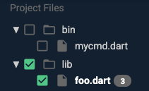

+++
title = "不健全空安全"
date = 2024-01-05T20:29:36+08:00
weight = 30
type = "docs"
description = ""
isCJKLanguage = true
draft = false
+++

> 原文: [https://dart.dev/null-safety/unsound-null-safety](https://dart.dev/null-safety/unsound-null-safety)

# Unsound null safety 不健全空安全

*merge_type* **Version note:** Dart 3 and later does not support code without null safety or with unsound null safety. All code must be soundly null safe. To learn more, check out the [Dart 3 sound null safety tracking issue](https://github.com/dart-lang/sdk/issues/49530).

​	版本说明：Dart 3 及更高版本不支持没有空安全或空安全不健全的代码。所有代码都必须是健全的空安全。要了解更多信息，请查看 Dart 3 健全空安全跟踪问题。

A Dart program may contain some libraries that are [null safe](https://dart.dev/null-safety) and some that aren’t. These **mixed-version programs** rely on **unsound null safety**.

​	Dart 程序可能包含一些空安全的库，也可能包含一些不安全的库。这些混合版本程序依赖于不健全的空安全。

The ability to mix [language versions](https://dart.dev/guides/language/evolution#language-versioning) frees package maintainers to migrate their code, with the knowledge that even legacy users can get new bug fixes and other improvements. However, mixed-version programs don’t get all the advantages that null safety can bring.

​	混合语言版本的能力使软件包维护者能够迁移其代码，因为他们知道即使是旧版用户也可以获得新的错误修复和其他改进。但是，混合版本程序无法获得空安全带来的所有优势。

This page describes the differences between sound and unsound null safety, with the goal of helping you decide when to migrate to null safety. After the conceptual discussion are instructions for migrating incrementally, followed by details on testing and running mixed-version programs.

​	此页面介绍了健全和不健全的空安全之间的差异，目的是帮助您决定何时迁移到空安全。在概念性讨论之后是逐步迁移的说明，然后是有关测试和运行混合版本程序的详细信息。

*info* **Note:** We recommend that, if possible, you wait for dependencies to migrate before you migrate your package. For details, see the [migration guide](https://dart.dev/null-safety/migration-guide).

​	注意：我们建议您尽可能等待依赖项迁移，然后再迁移您的软件包。有关详细信息，请参阅迁移指南。

## 健全和不健全的空安全 Sound and unsound null safety 

Dart provides sound null safety through a combination of static and runtime checks. Each Dart library that opts in to null safety gets all the *static* checks, with stricter compile-time errors. This is true even in a mixed-version program that contains null-unsafe libraries. You start getting these benefits as soon as you start migrating some of your code to null safety.

​	Dart 通过静态和运行时检查相结合的方式提供健全的空安全。选择加入空安全的每个 Dart 库都会获得所有静态检查，并具有更严格的编译时错误。即使在包含空不安全库的混合版本程序中也是如此。只要您开始将部分代码迁移到空安全，您就会开始获得这些好处。

However, a mixed-version program can’t have the *runtime* soundness guarantees that a fully null-safe app has. It’s possible for `null` to leak out of the null-unsafe libraries into the null-safe code, because preventing that would break the existing behavior of the unmigrated code.

​	但是，混合版本程序无法获得完全空安全应用所具有的运行时健全性保证。有可能将 `null` 从空不安全库泄漏到空安全代码中，因为防止这种情况会破坏未迁移代码的现有行为。

To maintain runtime compatibility with legacy libraries while offering soundness to completely null-safe programs, Dart tools support two modes:

​	为了在为完全空安全程序提供健全性的同时保持与旧库的运行时兼容性，Dart 工具支持两种模式：

- Mixed-version programs run with **unsound null safety**. It’s possible for `null` reference errors to occur at runtime, but only because a `null` or nullable type escaped from some null-unsafe library and got into null-safe code.
- 混合版本程序以不健全的空安全性运行。在运行时可能会发生 `null` 引用错误，但仅是因为 `null` 或可空类型从某个空不安全库中逃逸并进入空安全代码。
- When a program is fully migrated and *all* its libraries are null safe, then it runs with **sound null safety**, with all of the guarantees and compiler optimizations that soundness enables.
- 当程序完全迁移并且其所有库都是空安全时，它将以健全的空安全性运行，并具有健全性所启用的所有保证和编译器优化。

Sound null safety is what you want if possible. Dart tools automatically run your program in sound mode if the main entrypoint library of your program has opted into null safety. If you import a null-unsafe library, the tools print a warning to let you know that they can only run with unsound null safety.

​	如果可能，健全的空安全性是您想要的。如果程序的主入口点库已选择加入空安全性，Dart 工具会自动以健全模式运行您的程序。如果您导入空不安全库，这些工具会打印警告，让您知道它们只能以不健全的空安全性运行。

## 增量迁移 Migrating incrementally 

Because Dart supports mixed-version programs, you can migrate one library (generally one Dart file) at a time, while still being able to run your program and its tests.

​	由于 Dart 支持混合版本程序，因此您可以一次迁移一个库（通常是一个 Dart 文件），同时仍然能够运行您的程序及其测试。

We recommend that you **first migrate leaf libraries**—libraries that don’t import other files from the package. Then migrate libraries that directly depend on the leaf libraries. End by migrating the libraries that have the most intra-package dependencies.

​	我们建议您首先迁移叶库——不从软件包导入其他文件的库。然后迁移直接依赖于叶库的库。最后迁移具有最多包内依赖项的库。

For example, say you have a `lib/src/util.dart` file that imports other (null-safe) packages and core libraries, but that doesn’t have any `import '<local_path>'` directives. Consider migrating `util.dart` first, and then migrating files that depend only on `util.dart`. If any libraries have cyclic imports (for example, A imports B which imports C, and C imports A), consider migrating those libraries together.

​	例如，假设您有一个导入其他（null 安全）包和核心库的 `lib/src/util.dart` 文件，但它没有任何 `import '<local_path>'` 指令。请考虑先迁移 `util.dart` ，然后迁移仅依赖于 `util.dart` 的文件。如果任何库具有循环导入（例如，A 导入 B，B 导入 C，C 导入 A），请考虑一起迁移这些库。

### 使用迁移工具 Using the migration tool 

You can migrate incrementally using the [migration tool](https://dart.dev/null-safety/migration-guide#step2-migrate). To opt out files or directories, click the green checkbox. In the following screenshot, all files in the `bin` directory are opted out.

​	您可以使用迁移工具增量迁移。要选择退出文件或目录，请点击绿色复选框。在以下屏幕截图中， `bin` 目录中的所有文件都已选择退出。



Each opted out file will be unchanged except for a 2.9 [language version comment](https://dart.dev/guides/language/evolution#per-library-language-version-selection). You can later run `dart migrate` again to continue the migration. Any files that are already migrated feature a disabled checkbox: you cannot un-migrate a file once it has been migrated.

​	除了 2.9 语言版本注释外，每个选择退出的文件都将保持不变。您稍后可以再次运行 `dart migrate` 以继续迁移。任何已迁移的文件都会显示一个禁用的复选框：一旦文件迁移后，您便无法取消迁移。

### 手动迁移 Migrating by hand 

If you want to incrementally migrate a package by hand, follow these steps:

​	如果您想手动增量迁移软件包，请按照以下步骤操作：

1. Edit the package’s `pubspec.yaml` file, setting the minimum SDK constraint to at least `2.12.0`:

2. 编辑包的 `pubspec.yaml` 文件，将最低 SDK 约束至少设置为 `2.12.0` ：

   ```
   environment:
     sdk: '>=2.12.0 <3.0.0'
   ```

3. Regenerate the [package configuration file](https://github.com/dart-lang/language/blob/main/accepted/2.8/language-versioning/package-config-file-v2.md):

4. 重新生成包配置文件：

   ```
   $ dart pub get
   ```

   Running `dart pub get` with a lower SDK constraint of `2.12.0` sets the default language version of every library in the package to 2.12, opting them all in to null safety.

   使用较低的 `2.12.0` SDK 约束运行 `dart pub get` 会将软件包中每个库的默认语言版本设置为 2.12，从而使它们全部选择加入 null 安全。

5. Open the package in your IDE.

6. 在 IDE 中打开包。
   You’re likely to see a lot of analysis errors. That’s OK.

   您可能会看到许多分析错误。没关系。

7. Add a [language version comment](https://dart.dev/guides/language/evolution#per-library-language-version-selection) to the top of any Dart files that you don’t want to consider during your current migration:

8. 在您当前迁移期间不想考虑的任何 Dart 文件顶部添加语言版本注释：

   ```
   // @dart=2.9
   ```

   Using language version 2.9 for a library that’s in a 2.12 package can reduce analysis errors (red squiggles) coming from unmigrated code. However, **unsound null safety reduces the information the analyzer can use.** For example, the analyzer might assume a parameter type is non-nullable, even though a 2.9 file might pass in a null value.

   对位于 2.12 包中的库使用语言版本 2.9 可以减少来自未迁移代码的分析错误（红色波浪线）。但是，不健全的空安全性会减少分析器可以使用的信息。例如，分析器可能会假设参数类型为非空，即使 2.9 文件可能会传入一个空值。

9. Migrate the code of each Dart file, using the analyzer to identify static errors.

10. 使用分析器识别静态错误，迁移每个 Dart 文件的代码。
   Eliminate static errors by adding `?`, `!`, `required`, and `late`, as needed.

   根据需要添加 `?` 、 `!` 、 `required` 和 `late` ，消除静态错误。

## 测试或运行混合版本程序 Testing or running mixed-version programs 

To test or run mixed-version code, you need to disable sound null safety. You can do this in two ways:

​	要测试或运行混合版本代码，您需要禁用健全的空安全性。您可以通过两种方式执行此操作：

- Disable sound null safety using the `--no-sound-null-safety` flag to the `dart` or `flutter` command:
  
- 使用 `--no-sound-null-safety` 标志禁用健全的空安全性，该标志用于 `dart` 或 `flutter` 命令：
  
  ```
  $ dart --no-sound-null-safety run
  $ flutter run --no-sound-null-safety
  ```
  
- Alternatively, set the language version in the entrypoint—the file that contains `main()` function—to 2.9. In Flutter apps, this file is often named `lib/main.dart`. In command-line apps, this file is often named `bin/<packageName>.dart`. You can also opt out files under `test`, because they are also entrypoints. Example:
  
- 或者，将入口点（包含 `main()` 函数的文件）中的语言版本设置为 2.9。在 Flutter 应用中，此文件通常命名为 `lib/main.dart` 。在命令行应用中，此文件通常命名为 `bin/<packageName>.dart` 。您还可以选择退出 `test` 下的文件，因为它们也是入口点。示例：
  
  ```
  // @dart=2.9
  import 'src/my_app.dart';
  
  void main() {
    //...
  }
  ```

Opting out tests using either of these mechanisms can be useful for testing **during** your incremental migration process, but doing so means that you aren’t testing your code with full null safety enabled. It’s important to opt your tests back *in* to null safety when you’ve finished the incremental migration of your libraries.

​	在增量迁移过程中，使用其中任一机制选择退出测试可能对测试有用，但这样做意味着您没有在启用完全空安全的情况下测试您的代码。在完成库的增量迁移后，将测试重新选择加入空安全非常重要。
