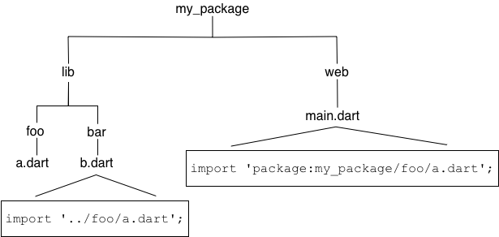

+++
title = "创建包"
date = 2024-01-05T20:29:36+08:00
weight = 20
type = "docs"
description = ""
isCJKLanguage = true
draft = false
+++

> 原文: [https://dart.dev/guides/libraries/create-packages](https://dart.dev/guides/libraries/create-packages)

## Creating packages 创建包

The Dart ecosystem uses [packages](https://dart.dev/guides/packages) to share software such as libraries and tools. This page tells you how to create a standard shared [package](https://dart.dev/tools/pub/glossary#package).
Dart 生态系统使用软件包来共享软件，例如库和工具。此页面告诉您如何创建标准共享软件包。

## Creating a new package 创建新软件包

To create the initial directory and structure for a package, use the [`dart create`](https://dart.dev/tools/dart-create) command and the `package` template:
要为软件包创建初始目录和结构，请使用 `dart create` 命令和 `package` 模板：

```
$ dart create -t package <PACKAGE_NAME>
```

## What makes a package 一个软件包由什么组成

The following diagram shows the simplest layout of a package:
下图显示了软件包的最简单布局：


The minimal requirements for a library are:
库的最低要求是：

- pubspec file pubspec 文件

  The `pubspec.yaml` file for a library is the same as for an [application package](https://dart.dev/tools/pub/glossary#application-package)—there is no special designation to indicate that the package is a library. 库的 `pubspec.yaml` 文件与应用程序包的 `pubspec.yaml` 文件相同，没有特殊标志来表明该软件包是库。

- lib directory lib 目录

  As you might expect, the library code lives under the *lib* directory and is public to other packages. You can create any hierarchy under lib, as needed. By convention, implementation code is placed under *lib/src*. Code under lib/src is considered private; other packages should never need to import `src/...`. To make APIs under lib/src public, you can export lib/src files from a file that’s directly under lib. 正如您所料，库代码位于 lib 目录下，并且对其他软件包是公开的。您可以根据需要在 lib 下创建任何层次结构。根据惯例，实现代码放在 lib/src 下。lib/src 下的代码被视为私有的；其他软件包永远不需要导入 `src/...` 。要使 lib/src 下的 API 公开，您可以从直接位于 lib 下的文件中导出 lib/src 文件。

## Organizing a package 组织软件包

Packages are easiest to maintain, extend, and test when you create small, individual libraries, referred to as *mini libraries*. In most cases, each class should be in its own mini library, unless you have a situation where two classes are tightly coupled.
当您创建小型独立库（称为迷你库）时，软件包最容易维护、扩展和测试。在大多数情况下，每个类都应该在自己的迷你库中，除非您遇到两个类紧密耦合的情况。

*info* **Note:** You may have heard of the `part` directive, which allows you to split a library into multiple Dart files. We recommend that you avoid using `part` and create mini libraries instead.
注意：您可能听说过 `part` 指令，它允许您将库拆分为多个 Dart 文件。我们建议您避免使用 `part` ，而创建迷你库。

Create a “main” library file directly under lib, lib/*<package-name>*.dart, that exports all of the public APIs. This allows the user to get all of a library’s functionality by importing a single file.
直接在 lib 下创建一个“main”库文件 lib/.dart，它会导出所有公共 API。这允许用户通过导入单个文件来获取库的所有功能。

The lib directory might also include other importable, non-src, libraries. For example, perhaps your main library works across platforms, but you create separate libraries that rely on `dart:io` or `dart:html`. Some packages have separate libraries that are meant to be imported with a prefix, when the main library is not.
lib 目录还可能包含其他可导入的非 src 库。例如，您的主库可能适用于所有平台，但您创建了依赖于 `dart:io` 或 `dart:html` 的独立库。某些软件包具有单独的库，这些库旨在使用前缀导入，而主库则不是。

Let’s look at the organization of a real-world package: shelf. The [shelf](https://github.com/dart-lang/shelf) package provides an easy way to create web servers using Dart, and is laid out in a structure that is commonly used for Dart packages:
我们来看一下一个真实软件包的组织方式：shelf。shelf 软件包提供了一种使用 Dart 创建 Web 服务器的简单方法，其结构是 Dart 软件包常用的结构：


Directly under lib, the main library file, `shelf.dart`, exports API from several files in `lib/src`. To avoid exposing more API than intended—and to give developers an overview of the entire public API of the package—`shelf.dart` uses `show` to specify exactly which symbols to export:
在 lib 下，主库文件 `shelf.dart` 从 `lib/src` 中的多个文件导出 API。为了避免公开比预期更多的 API，并为开发者提供软件包的整个公共 API 的概述， `shelf.dart` 使用 `show` 来准确指定要导出的符号：

```
export 'src/cascade.dart' show Cascade;
export 'src/handler.dart' show Handler;
export 'src/hijack_exception.dart' show HijackException;
export 'src/middleware.dart' show Middleware, createMiddleware;
export 'src/middleware/add_chunked_encoding.dart' show addChunkedEncoding;
export 'src/middleware/logger.dart' show logRequests;
export 'src/middleware_extensions.dart' show MiddlewareExtensions;
export 'src/pipeline.dart' show Pipeline;
export 'src/request.dart' show Request;
export 'src/response.dart' show Response;
export 'src/server.dart' show Server;
export 'src/server_handler.dart' show ServerHandler;
```

The shelf package also contains a mini library: shelf_io. This adapter handles HttpRequest objects from `dart:io`.
shelf 软件包还包含一个迷你库：shelf_io。此适配器处理来自 `dart:io` 的 HttpRequest 对象。

*tips_and_updates* **Tip:** For the best performance when developing with the development JavaScript compiler through [`webdev serve`](https://dart.dev/tools/webdev#serve), put [implementation files](https://dart.dev/tools/pub/package-layout#implementation-files) under `/lib/src`, instead of elsewhere under `/lib`. Also, avoid imports of `package:*package_name*/src/...`.
提示：在通过 `webdev serve` 使用开发 JavaScript 编译器进行开发时，为了获得最佳性能，请将实现文件放在 `/lib/src` 下，而不是放在 `/lib` 下的其他位置。此外，避免导入 `package:*package_name*/src/...` 。

## Importing library files 导入库文件

When importing a library file from another package, use the `package:` directive to specify the URI of that file.
从另一个包导入库文件时，请使用 `package:` 指令指定该文件的 URI。

```
import 'package:utilities/utilities.dart';
```

When importing a library file from your own package, use a relative path when both files are inside of lib, or when both files are outside of lib. Use `package:` when the imported file is in lib and the importer is outside.
从您自己的包导入库文件时，当两个文件都位于 lib 中，或者当两个文件都位于 lib 之外时，请使用相对路径。当导入的文件位于 lib 中而导入程序位于 lib 之外时，请使用 `package:` 。

The following graphic shows how to import `lib/foo/a.dart` from both lib and web.
下图显示了如何从 lib 和 web 导入 `lib/foo/a.dart` 。



## Conditionally importing and exporting library files 有条件地导入和导出库文件

If your library supports multiple platforms, then you might need to conditionally import or export library files. A common use case is a library that supports both web and native platforms.
如果您的库支持多个平台，则可能需要有条件地导入或导出库文件。一个常见的用例是同时支持 web 和原生平台的库。

To conditionally import or export, you need to check for the presence of `dart:*` libraries. Here’s an example of conditional export code that checks for the presence of `dart:io` and `dart:html`:
要进行有条件导入或导出，您需要检查是否存在 `dart:*` 库。以下是有条件导出代码的一个示例，该代码检查是否存在 `dart:io` 和 `dart:html` ：

```dart
export 'src/hw_none.dart' // Stub implementation
    if (dart.library.io) 'src/hw_io.dart' // dart:io implementation
    if (dart.library.html) 'src/hw_html.dart'; // dart:html implementation
```

lib/hw_mp.dart

Here’s what that code does:
以下是该代码的作用：

- In an app that can use `dart:io` (for example, a command-line app), export `src/hw_io.dart`.
  在可使用 `dart:io` 的应用（例如命令行应用）中，导出 `src/hw_io.dart` 。
- In an app that can use `dart:html` (a web app), export `src/hw_html.dart`.
  在可以使用 `dart:html` 的应用（网络应用）中，导出 `src/hw_html.dart` 。
- Otherwise, export `src/hw_none.dart`.
  否则，导出 `src/hw_none.dart` 。

To conditionally import a file, use the same code as above, but change `export` to `import`.
要条件性导入文件，请使用与上述相同的代码，但将 `export` 更改为 `import` 。

*info* **Note:** The conditional import or export checks only whether the library is *available for use* on the current platform, not whether it’s actually imported or used.
注意：条件性导入或导出仅检查库是否可用于当前平台，而不检查它是否实际导入或使用。

All of the conditionally exported libraries must implement the same API. For example, here’s the `dart:io` implementation:
所有条件性导出的库都必须实现相同的 API。例如，以下是 `dart:io` 实现：

```dart
import 'dart:io';

void alarm([String? text]) {
  stderr.writeln(text ?? message);
}

String get message => 'Hello World from the VM!';
```

lib/src/hw_io.dart

And here’s the default implementation, which uses stubs that throw `UnsupportedError`:
以下是默认实现，它使用抛出 `UnsupportedError` 的存根：

```dart
void alarm([String? text]) => throw UnsupportedError('hw_none alarm');

String get message => throw UnsupportedError('hw_none message');
```

lib/src/hw_none.dart

On any platform, you can import the library that has the conditional export code:
在任何平台上，您都可以导入具有条件性导出代码的库：

```dart
import 'package:hw_mp/hw_mp.dart';

void main() {
  print(message);
}
```

## Providing additional files 提供其他文件

A well-designed package is easy to test. We recommend that you write tests using the [test](https://github.com/dart-lang/test) package, placing the test code in the `test` directory at the top of the package.
设计良好的软件包易于测试。我们建议您使用 test 软件包编写测试，并将测试代码放在软件包顶部的 `test` 目录中。

If you create any command-line tools intended for public consumption, place those in the `bin` directory, which is public. Enable running a tool from the command line, using [`dart pub global activate`](https://dart.dev/tools/pub/cmd/pub-global#activating-a-package). Listing the tool in the [`executables` section](https://dart.dev/tools/pub/pubspec#executables) of the pubspec allows a user to run it directly without calling [`dart pub global run`](https://dart.dev/tools/pub/cmd/pub-global#running-a-script-using-dart-pub-global-run).
如果您创建任何供公众使用的命令行工具，请将它们放在公共的 `bin` 目录中。使用 `dart pub global activate` 启用从命令行运行工具。在 pubspec 的 `executables` 部分列出该工具，允许用户直接运行它，而无需调用 `dart pub global run` 。

It’s helpful if you include an example of how to use your library. This goes into the `example` directory at the top of the package.
如果您包含一个有关如何使用库的示例，会很有帮助。这会进入包顶部的 `example` 目录。

Any tools or executables that you create during development that aren’t for public use go into the `tool` directory.
在开发过程中创建的任何工具或可执行文件（不供公开使用）都会进入 `tool` 目录。

Other files that are required if you publish your library to the [pub.dev](https://pub.dev/) site, such as `README.md` and `CHANGELOG.md`, are described in [Publishing a package](https://dart.dev/tools/pub/publishing). For more information on how to organize a package directory, see the [pub package layout conventions](https://dart.dev/tools/pub/package-layout).
如果您将库发布到 pub.dev 网站，其他所需文件（例如 `README.md` 和 `CHANGELOG.md` ）将在发布包中进行说明。有关如何组织包目录的更多信息，请参阅 pub 包布局约定。

## Documenting a library 记录库

You can generate API docs for your library using the [`dart doc`](https://dart.dev/tools/dart-doc) tool. `dart doc` parses the source looking for [documentation comments](https://dart.dev/effective-dart/documentation#doc-comments), which use the `///` syntax:
您可以使用 `dart doc` 工具为库生成 API 文档。 `dart doc` 会分析源代码，查找使用 `///` 语法的文档注释：

```dart
/// The event handler responsible for updating the badge in the UI.
void updateBadge() {
  ...
}
```

For an example of generated docs, see the [shelf documentation.](https://pub.dev/documentation/shelf/latest)
有关生成的文档示例，请参阅 shelf 文档。

To include any *library-level* documentation in the generated docs, add a `library` directive and attach the comment directly above it. For the how-and-why of documenting libraries, see [Effective Dart: Documentation](https://dart.dev/effective-dart/documentation#consider-writing-a-library-level-doc-comment).
要在生成的文档中包含任何库级文档，请添加 `library` 指令，并在其正上方附加注释。有关记录库的如何和原因，请参阅有效的 Dart：文档。

## Distributing an open source library 分发开源库

If your library is open source, we recommend sharing it on the [pub.dev site.](https://pub.dev/) To publish or update the library, use [pub publish](https://dart.dev/tools/pub/cmd/pub-lish), which uploads your package and creates or updates its page. For example, see the page for the [shelf package.](https://pub.dev/packages/shelf) See [Publishing a package](https://dart.dev/tools/pub/publishing) for details on how to prepare your package for publishing.
如果您的库是开源的，我们建议您在 pub.dev 网站上分享它。要发布或更新库，请使用 pub publish，它会上传您的软件包并创建或更新其页面。例如，请参阅 shelf 软件包的页面。有关如何准备软件包以供发布的详细信息，请参阅发布软件包。

The pub.dev site not only hosts your package, but also generates and hosts your package’s API reference docs. A link to the latest generated docs is in the package’s **About** box; for example, see the shelf package’s [API docs.](https://pub.dev/documentation/shelf) Links to previous versions’ docs are in the **Versions** tab of the package’s page.
pub.dev 网站不仅托管您的软件包，还会生成并托管软件包的 API 参考文档。指向最新生成文档的链接位于软件包的“关于”框中；例如，请参阅 shelf 软件包的 API 文档。指向以前版本文档的链接位于软件包页面的“版本”选项卡中。

To ensure that your package’s API docs look good on the pub.dev site, follow these steps:
要确保您的软件包的 API 文档在 pub.dev 网站上看起来不错，请按照以下步骤操作：

- Before publishing your package, run the [`dart doc`](https://dart.dev/tools/dart-doc) tool to make sure that your docs generate successfully and look as expected.
  在发布软件包之前，运行 `dart doc` 工具以确保您的文档成功生成且看起来符合预期。
- After publishing your package, check the **Versions** tab to make sure that the docs generated successfully.
  发布软件包后，检查“版本”选项卡以确保文档成功生成。
- If the docs didn’t generate at all, click **failed** in the **Versions** tab to see the `dart doc` output.
  如果文档根本没有生成，请点击“版本”选项卡中的“失败”以查看 `dart doc` 输出。

## Resources 资源

Use the following resources to learn more about packages:
使用以下资源以详细了解软件包：

- [Libraries and imports](https://dart.dev/language/libraries) covers using library files.
  库和导入涵盖使用库文件。
- The [package](https://dart.dev/guides/packages) documentation is useful, particularly the [package layout conventions](https://dart.dev/tools/pub/package-layout).
  软件包文档很有用，特别是软件包布局约定。
- [What not to commit](https://dart.dev/guides/libraries/private-files) covers what should not be checked into a source code repository.
  不提交的内容涵盖了不应检入源代码存储库的内容。
- The newer packages under the [dart-lang](https://github.com/dart-lang) organization tend to show best practices. Consider studying these examples: [dart_style,](https://github.com/dart-lang/dart_style) [path,](https://github.com/dart-lang/path) [shelf,](https://github.com/dart-lang/shelf) [source_gen,](https://github.com/dart-lang/source_gen) and [test.](https://github.com/dart-lang/test)
  dart-lang 组织下的较新软件包往往会展示最佳做法。考虑研究以下示例：dart_style、path、shelf、source_gen 和 test。
