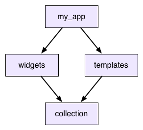
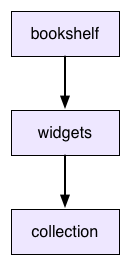

+++
title = "版本控制"
date = 2024-01-05T20:29:36+08:00
weight = 70
type = "docs"
description = ""
isCJKLanguage = true
draft = false
+++

> 原文: [https://dart.dev/tools/pub/versioning](https://dart.dev/tools/pub/versioning)

## Package versioning 软件包版本控制

One of the main jobs of the [pub package manager](https://dart.dev/guides/packages) is helping you work with versioning. This document explains a bit about the history of versioning and pub’s approach to it. Consider this to be advanced information. If you want a better picture of *why* pub was designed the way it was, read on. If you just want to *use* pub, the [other docs](https://dart.dev/guides/packages) will serve you better.

​	pub 包管理器的主要工作之一是帮助您处理版本控制。本文档简要介绍了版本控制的历史以及 pub 的处理方法。请将其视为高级信息。如果您想更好地了解 pub 的设计方式，请继续阅读。如果您只想使用 pub，其他文档会为您提供更好的服务。

Modern software development, especially web development, leans heavily on reusing lots and lots of existing code. That includes code *you* wrote in the past, but also code from third-parties, everything from big frameworks to small utility libraries. It’s not uncommon for an application to depend on dozens of different packages and libraries.

​	现代软件开发，尤其是 Web 开发，很大程度上依赖于大量重复使用现有代码。其中包括您过去编写的代码，也包括来自第三方的代码，从大型框架到小型实用程序库，无所不包。应用程序依赖于数十个不同的软件包和库的情况并不少见。

It’s hard to understate how powerful this is. When you see stories of small web startups building a site in a few weeks that gets millions of users, the only reason they can achieve this is because the open source community has laid a feast of software at their feet.

​	很难低估这一点的强大之处。当您看到小型 Web 初创公司在几周内构建一个网站并获得数百万用户的故事时，他们能够实现这一点的唯一原因是开源社区为他们提供了丰富的软件盛宴。

But this doesn’t come for free: There’s a challenge to code reuse, especially reusing code you don’t maintain. When your app uses code being developed by other people, what happens when they change it? They don’t want to break your app, and you certainly don’t either. We solve this problem by *versioning*.

​	但这并非免费提供：代码重用存在挑战，尤其是重用您不维护的代码。当您的应用程序使用其他人开发的代码时，如果他们对其进行更改，会发生什么？他们不想破坏您的应用程序，您当然也不想。我们通过版本控制来解决此问题。

## 一个名称和一个数字 A name and a number 

When you depend on some piece of outside code, you don’t just say “My app uses `widgets`.” You say, “My app uses `widgets 2.0.5`.” That combination of name and version number uniquely identifies an *immutable* chunk of code. The people updating `widgets` can make all of the changes they want, but they promise to not touch any already released versions. They can put out `2.0.6` or `3.0.0` and it won’t affect you one bit because the version you use is unchanged.

​	当您依赖某些外部代码时，您不会仅仅说“我的应用使用 `widgets` ”。您会说“我的应用使用 `widgets 2.0.5` ”。名称和版本号的组合唯一标识了一段不可变的代码。更新 `widgets` 的人员可以进行他们想要的所有更改，但他们承诺不会触及任何已发布的版本。他们可以推出 `2.0.6` 或 `3.0.0` ，而这不会对您产生任何影响，因为您使用的版本保持不变。

When you *do* want to get those changes, you can always point your app to a newer version of `widgets` and you don’t have to coordinate with those developers to do it. However, that doesn’t entirely solve the problem.

​	当您确实想要获得这些更改时，您始终可以将您的应用指向 `widgets` 的较新版本，而无需与那些开发人员协调即可执行此操作。但是，这并不能完全解决问题。

## 解决共享依赖项 Resolving shared dependencies 

Depending on specific versions works fine when your dependency *graph* is really just a dependency *tree*. If your app depends on a bunch of packages, and those things in turn have their own dependencies and so on, that all works fine as long as none of those dependencies *overlap*.

​	当您的依赖关系图实际上只是一棵依赖关系树时，依赖特定版本的效果很好。如果您的应用依赖于一堆软件包，而这些软件包又具有自己的依赖项，等等，只要这些依赖项没有重叠，那么一切都会很好。

But consider the following example:

​	但请考虑以下示例：



So your app uses `widgets` and `templates`, and *both* of those use `collection`. This is called a **shared dependency**. Now what happens when `widgets` wants to use `collection 2.3.5` and `templates` wants `collection 2.3.7`? What if they don’t agree on a version?

​	因此，您的应用使用 `widgets` 和 `templates` ，并且两者都使用 `collection` 。这称为共享依赖项。现在，当 `widgets` 想使用 `collection 2.3.5` 而 `templates` 想使用 `collection 2.3.7` 时会发生什么？如果它们不同意某个版本呢？

### 未共享库（npm 方法） Unshared libraries (the npm approach) 

One option is to just let the app use both versions of `collection`. It will have two copies of the library at different versions and `widgets` and `templates` will each get the one they want.

​	一种选择是让应用同时使用 `collection` 的两个版本。它将拥有两个不同版本的库副本， `widgets` 和 `templates` 将分别获得它们想要的那个。

This is what [npm](https://npmjs.org/) does for node.js. Would it work for Dart? Consider this scenario:

​	这是 npm 为 node.js 所做的。它适用于 Dart 吗？考虑以下场景：

1. `collection` defines some `Dictionary` class.
2. `collection` 定义了一些 `Dictionary` 类。
3. `widgets` gets an instance of it from its copy of `collection` (`2.3.5`). It then passes it up to `my_app`.
4. `widgets` 从其 `collection` 副本（ `2.3.5` ）获取它的实例。然后，它将其传递给 `my_app` 。
5. `my_app` sends the dictionary over to `templates`.
6. `my_app` 将词典发送给 `templates` 。
7. That in turn sends it down to *its* version of `collection` (`2.3.7`).
8. 然后，它将其发送到其 `collection` 版本（ `2.3.7` ）。
9. The method that takes it has a `Dictionary` type annotation for that object.
10. 接收它的方法为该对象具有 `Dictionary` 类型注释。

As far as Dart is concerned, `collection 2.3.5` and `collection 2.3.7` are entirely unrelated libraries. If you take an instance of class `Dictionary` from one and pass it to a method in the other, that’s a completely different `Dictionary` type. That means it will fail to match a `Dictionary` type annotation in the receiving library. Oops.

​	就 Dart 而言， `collection 2.3.5` 和 `collection 2.3.7` 是完全不相关的库。如果您从一个库中获取类 `Dictionary` 的一个实例并将其传递给另一个库中的方法，那将是完全不同的 `Dictionary` 类型。这意味着它将无法匹配接收库中的 `Dictionary` 类型注释。糟糕。

Because of this (and because of the headaches of trying to debug an app that has multiple versions of things with the same name), we’ve decided npm’s model isn’t a good fit.

​	因此（以及尝试调试具有多个同名版本的应用程序的麻烦），我们决定 npm 的模型不合适。

### 版本锁定（死胡同方法） Version lock (the dead end approach) 

Instead, when you depend on a package, your app only uses a single copy of that package. When you have a shared dependency, everything that depends on it has to agree on which version to use. If they don’t, you get an error.

​	相反，当您依赖某个软件包时，您的应用只会使用该软件包的单个副本。当您有共享依赖项时，所有依赖它的内容都必须就使用哪个版本达成一致。如果他们不同意，您就会收到错误。

That doesn’t actually solve your problem though. When you *do* get that error, you need to be able to resolve it. So let’s say you’ve gotten yourself into that situation in the previous example. You want to use `widgets` and `templates`, but they are using different versions of `collection`. What do you do?

​	但这实际上并没有解决您的问题。当您确实收到该错误时，您需要能够解决它。因此，假设您已在前面的示例中陷入这种情况。您想使用 `widgets` 和 `templates` ，但它们使用的是不同版本的 `collection` 。您该怎么办？

The answer is to try to upgrade one of those. `templates` wants `collection 2.3.7`. Is there a later version of `widgets` that you can upgrade to that works with that version?

​	答案是尝试升级其中一个。 `templates` 需要 `collection 2.3.7` 。是否有更高版本的 `widgets` 可以升级到与该版本兼容？

In many cases, the answer will be “no”. Look at it from the perspective of the people developing `widgets`. They want to put out a new version with new changes to *their* code, and they want as many people to be able to upgrade to it as possible. If they stick to their *current* version of `collection` then anyone who is using the current version `widgets` will be able to drop in this new one too.

​	在许多情况下，答案将是“否”。从开发 `widgets` 的人员的角度来看待它。他们希望发布一个带有新代码更改的新版本，并且他们希望尽可能多的人能够升级到它。如果他们坚持使用当前版本的 `collection` ，那么任何使用当前版本 `widgets` 的人都可以加入这个新版本。

If they were to upgrade *their* dependency on `collection` then everyone who upgrades `widgets` would have to as well, *whether they want to or not*. That’s painful, so you end up with a disincentive to upgrade dependencies. That’s called **version lock**: everyone wants to move their dependencies forward, but no one can take the first step because it forces everyone else to as well.

​	如果他们要升级对 `collection` 的依赖，那么所有升级 `widgets` 的人也必须升级，无论他们是否愿意。这很痛苦，所以你最终会失去升级依赖的动力。这被称为版本锁定：每个人都想推进他们的依赖，但没有人能迈出第一步，因为它会迫使其他人也这样做。

### 版本约束（Dart 方法） Version constraints (the Dart approach) 

To solve version lock, we loosen the constraints that packages place on their dependencies. If `widgets` and `templates` can both indicate a *range* of versions for `collection` that they work with, then that gives us enough wiggle room to move our dependencies forward to newer versions. As long as there is overlap in their ranges, we can still find a single version that makes them both happy.

​	为了解决版本锁定，我们放宽了软件包对其依赖项施加的约束。如果 `widgets` 和 `templates` 都可以为 `collection` 指示一系列可用的版本，那么这将为我们提供足够的回旋余地，以便将我们的依赖项推进到较新版本。只要它们的范围内有重叠，我们仍然可以找到一个让它们都满意的单一版本。

This is the model that [bundler](https://bundler.io/) follows, and is pub’s model too. When you add a dependency in your pubspec, you can specify a *range* of versions that you can accept. If the pubspec for `widgets` looked like this:

​	这是 bundler 遵循的模型，也是 pub 的模型。在 pubspec 中添加依赖项时，您可以指定可以接受的一系列版本。如果 `widgets` 的 pubspec 如下所示：

```
dependencies:
  collection: '>=2.3.5 <2.4.0'
```

Then we could pick version `2.3.7` for `collection` and then both `widgets` and `templates` have their constraints satisfied by a single concrete version.

​	那么我们可以为 `collection` 选择版本 `2.3.7` ，然后 `widgets` 和 `templates` 的约束都将由一个具体的版本满足。

## 语义版本 Semantic versions 

When you add a dependency to your package, you’ll sometimes want to specify a range of versions to allow. How do you know what range to pick? You need to be forward compatible, so ideally the range encompasses future versions that haven’t been released yet. But how do you know your package is going to work with some new version that doesn’t even exist yet?

​	当您向软件包添加依赖项时，有时您会想要指定允许的版本范围。您如何知道要选择哪个范围？您需要向前兼容，因此理想情况下，该范围应包含尚未发布的未来版本。但是，您如何知道您的软件包将与某个甚至尚未存在的新版本一起使用？

To solve that, you need to agree on what a version number *means*. Imagine that the developers of a package you depend on say, “If we make any backwards incompatible change, then we promise to increment the major version number.” If you trust them, then if you know your package works with `2.3.5` of theirs, you can rely on it working all the way up to `3.0.0`. You can set your range like:

​	要解决此问题，您需要就版本号的含义达成一致。想象一下，您依赖的软件包的开发人员说：“如果我们进行任何向后不兼容的更改，那么我们承诺增加主要版本号。”如果您信任他们，那么如果您知道您的软件包与他们的 `2.3.5` 一起使用，那么您可以依靠它一直使用到 `3.0.0` 。您可以将范围设置为：

```
dependencies:
  collection: ^2.3.5
```

*info* **Note:** This example uses *caret syntax* to express a range of versions. The string `^2.3.5` means “the range of all versions from 2.3.5 to 3.0.0, not including 3.0.0.” For more information, see [Caret syntax](https://dart.dev/tools/pub/dependencies#caret-syntax).

​	注意：此示例使用插入符号语法来表示一系列版本。字符串 `^2.3.5` 表示“从 2.3.5 到 3.0.0 的所有版本范围，不包括 3.0.0。”有关更多信息，请参阅插入符号语法。

To make this work, then, we need to come up with that set of promises. Fortunately, other smart people have done the work of figuring this all out and named it [*semantic versioning*](https://semver.org/spec/v2.0.0-rc.1.html).

​	为了实现这一点，我们需要提出这一系列承诺。幸运的是，其他聪明的人已经完成了这项工作，并将其命名为语义版本控制。

That describes the format of a version number, and the exact API behavioral differences when you increment to a later version number. Pub requires versions to be formatted that way, and to play well with the pub community, your package should follow the semantics it specifies. You should assume that the packages you depend on also follow it. (And if you find out they don’t, let their authors know!)

​	这描述了版本号的格式，以及当您增量到更高版本号时确切的 API 行为差异。Pub 要求版本以这种方式格式化，并且为了与 pub 社区配合良好，您的软件包应遵循其指定的语义。您应该假设您依赖的软件包也遵循它。（如果您发现它们没有遵循，请告知它们的作者！）

Although semantic versioning doesn’t promise any compatibility between versions prior to `1.0.0`, the Dart community convention is to treat those versions semantically as well. The interpretation of each number is just shifted down one slot: going from `0.1.2` to `0.2.0` indicates a breaking change, going to `0.1.3` indicates a new feature, and going to `0.1.2+1` indicates a change that doesn’t affect the public API. For simplicity’s sake, avoid using `+` after the version reaches `1.0.0`.

​	尽管语义版本控制不保证 `1.0.0` 之前的版本之间有任何兼容性，但 Dart 社区惯例也将其版本语义化处理。每个数字的解释只是向下移动一个槽位：从 `0.1.2` 到 `0.2.0` 表示重大更改，到 `0.1.3` 表示新功能，到 `0.1.2+1` 表示不影响公共 API 的更改。为了简单起见，请避免在版本达到 `1.0.0` 后使用 `+` 。

We’ve got almost all of the pieces we need to deal with versioning and API evolution now. Let’s see how they play together and what pub does.

​	现在，我们几乎拥有了处理版本控制和 API 演进所需的所有部分。让我们看看它们如何协同工作以及 pub 的作用。

## 约束求解 Constraint solving 

When you define your package, you list its [**immediate dependencies**](https://dart.dev/tools/pub/glossary#immediate-dependency)—the packages it itself uses. For each one, you specify the range of versions it allows. Each of those dependent packages may in turn have their own dependencies (called [**transitive dependencies**](https://dart.dev/tools/pub/glossary#transitive-dependency). Pub traverses these and builds up the entire deep dependency graph for your app.

​	定义软件包时，您会列出它的直接依赖项，即它本身使用的软件包。对于每个依赖项，您需要指定它允许的版本范围。每个依赖的软件包可能反过来有它们自己的依赖项（称为传递依赖项）。Pub 会遍历这些依赖项并为您的应用构建整个深度依赖关系图。

For each package in the graph, pub looks at everything that depends on it. It gathers together all of their version constraints and tries to simultaneously solve them. (Basically, it intersects their ranges.) Then it looks at the actual versions that have been released for that package and selects the best (most recent) one that meets all of those constraints.

​	对于图中的每个软件包，pub 会查看所有依赖于它的内容。它会收集所有这些内容的版本约束，并尝试同时解决它们。（基本上，它会求出它们的交集。）然后，它会查看已为该软件包发布的实际版本，并选择满足所有这些约束的最佳（最新）版本。

For example, let’s say our dependency graph contains `collection`, and three packages depend on it. Their version constraints are:

​	例如，假设我们的依赖关系图包含 `collection` ，并且三个软件包依赖于它。它们的版本约束为：

```
>=1.7.0
^1.4.0
<1.9.0
```

The developers of `collection` have released these versions of it:

​	`collection` 的开发者已发布了以下版本：

```
1.7.0
1.7.1
1.8.0
1.8.1
1.8.2
1.9.0
```

The highest version number that fits in all of those ranges is `1.8.2`, so pub picks that. That means your app *and every package your app uses* will all use `collection 1.8.2`.

​	适合所有这些范围的最高版本号是 `1.8.2` ，因此 pub 会选择它。这意味着您的应用和您的应用使用的每个软件包都将使用 `collection 1.8.2` 。

## 约束上下文 Constraint context 

The fact that selecting a package version takes into account *every* package that depends on it has an important consequence: *the specific version that will be selected for a package is a global property of the app using that package.*

​	选择软件包版本时会考虑依赖于它的每个软件包这一事实具有一个重要的后果：将为软件包选择的特定版本是使用该软件包的应用的全局属性。

The following example shows what this means. Let’s say we have two apps. Here are their pubspecs:

​	以下示例说明了这意味着什么。假设我们有两个应用。以下是它们的 pubspec：

```
name: my_app
dependencies:
  widgets:
name: other_app
dependencies:
  widgets:
  collection: '<1.5.0'
```

They both depend on `widgets`, whose pubspec is:

​	它们都依赖于 `widgets` ，其 pubspec 为：

```
name: widgets
dependencies:
  collection: '>=1.0.0 <2.0.0'
```

The `other_app` package depends directly on `collection` itself. The interesting part is that it happens to have a different version constraint on it than `widgets` does.

​	软件包 `other_app` 直接依赖于 `collection` 本身。有趣的是，它碰巧对它有不同于 `widgets` 的版本约束。

This means that you can’t just look at the `widgets` package in isolation to figure out what version of `collection` it will use. It depends on the context. In `my_app`, `widgets` will use `collection 1.9.9`. But in `other_app`, `widgets` will get saddled with `collection 1.4.9` because of the *other* constraint that `otherapp` places on it.

​	这意味着您不能只孤立地查看软件包 `widgets` 来确定它将使用哪个版本的 `collection` 。它取决于上下文。在 `my_app` 中， `widgets` 将使用 `collection 1.9.9` 。但在 `other_app` 中， `widgets` 将因 `otherapp` 对它施加的另一个约束而被 `collection 1.4.9` 所累。

This is why each app gets its own `package_config.json` file: The concrete version selected for each package depends on the entire dependency graph of the containing app.

​	这就是每个应用都有自己的 `package_config.json` 文件的原因：为每个软件包选择的具体版本取决于包含应用的整个依赖关系图。

## 解决导出的依赖项的约束 Constraint solving for exported dependencies 

Package authors must define package constraints with care. Consider the following scenario:

​	软件包作者必须谨慎定义软件包约束。考虑以下情况：



The `bookshelf` package depends on `widgets`. The `widgets` package, currently at 1.2.0, exports `collection` via `export 'package:collection/collection.dart'`, and is at 2.4.0. The pubspec files are as follows:

​	软件包 `bookshelf` 依赖于 `widgets` 。软件包 `widgets` 当前为 1.2.0，通过 `export 'package:collection/collection.dart'` 导出 `collection` ，并且为 2.4.0。pubspec 文件如下所示：

```
name: bookshelf
dependencies:
  widgets:  ^1.2.0
name: widgets
dependencies:
  collection:  ^2.4.0
```

The `collection` package is then updated to 2.5.0. The 2.5.0 version of `collection` includes a new method called `sortBackwards()`. `bookshelf` may call `sortBackwards()`, because it’s part of the API exposed by `widgets`, despite `bookshelf` having only a transitive dependency on `collection`.

​	然后将 `collection` 包更新到 2.5.0。2.5.0 版本的 `collection` 包含一个名为 `sortBackwards()` 的新方法。 `bookshelf` 可能会调用 `sortBackwards()` ，因为它是 `widgets` 公开的 API 的一部分，尽管 `bookshelf` 仅对 `collection` 具有传递依赖关系。

Because `widgets` has an API that is not reflected in its version number, the app that uses the `bookshelf` package and calls `sortBackwards()` may crash.

​	由于 `widgets` 具有未在其版本号中反映的 API，因此使用 `bookshelf` 包并调用 `sortBackwards()` 的应用可能会崩溃。

Exporting an API causes that API to be treated as if it is defined in the package itself, but it can’t increase the version number when the API adds features. This means that `bookshelf` has no way of declaring that it needs a version of `widgets` that supports `sortBackwards()`.

​	导出 API 会导致将该 API 视为在包本身中定义，但当 API 添加功能时，它无法增加版本号。这意味着 `bookshelf` 无法声明它需要支持 `sortBackwards()` 的 `widgets` 版本。

For this reason, when dealing with exported packages, it’s recommended that the package’s author keeps a tighter limit on the upper and lower bounds of a dependency. In this case, the range for the `widgets` package should be narrowed:

​	出于此原因，在处理导出的包时，建议包的作者对依赖项的上限和下限保持更严格的限制。在这种情况下，应缩小 `widgets` 包的范围：

```
name: bookshelf
dependencies:
  widgets:  '>=1.2.0 <1.3.0'
name: widgets
dependencies:
  collection:  '>=2.4.0 <2.5.0'
```

This translates to a lower bound of 1.2.0 for `widgets` and 2.4.0 for `collection`. When the 2.5.0 version of `collection` is released, then `widgets` is also updated to 1.3.0 and the corresponding constraints are also updated.

​	这转化为 `widgets` 的下限为 1.2.0， `collection` 的下限为 2.4.0。当发布 `collection` 的 2.5.0 版本时， `widgets` 也更新到 1.3.0，并且相应的约束条件也会更新。

Using this convention ensures that users have the correct version of both packages, even if one is not a direct dependency.

​	使用此约定可确保用户拥有两个软件包的正确版本，即使其中一个不是直接依赖项。

## 锁定文件 Lockfiles 

So once pub has solved your app’s version constraints, then what? The end result is a complete list of every package that your app depends on either directly or indirectly and the best version of that package that will work with your app’s constraints.

​	那么，一旦 pub 解决您的应用版本约束，接下来会发生什么？最终结果是您的应用直接或间接依赖的每个软件包的完整列表，以及与您的应用约束兼容的该软件包的最佳版本。

For each package, pub takes that information, computes a [content hash](https://dart.dev/tools/pub/glossary#content-hashes) from it, and writes both to a [**lockfile**](https://dart.dev/tools/pub/glossary#lockfile) in your app’s directory called `pubspec.lock`. When pub builds the `.dart_tool/package_config.json` file for your app, it uses the lockfile to know what versions of each package to refer to. (And if you’re curious to see what versions it selected, you can read the lockfile to find out.)

​	对于每个软件包，pub 获取该信息，从中计算内容哈希，并将两者写入您应用目录中名为 `pubspec.lock` 的锁定文件中。当 pub 为您的应用构建 `.dart_tool/package_config.json` 文件时，它使用锁定文件来了解要引用的每个软件包的版本。（如果您想知道它选择了哪些版本，可以阅读锁定文件来找出答案。）

The next important thing pub does is it *stops touching the lockfile*. Once you’ve got a lockfile for your app, pub won’t touch it until you tell it to. This is important. It means you won’t spontaneously start using new versions of random packages in your app without intending to. Once your app is locked, it stays locked until you manually tell it to update the lockfile.

​	pub 执行的下一个重要操作是停止触碰锁定文件。一旦您为您的应用获取了锁定文件，pub 就会在您告诉它之前不触碰它。这一点很重要。这意味着您不会在无意中开始在您的应用中使用新版本的随机软件包。一旦您的应用被锁定，它就会保持锁定状态，直到您手动告诉它更新锁定文件。

If your package is for an app, you *check your lockfile into your source control system!* That way, everyone on your team will be using the exact same versions of every dependency when they build your app. You’ll also use this when you deploy your app so you can ensure that your production servers are using the exact same packages that you’re developing with.

​	如果您的软件包适用于某个应用，您会将您的锁定文件检入到您的源代码控制系统中！这样，您的团队中的每个人在构建您的应用时都会使用完全相同的每个依赖项版本。您在部署您的应用时也会使用它，以便您可以确保您的生产服务器使用与您开发时完全相同的软件包。

## 当事情出错时 When things go wrong 

Of course, all of this presumes that your dependency graph is perfect and flawless. Even with version ranges and pub’s constraint solving and semantic versioning, you can never be entirely spared from the dangers of versionitis.

​	当然，所有这些都假定您的依赖项图是完美无缺的。即使使用版本范围和 pub 的约束求解和语义版本控制，您也永远无法完全免受版本控制的危害。

You might run into one of the following problems:

​	您可能会遇到以下问题之一：

### 您可能具有不连贯的约束 You can have disjoint constraints 

Lets say your app uses `widgets` and `templates` and both use `collection`. But `widgets` asks for a version of it between `1.0.0` and `2.0.0` and `templates` wants something between `3.0.0` and `4.0.0`. Those ranges don’t even overlap. There’s no possible version that would work.

​	假设您的应用使用 `widgets` 和 `templates` ，并且两者都使用 `collection` 。但是 `widgets` 要求介于 `1.0.0` 和 `2.0.0` 之间的一个版本，而 `templates` 需要介于 `3.0.0` 和 `4.0.0` 之间的一个版本。这些范围甚至没有重叠。没有可能的版本能够满足要求。

### 您可能具有不包含已发布版本的范围 You can have ranges that don’t contain a released version 

Let’s say after putting all of the constraints on a shared dependency together, you’re left with the narrow range of `>=1.2.4 <1.2.6`. It’s not an empty range. If there was a version `1.2.4` of the dependency, you’d be golden. But maybe they never released that and instead went straight from `1.2.3` to `1.3.0`. You’ve got a range but nothing exists inside it.

​	假设在对共享依赖项的所有约束进行组合后，您只剩下 `>=1.2.4 <1.2.6` 的窄范围。这不是一个空范围。如果存在依赖项的版本 `1.2.4` ，您将获得成功。但也许他们从未发布过该版本，而是直接从 `1.2.3` 转到 `1.3.0` 。您有一个范围，但其中没有任何内容。

### 您可能有一个不稳定的图 You can have an unstable graph 

This is, by far, the most challenging part of pub’s version solving process. The process was described as *build up the dependency graph and then solve all of the constraints and pick versions*. But it doesn’t actually work that way. How could you build up the *whole* dependency graph before you’ve picked *any* versions? *The pubspecs themselves are version-specific.* Different versions of the same package may have different sets of dependencies.

​	这是迄今为止发布版本解决过程中最具挑战性的部分。该过程被描述为构建依赖关系图，然后解决所有约束并选择版本。但实际上并非如此。在选择任何版本之前，您如何构建整个依赖关系图？Pubspec 本身是特定于版本的。同一软件包的不同版本可能具有不同的依赖项集。

As you’re selecting versions of packages, they are changing the shape of the dependency graph itself. As the graph changes, that may change constraints, which can cause you to select different versions, and then you go right back around in a circle.

​	在选择软件包版本时，它们会改变依赖关系图本身的形状。随着图形的变化，可能会改变约束，这可能会导致您选择不同的版本，然后您又会回到原点。

Sometimes this process never settles down into a stable solution. Gaze into the abyss:

​	有时此过程永远不会稳定为一个解决方案。凝视深渊：

```
name: my_app
version: 0.0.0
dependencies:
  yin: '>=1.0.0'
name: yin
version: 1.0.0
dependencies:
name: yin
version: 2.0.0
dependencies:
  yang: '1.0.0'
name: yang
version: 1.0.0
dependencies:
  yin: '1.0.0'
```

In all of these cases, there is no set of concrete versions that will work for your app, and when this happens pub reports an error and tells you what’s going on. It definitely won’t leave you in some weird state where you think things can work but won’t.

​	在所有这些情况下，都没有一组适用于您应用的具体版本，当这种情况发生时，pub 会报告一个错误并告诉您发生了什么。它绝对不会让您处于一种奇怪的状态，您认为事情可以正常工作，但实际上却不行。

## 总结 Summary 

That was a lot of information, but here are the key points:

​	这有很多信息，但以下是一些要点：

- Code reuse is great, but in order to let developers move quickly, packages need to be able to evolve independently.
- 代码重用很好，但为了让开发人员能够快速行动，包需要能够独立演进。
- Versioning is how you enable that. But depending on single concrete versions is too precise and with shared dependencies leads to version lock.
- 版本控制就是您实现此目的的方式。但依赖于单个具体版本过于精确，并且与共享依赖项一起会导致版本锁定。
- To cope with that, you depend on *ranges* of versions. Pub then walks your dependency graph and picks the best versions for you. If it can’t, it tells you.
- 为了应对这种情况，您依赖于一系列版本。然后，Pub 会遍历您的依赖项图并为您挑选最佳版本。如果它做不到，它会告诉您。
- Once your app has a solid set of versions for its dependencies, that gets pinned down in a *lockfile*. That ensures that every machine your app is on is using the same versions of all of its dependencies.
- 一旦您的应用为其依赖项拥有了一组可靠的版本，这些版本就会固定在一个锁定文件中。这可确保您的应用所在的每台机器都使用其所有依赖项的相同版本。

If you’d like to know more about pub’s version solving algorithm, see the article [PubGrub: Next-Generation Version Solving.](https://medium.com/@nex3/pubgrub-2fb6470504f)

​	如果您想详细了解 pub 的版本解决算法，请参阅文章 PubGrub：下一代版本解决。
