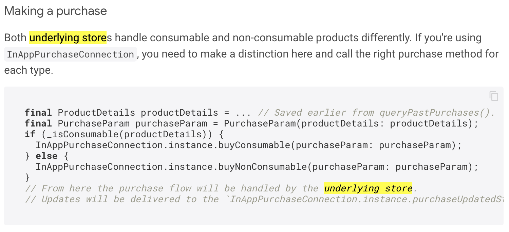
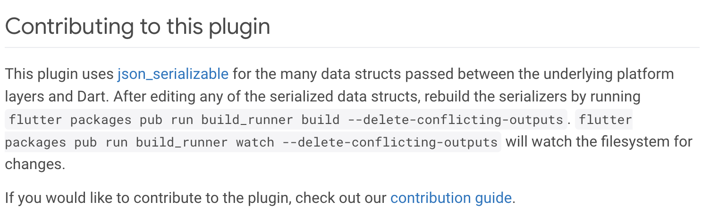

+++
title = "编写包页面"
date = 2024-01-05T20:29:36+08:00
weight = 40
type = "docs"
description = ""
isCJKLanguage = true
draft = false
+++

> 原文: [https://dart.dev/guides/libraries/writing-package-pages](https://dart.dev/guides/libraries/writing-package-pages)

## Writing package pages 编写软件包页面

The guidelines on this page can help you create good package pages on pub.dev. Specifically, this page has tips for writing a better package README, which provides the content marked **README (this document)** in the following screenshot:
本页上的指南可帮助您在 pub.dev 上创建良好的软件包页面。具体来说，本页提供了编写更好的软件包自述文件的技巧，该自述文件提供了以下屏幕截图中标记为自述文件 (此文档) 的内容：


For details about other parts of the package page, follow these links:
有关软件包页面其他部分的详细信息，请点击以下链接：

1. [Package layout
   软件包布局](https://dart.dev/tools/pub/package-layout)
2. [Flutter Favorite](https://flutter.dev/docs/development/packages-and-plugins/favorites)
3. [Package scoring
   软件包评分](https://pub.dev/help/scoring)
4. [Verified publishers
   已验证的发布者](https://dart.dev/tools/pub/verified-publishers)
5. [Pubspec file
   Pubspec 文件](https://dart.dev/tools/pub/pubspec)

## Writing a good README is important 编写良好的自述文件很重要

People who find your package on pub.dev are likely to quickly scan the README when deciding whether to try your package. A good README catches the reader’s attention and shows that your package is worth trying.
在 pub.dev 上找到您软件包的人在决定是否尝试您的软件包时可能会快速扫描自述文件。良好的自述文件可以吸引读者的注意力，并表明您的软件包值得尝试。

*info* **Note:** The package README is used in multiple ways. For example, its content appears not only in the package page on pub.dev, but also in [`dart doc`](https://dart.dev/tools/dart-doc)-produced API reference documentation.
注意：软件包 README 以多种方式使用。例如，其内容不仅出现在 pub.dev 上的软件包页面中，还出现在 `dart doc` 生成的 API 参考文档中。

Although this page features the [`in_app_purchase`](https://pub.dev/packages/in_app_purchase) package README, yours might not need to be as large or detailed. If your package is simple and has no associated UI, its README might look more like the one for the [`yaml`](https://pub.dev/packages/yaml) package.
虽然此页面显示了 `in_app_purchase` 软件包 README，但您的软件包可能不需要如此庞大或详细。如果您的软件包很简单，并且没有关联的 UI，那么其 README 可能更类似于 `yaml` 软件包的 README。

## Seven tips for good README 七个编写良好 README 的技巧

Here are some suggestions for creating a README that works well on pub.dev:
以下是一些关于在 pub.dev 上创建效果良好的 README 的建议：

1. [Put a short description at the top
   在顶部放一个简短的描述](https://dart.dev/guides/libraries/writing-package-pages#tip1)
2. [Include visual content
   包含可视化内容](https://dart.dev/guides/libraries/writing-package-pages#tip2)
3. [Use lists to present important information
   使用列表来呈现重要信息](https://dart.dev/guides/libraries/writing-package-pages#tip3)
4. [Include usage examples
   包含使用示例](https://dart.dev/guides/libraries/writing-package-pages#tip4)
5. [Use Dart code formatting
   使用 Dart 代码格式](https://dart.dev/guides/libraries/writing-package-pages#tip5)
6. [Mention related terms
   提及相关术语](https://dart.dev/guides/libraries/writing-package-pages#tip6)
7. [Tell users where to go next
   告诉用户下一步去哪里](https://dart.dev/guides/libraries/writing-package-pages#tip7)

### 1. Put a short description at the top 1. 在顶部放一个简短的描述

According to our user research, package users spend only a few seconds to read the package description and decide whether to read the rest of the README. Thus, you should concisely describe what the package does or achieves, at a glance. Spend some time to craft a short and sweet description and help the user to make decisions.
根据我们的用户研究，软件包用户只花几秒钟来阅读软件包描述，并决定是否阅读 README 的其余部分。因此，您应该简洁地描述软件包的功能或用途，一目了然。花一些时间来制作一个简短而优美的描述，帮助用户做出决定。

*tips_and_updates* **Tip:** Don’t write the package name again at the top. It’s already visible in the pub.dev UI.
提示：不要在顶部再次编写软件包名称。它已在 pub.dev UI 中可见。

Here are some examples of good descriptions:
以下是一些好的描述示例：

- `A Flutter plugin for showing rainbows.`
- `Use machine learning to categorize bird sounds.`

Important information such as project status or constraints should also be near the top. For example:
诸如项目状态或约束之类的重要信息也应放在顶部附近。例如：

- `Does not work on iOS versions below 10.3.`

Here’s a screenshot of the [`in_app_purchase`](https://pub.dev/packages/in_app_purchase) package page, which starts with a brief explanation of the package and a caution:
这是 `in_app_purchase` 软件包页面的屏幕截图，它以对软件包的简要说明和警告开头：


[Badges](https://github.com/badges/shields#readme) are often near the top of the README, either above or under the short description.
徽章通常位于 README 的顶部附近，位于简短描述的上方或下方。

### 2. Include visual content 2. 包含视觉内容

If your package page is a wall of text with no visual content, users might find it intimidating and stop reading. Images are especially important if your package supports UI, but they’re also useful for explaining important concepts. Either way, visual content can help users feel confident about using the package.
如果您的软件包页面是一堵没有视觉内容的文字墙，用户可能会觉得它令人生畏而停止阅读。如果您的软件包支持 UI，图像尤其重要，但它们对于解释重要概念也很有用。无论哪种方式，视觉内容都可以帮助用户对使用该软件包充满信心。

Place visual content such as static images, animated GIFs, and videos (such as MOV or MP4 files) close to the beginning of the README, where users are likely to see them.
将静态图像、动画 GIF 和视频（例如 MOV 或 MP4 文件）等视觉内容放在 README 的开头附近，用户很可能会看到它们。

*tips_and_updates* **Tip:** Prefer animated GIFs and videos for UI-related content, because most UIs aren’t static, and animation conveys more information about the UI’s behavior.
提示：对于与 UI 相关的内容，优先选择动画 GIF 和视频，因为大多数 UI 并非静态的，动画可以传达更多有关 UI 行为的信息。

The screenshots below show how adding visual content made the `in_app_purchase` package page look informative at first glance. (The *before* picture is on the left; *after* is on the right.)
下面的屏幕截图显示了添加视觉内容如何使 `in_app_purchase` 包页面乍一看就显得内容丰富。（之前的图片在左边；之后的图片在右边。）


*tips_and_updates* **Tip:** When adding visual content, use absolute URLs for the files to make the images reliably appear, no matter where the README is published. One place to host your images is in the repository itself, like `in_app_purchase` does.
提示：添加视觉内容时，请对文件使用绝对 URL，以便无论 README 发布在何处，图像都能可靠地显示。您可以将图像托管在一个地方，例如 `in_app_purchase` 。

### 3. Use lists to present important information 3. 使用列表来呈现重要信息

Lists can draw attention to important information on your README. You might use lists for the following:
列表可以将注意力吸引到 README 中的重要信息上。您可能会将列表用于以下内容：

- [Key features of the package
  包的主要功能](https://dart.dev/guides/libraries/writing-package-pages#list1)
- [Parameters, attributes, or properties
  参数、属性或特性](https://dart.dev/guides/libraries/writing-package-pages#list2)
- [Unusual requirements
  不寻常的要求](https://dart.dev/guides/libraries/writing-package-pages#list3)
- [Functionality that’s out of scope of your package
  超出包范围的功能](https://dart.dev/guides/libraries/writing-package-pages#list4)
- [A summary of the contents of a page or a section within a page (like this list)
  页面或页面内部分内容的摘要（如此列表）](https://dart.dev/guides/libraries/writing-package-pages#list5)

Usually, lists are bulleted, like the list above. Another option is using a table, like the table of platform support in the next section.
通常，列表会采用项目符号，如上面的列表。另一种选择是使用表格，如下一部分中的平台支持表格。

#### Key features of the package 该软件包的主要功能

First, clearly list what your package can do. Some users might be looking for a very specific feature. Help those users find out whether your package supports their needs.
首先，清楚地列出您的软件包可以做什么。一些用户可能正在寻找非常具体的功能。帮助这些用户找出您的软件包是否支持他们的需求。

The following screenshot shows how the `in_app_purchase` README presents the package’s features:
以下屏幕截图显示了 `in_app_purchase` README 如何介绍软件包的功能：


The next screenshot shows a table from the `just_audio` README that lists the package’s features and platform support:
下一个屏幕截图显示了 `just_audio` README 中的一个表格，其中列出了软件包的功能和平台支持：


#### Parameters, attributes, or properties 参数、属性或特性

Consider listing parameters, attributes, or properties for quick reference. (Remember, the content of the package README appears in the API reference documentation, as well as in the package page.)
考虑列出参数、属性或特性以供快速参考。（请记住，软件包 README 的内容会显示在 API 参考文档中，也会显示在软件包页面中。）

For example, the `url_launcher` package has a table of supported URL schemes:
例如， `url_launcher` 软件包有一个支持的 URL 方案表：


Linking to specific functions or classes in the API reference documentation can also be useful. See the [async](https://pub.dev/packages/async) package for an example.
链接到 API 参考文档中的特定函数或类也可能很有用。请参阅 async 软件包以获取示例。

#### Unusual requirements 不寻常的要求

If your package needs a specific setup, beyond what all packages require, list setup instructions in the README.
如果您的软件包需要特定设置，超出所有软件包的要求，请在 README 中列出设置说明。

For example, the following screenshot for the `google_maps_flutter` package shows instructions on getting started with Google Maps Platform:
例如，以下 `google_maps_flutter` 软件包的屏幕截图显示了有关如何开始使用 Google 地图平台的说明：


#### Functionality that’s out of scope of your package 超出软件包范围的功能

To help users know whether your package can help them, list the features that users might expect, but that your package *doesn’t* support.
为了帮助用户了解您的软件包是否可以帮助他们，请列出用户可能期望但您的软件包不支持的功能。

Here are some examples of when you might want to list out-of-scope functionality:
以下是一些您可能想要列出超出范围功能的示例：

- If your button package is focused only on text buttons and not on icon buttons, make that clear in the README.
  如果您的按钮软件包仅关注文本按钮，而不关注图标按钮，请在自述文件中明确说明这一点。
- If your package supports only certain versions of Android, say that in the README.
  如果您的软件包仅支持某些版本的 Android，请在自述文件中说明这一点。

#### Contents 内容

Users find it easier to navigate a page or section when it has a table of contents. If a section in your README is very long, consider listing the subsections clearly at the beginning of the section.
当页面或部分具有目录时，用户会发现更容易导航。如果自述文件中的某个部分很长，请考虑在该部分的开头清楚地列出子部分。

For example, the “Usage” section of the `in_app_purchase` README has a lot of examples. The following table of contents helps users understand which examples exist, and go to the code that interests them:
例如， `in_app_purchase` 自述文件的“用法”部分有很多示例。以下目录可以帮助用户了解存在哪些示例，并转到他们感兴趣的代码：


### 4. Include usage examples 4. 包括使用示例

If your package looks promising, users might want to test your package. Include a “Get started” or “Usage” section that has at least one code sample that users can easily understand—and, ideally, that they can copy and paste into their project. It’s even better if you can provide more examples with more details to help users to understand your package.
如果您的软件包看起来很有前景，用户可能希望测试您的软件包。包含一个“开始”或“用法”部分，其中至少有一个用户可以轻松理解的代码示例，理想情况下，他们可以将其复制并粘贴到自己的项目中。如果您能提供更多示例以及更多详细信息来帮助用户理解您的软件包，那就更好了。

Remember that not all users speak English, but they all speak Dart! Good code samples can go a long way. Consider adding more complete examples under your package’s `example` directory, which pub.dev can use to populate an **Examples** tab. For details, see [Examples](https://dart.dev/tools/pub/package-layout#examples) in the [package layout conventions](https://dart.dev/tools/pub/package-layout).
请记住，并非所有用户都会说英语，但他们都会说 Dart！好的代码示例可以大有帮助。考虑在软件包的 `example` 目录下添加更完整的示例，pub.dev 可以使用该目录填充示例标签。有关详细信息，请参阅软件包布局约定中的示例。

The following screenshot shows one of several examples in the README for the `in_app_purchase` package:
以下屏幕截图显示了 `in_app_purchase` 软件包的自述文件中的几个示例之一：


### 5. Use Dart code formatting 5. 使用 Dart 代码格式

When adding code examples, use three backticks plus `dart` (````dart`) instead of three backticks (`````). As the following examples show, adding `dart` tells pub.dev to use Dart syntax highlighting:
添加代码示例时，使用三个反引号加 `dart` ( ````dart` )，而不是三个反引号 ( ````` )。如下面的示例所示，添加 `dart` 会告知 pub.dev 使用 Dart 语法突出显示：

| **Formatted with just ````` 仅使用 ````` 格式化** | **Formatted with ````dart` 使用 ````dart` 格式化** |
| ------------------------------------------------- | -------------------------------------------------- |
| `final like = 'this'; `                           | `final like = 'this'; `                            |

### 6. Mention related terms 6. 提及相关术语

A recent UX study found that many users use the within-page search feature (`Control+F` or `Command+F`) to search for the feature they are looking for. Thus, be sure to mention important terms in the README, so that users can find them.
最近的一项 UX 研究发现，许多用户使用页面内搜索功能（ `Control+F` 或 `Command+F` ）来搜索他们正在寻找的功能。因此，务必在自述文件中提及重要术语，以便用户可以找到它们。

For example, users might want to know whether the `in_app_purchase` package supports in-app subscription. A user who searches for the keyword *subscription* might abandon the page if the page doesn’t use that term.
例如，用户可能想知道 `in_app_purchase` 软件包是否支持应用内订阅。如果页面不使用该术语，搜索关键字订阅的用户可能会放弃该页面。


After mentioning all the terms that people might search for, be consistent about the terms you use. If needed, clearly define the terms.
在提及人们可能搜索的所有术语后，请对您使用的术语保持一致。如有必要，请明确定义这些术语。

For example, the [`in_app_purchase`](https://pub.dev/packages/in_app_purchase) package defines *underlying store* at the beginning:
例如， `in_app_purchase` 软件包一开始就定义了基础商店：


The rest of the page consistently uses that term:
页面的其余部分始终使用该术语：



### 7. Tell users where to go next 7. 告诉用户接下来去哪里

Help your users find out more about the package. Here are some suggestions for what to tell potential users:
帮助您的用户详细了解该软件包。以下是一些告诉潜在用户的内容的建议：

- Where to learn more about the package. You might link to an article on Medium, or to a video on YouTube.
  在哪里可以详细了解该软件包。您可以链接到 Medium 上的文章或 YouTube 上的视频。
- Where to get help on using the package. Possibilities include an issue tracker, a chat room, or an email address.
  在哪里可以获得有关如何使用该软件包的帮助。可能性包括问题跟踪器、聊天室或电子邮件地址。
- What you’re planning to do with the package. A roadmap—either in the README or in an external page—can help users know whether the feature they need is coming soon.
  您计划用该软件包做什么。路线图（在 README 中或外部页面中）可以帮助用户了解他们需要的功能是否即将推出。
- How to contribute code to the package.
  如何向软件包贡献代码。

The following screenshot shows the part of the `in_app_purchase` README that has information for potential contributors:
以下屏幕截图显示了 `in_app_purchase` README 中针对潜在贡献者的信息部分：



## Learn more about good README authoring 了解有关良好自述文件编写方法的更多信息

We’ve suggested seven tips for good README in this documentation. You can learn more about common recommendations for developer documentation from the [Google Developer Documentation Style Guide](https://developers.google.com/style/highlights). Some additional tips include:
我们在此文档中提出了七个有关良好自述文件的建议。您可以从 Google 开发者文档风格指南中了解有关开发者文档的常见建议。一些其他建议包括：

- Supply alt text for images.
  为图片提供替代文本。
- Be succinct. Don’t say please.
  简洁明了。不要说“请”。
- Keep the line length <= 80 chars.
  保持行长 <= 80 个字符。
- Format code correctly (as `dart format` would).
  正确格式化代码（如 `dart format` 所示）。

To learn more about good README practices, see these resources:
要了解有关良好自述文件做法的更多信息，请参阅以下资源：

- [README Checklist 自述文件清单](https://github.com/ddbeck/readme-checklist/blob/main/checklist.md)

  A checklist for writing a README that helps readers feel confident about your project. 一份撰写自述文件的清单，可帮助读者对您的项目充满信心。

- [Awesome README 优秀的自述文件](https://github.com/matiassingers/awesome-readme)

  A curated, annotated list of great READMEs. 一份经过精心挑选和注释的优秀自述文件列表。

- [Make a README 撰写 README](https://www.makeareadme.com/)

  An introduction to READMEs, with a template and suggestions for a good README. README 简介，附有模板和撰写优秀 README 的建议。

- [How to write a great README for your GitHub project 如何为 GitHub 项目撰写出色的 README](https://dbader.org/blog/write-a-great-readme-for-your-github-project)

  Key elements of a good README, and a template. 优秀 README 的关键要素和模板。

The suggestions in this page and others might not work for all packages. Be creative! Put yourself into users’ shoes and imagine what the reader might want to read and know. You’re the only person who can provide the information that the reader needs.
本页和其他页面中的建议可能不适用于所有软件包。发挥创意！设身处地为用户着想，想象读者可能想要阅读和了解的内容。只有您才能提供读者所需的信息。
